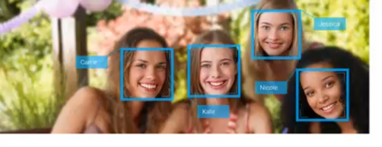
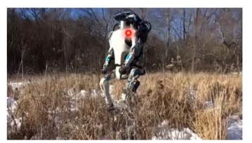
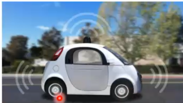
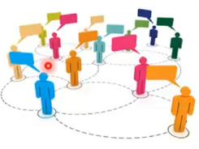
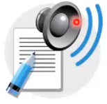
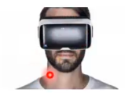

# Aprendizagem de máquina

## Algumas aplicações dessa área

- Detecção ou reconhecimento facial

$\qquad\quad$

- Kinect da microsoft, sendo a captura de movimentos e a sicronização do usuário com o avatar
- Além disso, em um jogo de futebol, jogando contra a cpu, o mesmo irá conseguir aprender quais são as suas pricipais jogadas, e com isso, vai marca-las

$\qquad\quad$

- Outro exemplo clássico, são os humanóides do google, que aprendem a caminhar, tem as pecepções onde consegue, detectar, reconhecer objetos que estão em volta

$\qquad\quad$

- Mais um exemplo, são os carros autônomos, são necessários varios algoritmos de aprendizagem de máquina

$\qquad\quad$

- Outro exempo, são esses robos médicos, muitas aplicações de inteligência artificial, estão sendo voltadas para essa área médica:
  - descoberta de novos medicamentos
  - descobertade curas para doenças
  - detecção de ter uma doença no futuro

$\qquad\quad$

- Sistema de recomendação, exemplos como:
  - NETFLIX, recomendação de filmes
  - Spotify, recomendando musicas, baseadas nas musicas que ouviu
  - eHarmony, Site de encontros, onde encontra parceiros/as semelhantes com você
  - amazon, e qualquer sistema de eCommerce, recomendação de produtos, similares ao da compra

$\qquad\quad$

- Exemplo da NASA, onde para explorar um planeta desconhecido, é mandado uma sonda espacial, pathfinder, dentro outros, onde terão que detectar obstáculos no ambiente, tirar fotos do que achar interessante

$\qquad\quad$

- Facebook Ads, são os anúncios do facebook, onde são personalizados, onde exibi-os apenas para as pessoas que possuem o interesse nele

$\qquad\quad$

- text-to-speak, texto para fala, onde se escreve o texto em português e é feita a leitura, ou falasse um texto e é trannsformado em escrita

$\qquad\quad$

- CIA, provavelmente é usado algoritmos de detecção para sabe chances de terrorismos

$\qquad\quad$

- Óculos de realidade aumentada

$\qquad\quad$

- Google, a famosa ferramenta de busca, se utiliza de algoritmos de aprendizagem de máquina, para melhorar as buscas, trazer resultados mais proximo possivel do esperado

$\qquad\quad$

### Temos o deep mind, onde geram imagens novas, literalmente uma IA desenha, temos um exemplo de uma pintura que foi feita com base em um aprendizado de um pinntor especifico, e foi criado um quadro totalmente novo, mas seguindo os traços desse pintor

### temos exemplo de poemas criados também, seguindo a mesma linha da pintura

## Algumas notícias

- Como a inteligência artificial pode ajudar previnir malware
- Inteligência artificial pode ajudar a reduzir o roubo de eletricidade no Brasil
- Inteligência artificial tenta descobrir quem traiu Anne Frank
- Google usa inteligência artificial para encontrar vírus na Play Store
- Tesla e AMD estão criando chip de inteligência artificial para **carros autônomos**
- Microsoft Pix edita imagens através de inteligência artificial
- Inteligência artificial detecta mal de Alzheimer uma década antes de sintomas aparecerem
- Inteligência artificial está escrevendo o fim de Game of Thrones
- Inteligência artificial consegue recriar fases de Super Mario
- Robô faz em segundos o que demorava 360 mil horas para um advogado
- Inteligência artificial, uma das tendências que revolucionam o serviço de atendimento ao cliente
- Cantora está compondo um álbum inteiro usando inteligência artificial
