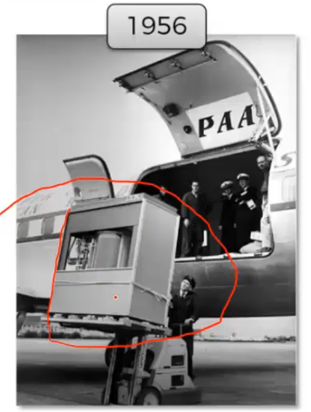
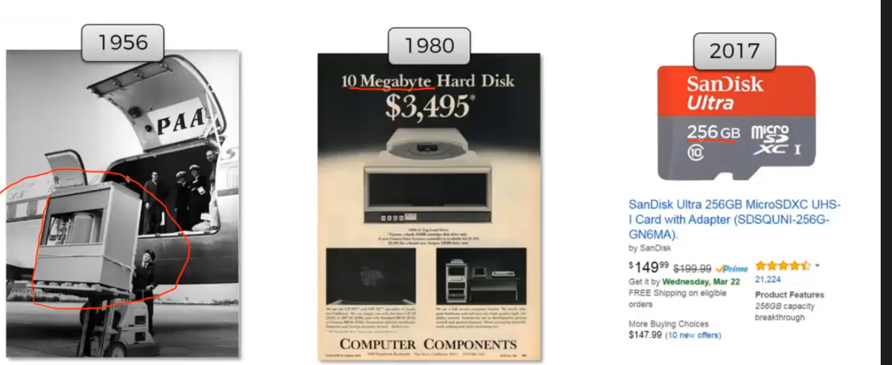
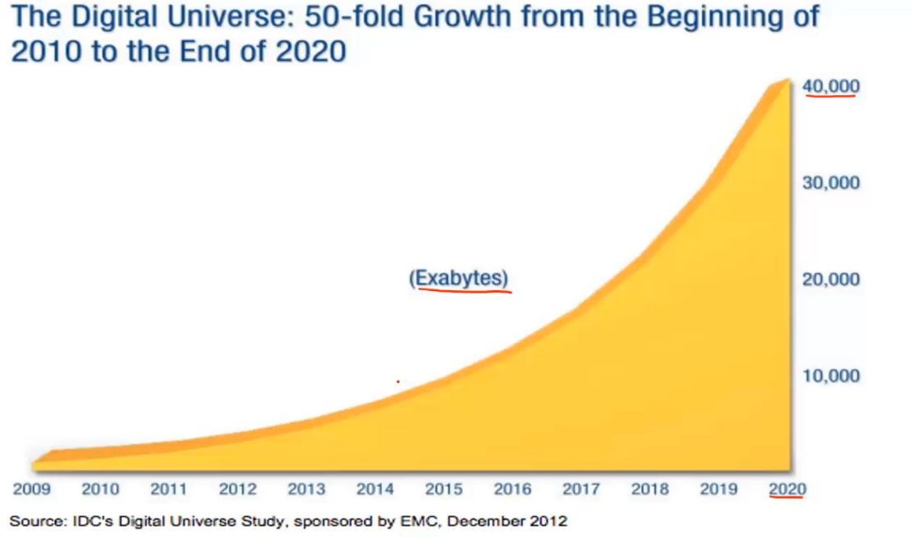

# História

## A área de inteligência artificial tem sua origem la para os anos 50 e somente agora em 2017, quase 70 anos, para sua ascensão

### Em 1956, um HD de 5 mega mais ou menos, tinha toda esse tamanho, onde era necessário um avião para carrega-lo

### aqui temos a evolução que tivemos de armazenamento

### Método de armazemento DNA e seus limites

### Gráfico que mostra o crescimento dos dados ao longo dos anos

