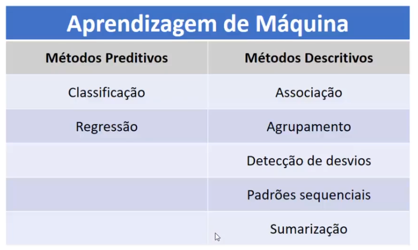
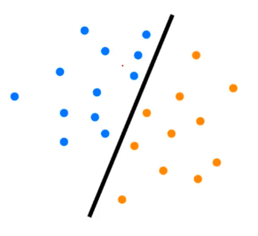
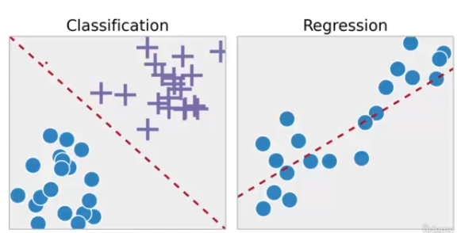

# aprendizagem de máquina

## A aprendizagem de máquinas é composta por métodos preditivos e descritivos

### Classificação

- nessa imagem temos duas classes, azul e laranja, foi trassado uma linha e separado as classes
- A classificação como presuporto em seu nome, irá definir classes para cada um dos registros
- Exemplos de aplicação:
  - Marketing direto
    - Se há um novo produto e não sabe para quem será mandado esse novo produto, um potencial cliente que virá a comprar esse novo produto, entao é aplicado uma técnica de classificação e classificar a pessoa, se ela vai comprar o produto ou não
  - Insatisfação de clientes
    - Pode-se definir se o cliente está satisfeito, insatisfeito, ou se ele não está nem satisfeito nem insatisfeito(status neutro)
  - Risco de crédito
    - Bastante utilizados pelos bancos, para analisar se uma determinada pessoa apresenta risco, alto, médio ou baixo pro banco conseguir empréstimo
  - Filtros de SPAM
    - Que é utilizado em praticamente todos os sistemas de e-mail. Vai pegar uma mensagem e classificar se é spam ou não é spam, além disso pode classificar se é promoções, mensagem de um menbro da família entre outros e vai colocando em suas pastas corespondentes
  - Separação de notícias
    - Dado varios textos, varios documentos, pode-se separar as notícias entre esportes, política, economia, por exemplo.
  - Reconhecimento de voz
    - Pode identificar se uma determinadda voz pertence ou não a pessoa A
  - Reconhecimento de face
    - Se uma determinada face em um sistema de segurança, pertence a pessoa A, ou pessoa B, ou pessia C e assim por diante
  - Previsão de doenças
    - Baseado nos dados do paciente, pode-se fazer uma previsão se ele vai desenvolver ou se não vai desenvolver uma determinada doença
- São só alguns exemplos basicos dessa tarefa de classificação, o que precisa ficar claro é que iremos prever uma classe, ou vai pagar, ou não vai pagar, o risco é alto, ou o risco é baixo.

### Regressão

- Nessa imagem, temos a classificação, que divide a classe em x e bola, e a regressão, perceba que não há classes e tem um pontilhado traçando os dados, então a regressão vai fazer a previsão de valores númericos, por exemplo, quanto que uma empresa vai ganhar de lucro baseado nos dados históricos. Então essa é a diferença básica, na classificação se tem rótulos e na regressão se tem números
- Exemplos de aplicação:
  - Gastos propaganda $\rightarrow$ valor de venda
    - Baseado nos gastos de propagandas, pode-se prever quanto que vai vender, qual valor total das vendas que terá
  - Temperatura, umidade e pressão do ar $\rightarrow$ velocidade do vento
    - Com base na temperatuda, umidade e pressão do ar, poderá ser feita a previsão da velocidade do vento
  - Fatores externos $\rightarrow$ valor do dólar
    - Baseado nos fatores externos, queremos fazer a previsão do valor do dólar
  - Resultados do exame $\rightarrow$ probablidade de um paciente sobreviver
    - Baseado nos resultados do exame, vai querer saber a probabilidede de um paciente sobreviver
  - Risco de investimento
    - Assim como visto o risco de crédito que pode ser classificado como alto, médio e baixo, aqui no risco de investimento ele pode classificar um número, exemplo, 71% de chance de ser risco alto
  - Gastos no cartão de crédito, histórico $\rightarrow$ limite
    - Com gastos no cartão de crédito e histórico de compras, pode-se definir um novo limite para o cartão de créditos
  - Valores anteriores $\rightarrow$ valores de produtos
    - Baseado nos valores anterios, poderá prever os novos valores para alguns produtos.
    - Semelhante com o buscapé, que tem as pesquisas dos preços, porém se aplicarmos uma regressão podesse, pegar toda base de dados histórica de um determinado produto e aplicar um algoritmo de regressão, para ver quanto que esse produto vai custar no futuro

> Note que todos os dados após a flexa, são valores numéricos, está sendo feito a previsão de números

