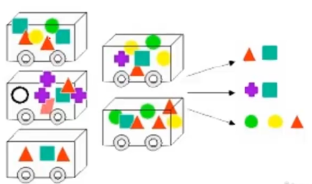
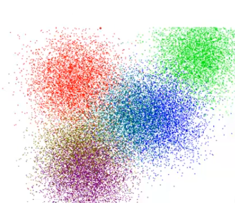
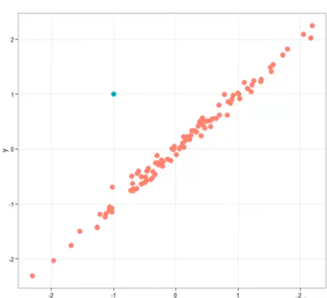
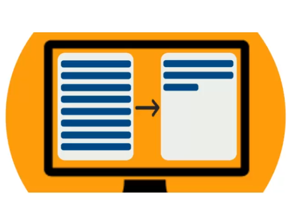

# Métodos de Descritivos

## Associação

- Regras de associação, na imagem temos um desenho de vários carrinhos de compra, com vários produtos diferentes em cada um deles, e o objetivo é encontrar algum tipo de associação
- Prateleiras de mercado
  - Exemplo, se comprar o trianngulo vermelho, entao também irá comprar o quadrado verde, ou se comprar a bola verde, com a bola amarela, entao quer dizer que também irá comprar o triângulo vermelho
  - são regras de associação, e a aplicação principal é justamente nas prateleiras de mercado, então a maioria emeplos sobre associação será sobre organização de prateleiras de mercado, para otimizar vendas.
  - Exemplo famoso é das fraldas e das cervejas, onde foi encrontrado o padrão que, nos finais de semana quanto tinha jogo era comprado muita fralda e cerveja, depois foi descoberto que geralmente o homem ia cuidar da criança no final de semana, então comprava faldas e já comprava cerveja para assistir ao jogo. Ai o que foi feito, foi colocar as fraldas e as cervejas do lado na prateleira e com isso foi bastante otimizada a venda desses produtos
- Promoções com itens que são vendidos em conjunto
- Planejar catálogos das lojas e folhetos de promoções
  - note que folhetos de mercado são separados por categoria, dificilmente é usado uma regra de associação para identificar quais são os produtos que saem em conjunto para fazre um folheto respeitando esse padrão de produtos que são muito vendidos. Então dessa forma consegue otimizar bastante as vedas
- Controle de evasão em universidades
  - Pode analisar os dados de pessoas que desistem de determinado curso

## Agrupamento

- Analizando a imagem, nota-se que temos vários grupos, e a ideia de agrupamento é analisar os dados e encontrar grupos
- Exemplo clássico da área é trabalha com **segmentação de mercado**
  - um exemplo é, pegar uma base de dados de clientes e vai segmentar, então vc vai mandar uma propaganda somente para as pessoas certas, assim não gastanto mandando propagandas para pessoas que não possuem o devido perfil
  - não vai mandar propaganda de video game pra uma pessoa que sabe que não vai comprar video game
- Encontrar grupos de clientes que irão comprar um produto(mala direta)
- Agrupamento de documentos/notícias
  - Então pode passar como parâmetros vários documentos e o algoritmo vai agrupar por conteúdo, pegando aqueles conteúdos que são parecidos, podendo separar pastas com somente notícia de esportes, outra apenas com política, e por ai vai
- Agrupamento de produtos similares
  - Podemos rodar um algoritmo numa base de dados de produto, e fazer a separação do mesmo
- Perfis de clientes(NetFlix)
  - Recomendação de filmes da NetFlix, é feita com base no perfeil do cliente, todos os filme já assistidos, os que gostou e não gostou
- Análise de redes sociais
  - Pode encontrar grupos de usuários, achar o usuário mais influente da rede, e podendo mandar uma amostra de produto para ele, por ter uma grande influência vai entra disseminar o produto mais fácilmente

## Detecção de desvio (outliers)

- Analisando a imagem, temos varias bolas vermelhas, de maneira agrupada seguindo uma mesma orientação, e possuimos uma bola azul, deslocada das demais, logo chamado de outliers, significando que está fora da margem
- Aplicações práticas:
  - Fraude em cartões de crédito
    - Detectar fraudes de cartão de crédito
  - Intrusão em redes
    - Quando há uma invasão numa rede, ele é um outlier, algo que saio do padrão
  - Uso de energia elétrica, água ou telefone
    - Se o consumo de energia elétrica está aumentando muito, pode haver um problema, pode ser um roubo de energia por exemplo, ou se o uso de água aumentou muito em um determinado mÊs, possa ser que ocorreu algum tipo de vazamento no cano, ou o relógio está com problema, então a empresa de saneamento pode acionar um técnico para verificar o problema
  - Desempenho de atletas(doping)
    - Se tem todos os dados históricos de um atleta, supondo que em uma determinada corrida, e um atleta com um padrão de realizar a corrida em 15 seg, e realiza a mesma com 10 seg, então saio do padrão dele, então é interessante chamar o atleta para um exame de doping, para verificar se ele ta usando algum produto ilegal que conseguiu aumentar o rendimento dele
  - Monitoramento de máquinas em um data center
    - Onde temos várias máquinas, e caso uma não esteja funcionando corretamente, ele vai gerar um outlier, talvez diminua muito o desempenho e processamento da rede como todo, por não está trabalhando adequandamente

## Padrões de sequenciais

- **Descoberta de padrões sequenciais**
  - Livrarias, lojas de equipamento de atletismo, computadores
  - Uma técnica bem interessante, que muitas lojas podem utilizar. Exemplo:
    - Supondo que compre o primeiro livro do Harry Potter e se passa um ou dois meses a empresa, manda um e-mail ofertando mais livros de Harry Potter. Ele vai detectar um padrão sequencial, pois geralmente, quem compra o primeiro livro, tende a comprar o segundo e por ai vai, então sabendo disso, pode montar um pacote do produto e fazer uma oferta personalizada para o cliente
  - Marketing direcionado para pessoas que tem maiores chances de adquirir um novo produto
    - Semelhante as técnicas vistas anteriormente, porém aqui temos um padrão sequencial, ou seja, uma coisa acontece e depois a outra, primeiro se compra o produto A, dpois se compra o produto B e por ai vai
  - Prevensão de doenças
    - Então se sabe que determinado sintomas vão causar uma doença, então é uma sequencia. Sintoma A, B e C, vão causar a doença X
  - Navegação em sites
    - Exemplo bastante interessante, aqui, pode ver qual a sequencia que os usuários estão acessando o seu site, e com isso montar uma sequencia para que possa levar o usuário para onde queira que ele vá

## Sumarização

- Note que na imagem temos o texto maior, e o objetivo é gerar um texto menor, aqui aplicando sumarização de documentos, mas essa técnica ela pode ser para identificar perfis de pessoas, por exemplo:
  - São ouvintes do programa homens, na faixa de 25 a 35 anos, com nível superior e que trabalham na área de administração. Então pode pegar todos os clientes que existem na sua empresa e aplicar o algoritmo de sumarização e ele vai pegar quais são os dados comuns, então podemos traçar o perfil das pessoas que usa determinado serviços
- Utilizado também para fazer **Segmentação de mercado**
  - Pois quanto se tem as característica, pode direcionar melhor essas pessoas

