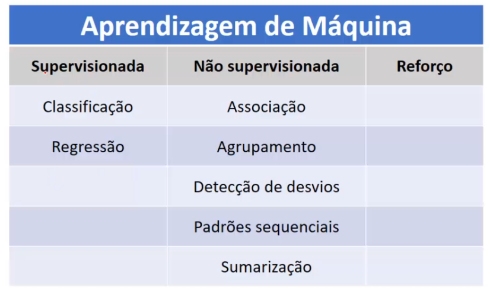
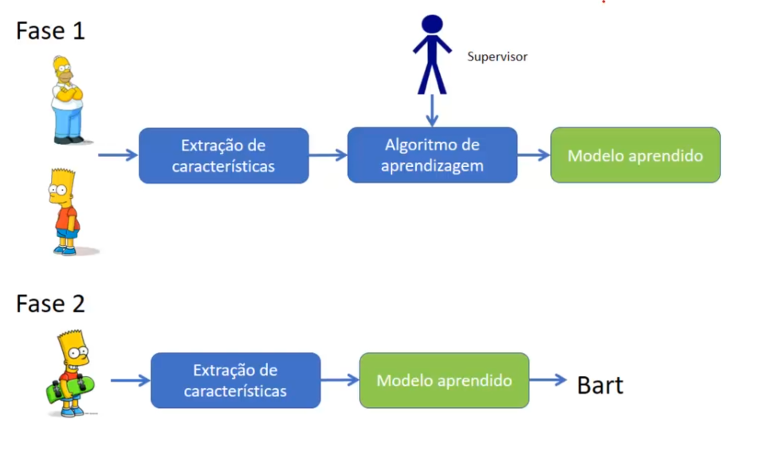
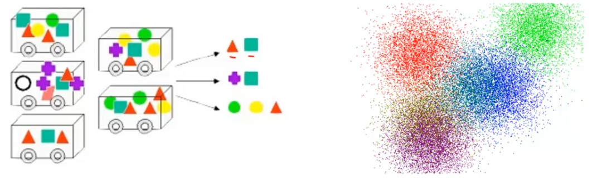

# Tipos de aprendizagem de máquina

## Como podemos observer na tabela, temos aprendezagem de máquina supervisionada, não supervisionada e por reforço. pode-se notar que a classificação e a regressão, que são os dois métodos preditivos, se encaixam na aprendizagem supervisionada, e os métodos descritivos, se encaixam na aprendizagem não supervisionada

### veremos a diferença entre elas

### Aprendizagem supervisionada

- Na imagem temos um exemplo prático
- e vamos usar esse cenário onde queremos classificar se uma dada imagems é do homer ou se uma imagem é do bart

1. Primeira Fase
   1. Extração de características
      - Primeiro passo que precisa ser feito é uma extração de características, essa extração é identificar o que tem no homer que não tem no bart e vice e versa, para que então possa diferenciar os dois
   2. Algoritmo de aprendizagem
      - Feito a extração, será submetida essa base de dados a um algoritmo de aprendizagem de máquina, e temos essa figura do supervisor, ele é responsável por definir a qual classe cada uma das imagens pertence, e é com base nessas classes que o algoritmo vai fazer as análiser e vai conseguir aprender. E como resultado dessa etapa, temos o modelo aprendido, que é o conhecimento que o algoritmo gerou
2. Segunda Fase
   1. Onde temos uam imagem que não sabemos a que classe pertence, e vamos extrair as características
   2. Vai aplicar essas características para esse modelo aprendido, onde por sua vai, dirá a qual classe essa imagem pertence

### Aprendizagem não supervisionada

- Analisar automaticamente os dados (associação, agrupamento)
- Necessita análise para determinar o significado dos padões encontrados

- analisando as figuras, a da esquerda é para encontrar a associação dos produtor e a da direita vai encontrar os agrupamentos

### aprendizagem por reforço

- Aprender com as interações com o ambiente (causa e efeito)
  - Exemplo: se tem um robozinho e ele bate na parede e se machuca, então ele já vai saber, que se bater na parede ele vai se machucar ou vai perder energia, então é baseado em causa e efeito
- Aprender com sua própria experiência
- É muito utilizado nessa área de robótica
  - Robô coletando lixo aprendendo a andar em um ambiente
- Essa ideia de aprendizado por reforço é bastante comum na área de `SMA(sistemas multi agentes)`
