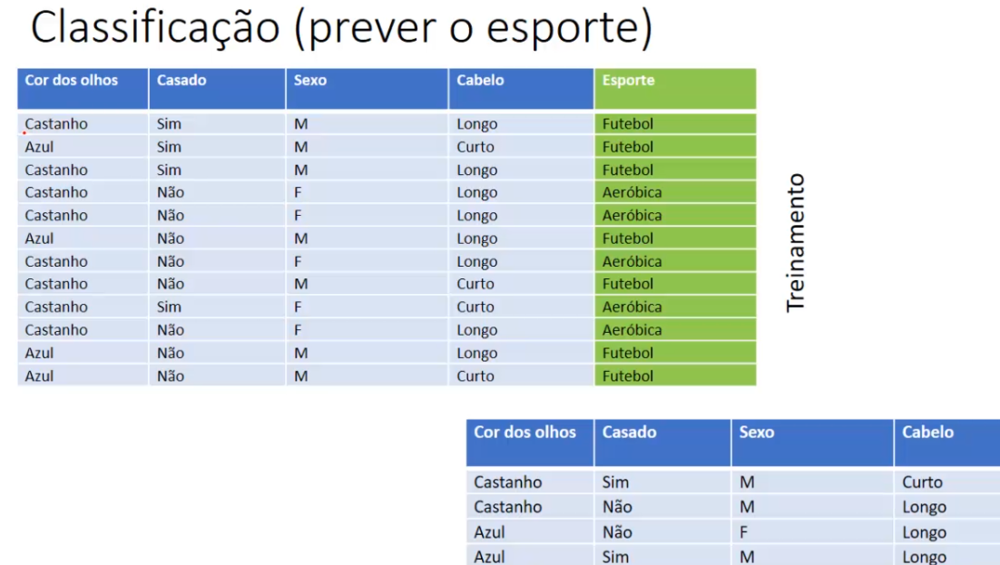

# Classificação

## O primeiro exemplo que veremos sera na base de dados de risco de crédito

- precisa ficar claro que possuimos atributos previsores, neste caso são a história do crédito, dívida, garantias e randa anual e temos o atributo meta e também chamado de atributo classe
- e o objetivo é, com base nos atributos previsores, queremos fazer a previsão de qual é a classe
- e essa classe que nos traz aquela ideia de apreendizagem supervisionada
- Toda essa parte de classificação, envolve uma base de dados histórica, então é necessário que tenha uma base de dados com todos os dados históricos, ao longo de um tempo, para que possa ser submetido um algoritmo de aprendizagem de máquina

### Cada algoritmo tem um aprendizado de maneira diferente

- Naive bayes, gera uma tabela de probabilidade
- Árvore de decisão, gera uma árvore
- Redes neurais, geram pesos
- E assim sucessivamente, e o objetivo é que o algoritmo aprenda com essa base de dados histórica, e depois de aprendido, quando entramos com novos registros ele fará previsores ou a classificação do nosso target ou classe

> A ideia é que vai ter um conjunto de atributos previsores, onde será encontrado uma correlação entre eles com a classe, que é aquilo que queremos faze a previsão

## Segundo exemplo, venda de livros

- Nossos previsores são, sexo, pais, idade e temos nossa classe ou target compara, se a pessoa comprou ou não o livro
- E novamente, para determinarmos se um livro vai ou não ser vendido é necessário termos uma base de dados histórica para que nosso algoritmo possa treinar e com isso prever/ classificar se vai ou não ser vendido o livro
- E depois de comcluido o treinamento, é submetido dados novos, onde não temos o atributo target(comparar), e o nosso algoritmo irá classificar cada um dos registros se isrá comprar ou não

## Terceiro exemplo, prever o esporte

- com base nos previsores, será previsto qual esporte será jogado, Futebol ou vai fazer Aeróbica
- esse exemplo pode ser muito usado para teste vocacional

## Quarto exemplo, jogar tênis

- Essa ideia é bem clássica na área de machine learning, que é com base nas características climáticas
- conforme temos os atributo previsores, vai ser definido se apessoa vai jogar ou não tênis

> Essas foram algumas bases de dados só para ter uma noção básica sobre como funciona esse processo

## Para revisar os conceitos

- Cada registro pertence a uma classe e possui um conjunto de atributos previsores
- Objetiva-se descobrir um relacionamento entre os atributos previsores e o atributo meta/classe(target)
  - Ai que entra o os algoritmos de aprendizagem de máquina, ele vão tentar identificar esse relacionamento
- O valor do atributo meta é **conhecido**(aprendizagem supervisionada)

## Representação da classificação (método indutivo)

