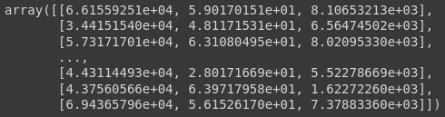
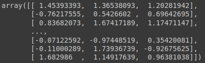

# Escalonamento dos valores

## Visualizando os previsores

```python
X_credit
```

### Output: `X_credit`



## Analizando valores mínimos de toda a coluna de cada linha

```python
X_credit[:,0].min(), X_credit[:, 1].min(), X_credit[:, 2].min()
```

### Output: `X_credit[:,0].min(), X_credit[:, 1].min(), X_credit[:, 2].min()`

```python
(20014.4894700497, 18.055188510566897, 1.37762959325451)
```

## Analizando valores máximos de toda a coluna de cada linha

```python
X_credit[:,0].max(), X_credit[:, 1].max(), X_credit[:, 2].max()
```

### Output: `X_credit[:,0].max(), X_credit[:, 1].max(), X_credit[:, 2].max()`

```python
(69995.6855783239, 63.971795841120205, 13766.0512393337)
```

> note que possiu uma diferença bem grande entro os valores mínimos e máximos de cada atributo

### Existe uma diferença muito grande nas escalas desses valores, tanto comparando idade com loan, quanto idade com a renda, assim como temos uma diferença grande na renda para a dívida, e isso pode ocasionar probelma para algoritmos de machine learning, principalmente aqueles algoritmos baseados em distância, como é o caso no KNN, e redes neurais artificiais. Com isso o ideal é aplicar a fórmula para padronizar os valores, para que fiquem em mesma escala. Outro problema que pode acontecer com alguns algoritmos é que como temos valores de renda muito maior que os valores da idade, o algoritmo pode considerar que a renda é muito mais importante do que a idade, criando assim um desbalanceamento nos pesos

## Padronização e Normalização

### Padronização (Standardisation)

$x = \frac{x-média(x)} {desvio\ padrão(x)}$

- desvio padrão é o quanto que os valores variam se comparado com a média

### Normalização (Normalization)

$x = \frac{x-mínimo(X)}{máximo(x) - mínimo(x)}$

> Existem basicamente esses dois cálculos para se aplicar. A padronização é mais inndicada quando tem-se outliear na base de dados, são aqueles registros que estão muito fora do padrão, como foi o caso dos 3 registros com a idade negativa

## importamos o método responsável por aplicar a formula de padronização, `StandardScaler`

- com `fit_transform`, realizamos a padronização nos nossos previsores

```python
from sklearn.preprocessing import StandardScaler
scaler_credit = StandardScaler()
X_credit = scaler_credit.fit_transform(X_credit)
```

## Re-Analizando valores mínimos de toda a coluna de cada linha

```python
X_credit[:,0].min(), X_credit[:, 1].min(), X_credit[:, 2].min()
```

### Output_2: `X_credit[:,0].min(), X_credit[:, 1].min(), X_credit[:, 2].min()`

```python
(-1.7676158019964077, -1.7264145408889917, -1.4592791099462408)
```

## Re-Analizando valores máximos de toda a coluna de cada linha

```python
X_credit[:,0].max(), X_credit[:, 1].max(), X_credit[:, 2].max()
```

### Output_2: `X_credit[:,0].max(), X_credit[:, 1].max(), X_credit[:, 2].max()`

```python
(1.7220222385319197, 1.7393673928651967, 3.0616609141708273)
```

## Analizando novamente os atributos previsores

```python
X_credit
```

### Output_2: `X_credit`



> perceba que escalamos os valores, note a diferença dos valores mínimos e máximos de antes e depois da padronização
