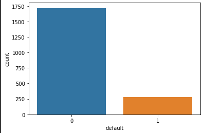
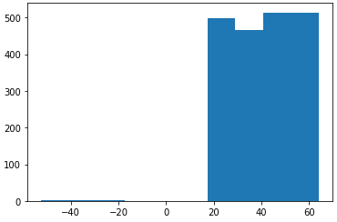
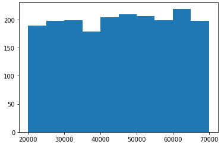
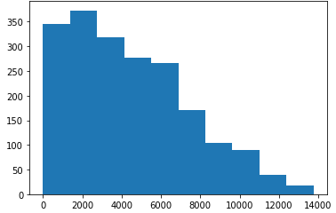
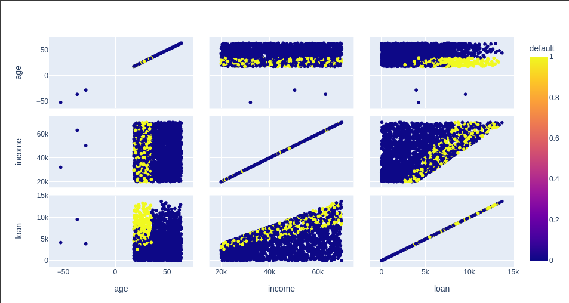

# visualização dos dados

## vamos fazer uma contagem, de quantos registros existem em cada uma das classes, lembrando que possuimos duas classe, a 0 quem pagou o empréstimo e 1 para quem não pagou

- `return_counts=True`, irá retornar a quantidade

```python
np.unique(base_credit['default'], return_counts=True)
```

### output np.unique

- Note que é uma base de dados bem desbalanceada, a quantidade de registros pagantes é muito maior do que a não pagantes

```python
(array([0, 1]), array([1717,  283]))
```

## sns, para gerar gráfico

- Essa função irá fazer a contagem de quantos registros existem em cada uma das classes e gerar um gráfico
- ';' no final para evitar a msg, `<matplotlib.axes._subplots.AxesSubplot at 0x7f87b0e1ef90>`

```python
sns.countplot(x = base_credit['default']);
```



## plt, para gerar um outro tipo de gráfico, o histograma

- notasse que temos uma maioria com uma faixa de idade acima dos 40 anos
- uma faixa menor de idade entre os 25 ao 40
- É um gráfico interessante para conntarmos a frequência separado por cada um dos atributos
- note também que possuimos valores negativos para idade no eixo x, referente a idade(age)

```python
plt.hist(x = base_credit['age']);
```



## vamos visualizar outro histograma com o atributo income

- perceba que temos como valor minimo 20 mil ao ano e o máximo quase 70 mil ao ano
- e podemos observer qual a distribuição de frequência
- a barra mais baixa que temos nesse gráfico é no intervalo próximo de 40 mil, isso indica que poucas pessoas nessa base de dados possuem essa faixa salarial
- e note que temos pouco mais de 200 pessoas com uma faixa salarial acima de 60 mil

```python
plt.hist(x = base_credit['income']);
```



## vamos visualizar outro histograma com o atributo loan

- temos dívidas próxima de 0 até um valor próximo de 14 mil
- onde a maioria das pessoa na barra maior, tem um pouco mais de 350 pessoas, onde tem uma dívida com valores próximos de 2 a 3 mil, enquanto que a minoria das pessoas possuem uma dívida mais alta, entre 12 e 14 mil

```python
plt.hist(x = base_credit['loan']);
```



## Gerando um gráfico dinnâmico com px

- parametros:
  1. passamos a base de dados
  2. passamos os atributos que queremos fazer a visualização dos dados, para isso usamos o dimensions
  3. definimos uma cor para o gráfico, e nesse caso vamo coloca-lo igual ao atributo default, quem paga ou não paga o empréstimo, dessa forma termos uma visualização mais dinâmica
     - Note que na legenda o default com valor 1 recebe tons de amarelo e com valor 0, tons azulados
- scatter, refere-se à um gráfico de dispersão

```python
grafico = px.scatter_matrix(base_credit, dimensions = ['age', 'income', 'loan'], color = 'default')
grafico.show()
```


