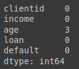
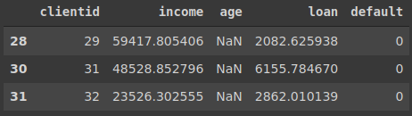
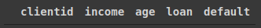
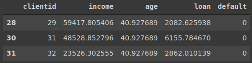

# Tratamento de valores faltantes

## verificando se na base de dados há valores NaN(nulos, ou faltantes)

- note que não é a melhor forma de realizar essa verificação, devido ao número alto de registros, não podemos avaliar bem cada um deles

```python
base_credit.isnull()
```

### Output: `base_credit.isnull()`


### Nesse caso, usamos o método `sum`, método somatório, onde vamos de 0 para false e 1 para true, onde false equivale à não nulos e true à valores nulos, ou faltantes, já que o método isnull, busca por valores nulos

- note que temos 3 valores faltantes no atributo age

```python
base_credit.isnull().sum()
```

### Output: `base_credit.isnull().sum()`



## Utilizando o método `loc`, do pandas, identificamos quais os registros que possuem valor nulo

```python
base_credit.loc[pd.isnull(base_credit['age'])]
```

### Output: `base_credit.loc[pd.isnull(base_credit['age'])]`



## Com o método fillna, vamos atribuir a correção para esses valores nulos

- note que o `fillna`, remete a preencher os valores nulos, por tanto, vamos preencher os valores nulos com o `mean`, méida, o inplace é responsável por que a alteração seja apenas na memória, `False`, ou que a alteração seja efetivamente na base de dados, `True`.

```python
base_credit['age'].fillna(base_credit['age'].mean(), inplace = True)
```

## Vamos realizar a verificar se a alteração foi realizada com sucesso

- note que não retornou nada, então foi realizada com sucesso

```python
base_credit.loc[pd.isnull(base_credit['age'])]
```

### Output:  `base_credit.loc[pd.isnull(base_credit['age'])]`



## Vamos fazer outra verificação, agora analizando os registros que sofreram a alteração

- Dessa forma podemos pegar cada id do cliente e exibir, com o método `loc`

```python
base_credit.loc[(base_credit['clientid'] == 29) | (base_credit['clientid'] == 31) | (base_credit['clientid']  == 32)]
```

### Output: `base_credit.loc[(base_credit['clientid'] == 29) | (base_credit['clientid'] == 31) | (base_credit['clientid']  == 32)]`


## Aqui é o mesmo método de verificar os registros que foram alterados, porém, de maneira mais simples, com menos código

- usando a função `isin` e passando os id, podemos realizar a mesma ação do código anterior, de maneira mais eficiente com o método `isin` do pandas

```python
base_credit.loc[base_credit['clientid'].isin([29,31,32])]
```

### Output: `base_credit.loc[base_credit['clientid'].isin([29,31,32])]`


