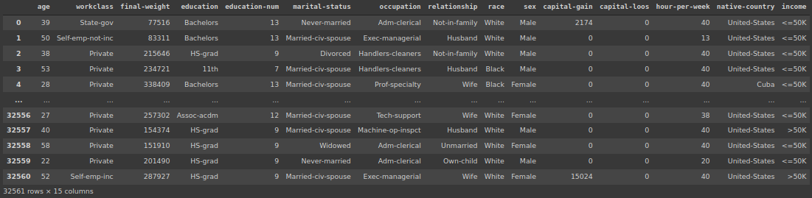
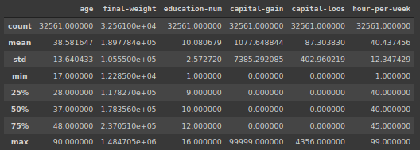
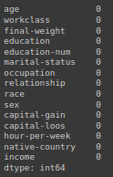

# base de dados do censo

## Importação da base censo

```python
base_census = pd.read_csv('/content/census.csv')
```

## verificação da base

```python
base_census
```

## analise base dos atributos

1. age $\rightarrow$ variável numérica discreta
    - pois temos um conjunto de valores finitos inteiro
2. workclass $\rightarrow$ variável categórica nominal
    - não existe uma ordem de importancia entre os atributos, por tanto é uma variável nominal, não há uma ordenação entre elas
3. final-weight $\rightarrow$ variável numérica Contínua
    - Por mais que sejam números inteiros, note que os números são grandes e diferentes, por tanto categorizamos como uma variável contínua
4. education $\rightarrow$ variável categórica ordinal
    - Pois podemos ordernar, pelo fato de termos níveis de educação, porém caso o sistema que estaja sendo trabalhando não considere tanto a importancia o nível de educação, para a aplicação, pode considerar como uma variável nominal simples

5. education-num $\rightarrow$ variável numérica discreta
    - conjunto de valores finitos
6. marital-status $\rightarrow$ variável categórica nominal
7. occupation $\rightarrow$ variável categórica nominal
8. relationnship $\rightarrow$ variável categórica nominal
9. race $\rightarrow$ variável categórica nominal
10. sex $\rightarrow$ variável categórica nominal
11. capital-gain $\rightarrow$ variável numérica contínua
12. capital-loos $\rightarrow$ variável numérica contínua
13. hour-per-week $\rightarrow$ variável numérica discreta
14. native-country $\rightarrow$ variável categórica nominal
15. income $\rightarrow$ variável categórica ordinal
    - É connsiderado ordinal, pois nesse caso, estamos considerando que é maior que 50 e menor do que 50 mil dolares

> A categorização das variaveis sempre irá depender muito de qual a aplicação envolvida

## tabela

------------------------
atributos | tipo de variável
------- | -------
age | numérica discreta
workclass | categórica nominal
final-weight | numérica Contínua
education | categórica ordinal
education-num | numérica discreta
marital-status | categórica nominal
occupation | categórica nominal
relationnship | categórica nominal
race | categórica nominal
sex | categórica nominal
capital-gain | numérica contínua
capital-loos | numérica contínua
hour-per-week | numérica discreta
native-country | categórica nominal
income | categórica ordinal

### Output: `base_census`



## verificação estatística da base

```python
base_census.describe()
```

### Output: `base_census.describe()`



## verificação de valores nulos na base

```python
base_census.issnull().sum()
```

### Output: `base_census.issnull().sum()`


