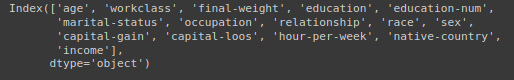
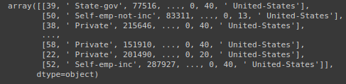
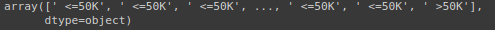

# Divisão entre previsores e classe

## primeiro vamos verificar as colunas, quantas são

```python
base_census.columns
```

### Output: `base_census.columns`



## Vamos realizar a divisão para os previsores e em seguida visualizar o resultado

```python
X_census = base_census.iloc[:, 0:14].values
X_census
```

### Output: `X_census = base_census.iloc[:, 0:14].values...X_census`



## Observando o primeiro registro dos previsores

```python
X_census[0]
```

### Output: `X_census[0]`

![X_census[0]](img/X_census[0].png)

## Vamos realizar a divisão para a classe e exibir o resultado em seguida

```python
y_census = base_census.iloc[:, 14].values
y_census
```

### Output: `y_census`


