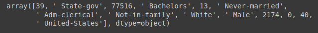
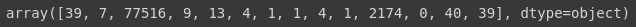
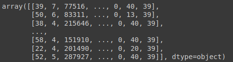
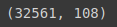

# Tratamento de atributos categóricos

## Sumário

- [LabelEncoder](#labelencoder)
- [OneHotEncoder](#onehotencoder)

### LabelEncoder

### Realizamos a importação do `LabelEncoder`

```python
from sklearn.preprocessing import LabelEncoder
```

### Instânciamos o LabelEncoder a uma variável

- Faremos uma variavel para cada um dos atributos categóricos encontreados nessa base census
- Essa variável será responsável pela mudaça dos atributos de valores categóricos para valores numéricos

```python
label_encoder_workclass = LabelEncoder()
label_encoder_education = LabelEncoder()
label_encoder_marital = LabelEncoder()
label_encoder_occupation = LabelEncoder()
label_encoder_relationship = LabelEncoder()
label_encoder_race = LabelEncoder()
label_encoder_sex = LabelEncoder()
label_encoder_country = LabelEncoder()
```

### Feito isso agora só precisa pegar cada um dos atributos e submete-los a variável com nosso `LabelEncoder`

```python
X_census[:,1] = label_encoder_workclass.fit_transform(X_census[:,1])
X_census[:,3] = label_encoder_education.fit_transform(X_census[:,3])
X_census[:,5] = label_encoder_marital.fit_transform(X_census[:,5])
X_census[:,6] = label_encoder_occupation.fit_transform(X_census[:,6])
X_census[:,7] = label_encoder_relationship.fit_transform(X_census[:,7])
X_census[:,8] = label_encoder_race.fit_transform(X_census[:,8])
X_census[:,9] = label_encoder_sex.fit_transform(X_census[:,9])
X_census[:,13] = label_encoder_country.fit_transform(X_census[:,13])
```

### Analizando os resultados

#### Tiamos esses valores para `X_census`

```python
X_census[0]
```



#### E depois de termos utilizado o `LabelEncoder`, são esses valores para `X_census`

```python
X_census[0]
```



#### Visualizando toda X_census

```python
X_census
```



> Problemas de utilizar somente o LabelEncoder, é que podemos ter muitas categorias e os valores serão diferentes, dessa forma, podem haver situações onde o o algoritmo irá considerar mais importante o atributo 15 por exemplo, do que o atributo 3, prém, são apenas categorias diferentes. Para resolver esses problemas aplicamos uma técnica chamada de **OneHotEncoder**

---------------------------

## OneHotEncoder

### Como funciona

carro  | categoria
-------| ------
gol    |$\quad$ 1
pálio  |$\quad$ 2
Uno    |$\quad$ 3

## com o OneHotEncoder

### No lugar de termos a coluna carro, vamos ter 3 colunas de acordo com o número de valores diferentes que temos

carro  | categorias | categorias | categorias
-------| -----------|------------|-----------
gol    |$\qquad$ 0  |$\quad$ 0   |$\qquad$ 1
pálio  |$\qquad$ 0  |$\quad$ 1   |$\qquad$ 0
Uno    |$\qquad$ 1  |$\quad$ 0   |$\qquad$ 0

## visualizando quantas categorias temos para o atributo workclass

```python
len(np.unique(base_census['workclass']))
```

### Output: `len(np.unique(base_census['workclass']))`

```python
9
```

## visualizando quantas categorias temos para o atributo occupation

```python
len(np.unique(base_census['occupation']))
```

### Output: `len(np.unique(base_census['occupation']))`

```python
15
```

### Realizamos as importações

```python
from sklearn.preprocessing import OneHotEncoder
from sklearn.compose import ColumnTransformer
```

### Estruturação do `ColumnTransformer` e `OneHotEncoder`

1. Iniciamos o `ColumnTransformer`, passamos o `OneHotEncoder`, com uma string.
2. Como segundo parâmetro colocamos uma lista de colunas, as quais serão transformadas.
3. No terceiro parâmetro passamos o `remainder`, onde passamos o passthrough, que indica que não será apagada os outros atributos, não [listados](#estruturação-do-columntransformer-e-onehotencoder)

```python
onehotencoder_census = ColumnTransformer(transformers=[('OneHot', OneHotEncoder(), [1,3,5,6,7,8,9,13])], remainder='passthrough')
```

### Feito isso recriamos a base de dados Census

- chamaos o `onehotencoder_census`, e passamos a função `fit_transform` para efetivamos realizar a transformação, e fazermos a conversão para o numpy array

```python
X_census = onehotencoder_census.fit_transform(X_census).toarray()
```

### Visualizamos o X_census no primeiro registro, e note que temos muito mais colunas do que anteriormente

```python
X_census[0]
```

### Output: `X_census[0]`

![X_census[0]](img/X_census_OHE.png)

### Exibimos o formado ou shape de nosso X_census, note que temos 32561 linhas e 108 colunas, saimos de 15 colunas para 108

```python
X_census.shape
```

### Output: `X_census.shape`


