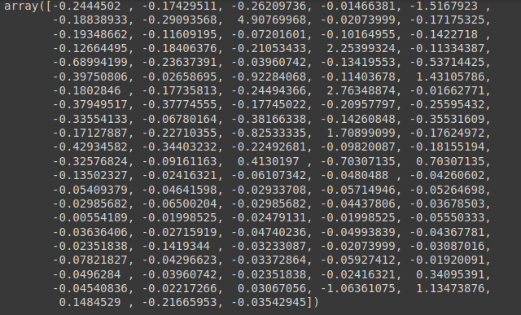

# Escalonamento dos valore

## vamos utilizar o Padronização

$x = \frac{x-média(x)}{desvio\ padrão(x)}$

### Para isso, realizamos a importação

- Já inicializamos a variável `scaler_census`
- E por fim aplicamos o método `fit_transform` no `X_census`

```python
from sklearn.preprocessing import StandardScaler
scaler_census = StandardScaler()
X_census = scaler_census.fit_transform(X_census)
```

### Feito isso, visualizamos o `X_census`

```python
X_census[0]
```


