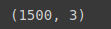
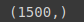
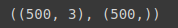
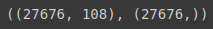
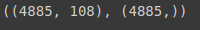

# Divisão das bases em treinamento e teste

## Primeiramente importamos o `train_test_split`

```python
from sklearn.model_selection import train_test_split
```

### Agora faremos a divisão da base Credit

```python

```

### Feito isso, vamos verificar

```python
X_credit_treinamento.shape
```

### Output: `X_credit_treinamento.shape`



```python
y_credit_treinamento.shape
```

### Output: `y_credit_treinamento.shape`



```python
X_credit_teste.shape, y_credit_teste.shape
```

### Output: `X_credit_teste.shape, y_credit_teste.shape`



```python
y_credit_treinamento.shape
```

### Agora faremos a divisão da base Census

```python
X_census_treinamento, X_census_teste, y_census_treinamento, y_census_teste = train_test_split(X_census, y_census, test_size = 0.15, random_state = 0)
```

### Feito isso, vamos verificar os valores

```python
X_census_treinamento.shape, y_census_treinamento.shape
```

### Output: `X_census_treinamento.shape, y_census_treinamento.shape`



```python
X_census_teste.shape, y_census_teste.shapeape
```

### Output: `X_census_teste.shape, y_census_teste.shape`


