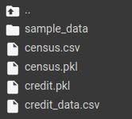

# Salvar as bases de dados

## primeiramento importamos o pickle, pacote do python, utilizada para salvar variáveis em disco

```python
import pickle
```

### Feito isso salvamos a base de dados credit

```python
with open('credit.pkl', mode = 'wb') as f:
  pickle.dump([X_credit_treinamento, y_credit_treinamento, X_credit_teste, y_credit_teste], f)
```

### E também a base de dados census

```python
with open('census.pkl', mode = 'wb') as f:
  pickle.dump([X_census_treinamento, y_census_treinamento, X_census_teste, y_census_teste], f)
```

### note que ficou salvo no formato pkl, formato essse do pickle


