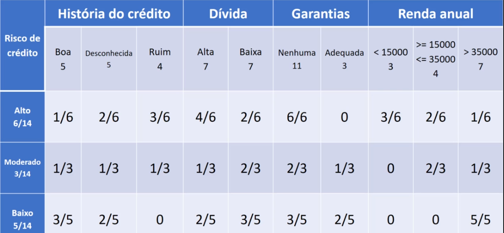

# Naive Bayes

## Abordagem probabilística(Teorema de Bayes)

> Teorema de Bayes, muito utilizado para tomadas de decisão na área de estatística, e o algoritmo Naive Bayes é totalmente baseado nesse teorema

### Exemplos

- Filtro de spam
- Mineração de emoções
  - Dada uma frase, é possível detectar qual emoção está naessa frase, se é uma emoção de raiva, alegria, tristeza.
- Separação de documentos
  - Exemplo para isso é um conjunto de notícias com muitos temas, e o algoritmo vai categorizar e separar por temas, como exemplo, esporte, política, tecnologia.

> Como pôde ser observado, esses 3 casos, são baseados em classificação de texto, mas o algoritmo Naive Bayes, não é só para classificação de texto, pois ele possui um bom desempenho em vários outros tipos de aplicações

### Exemplo da tabela de probabilidades gerada pelo naive bayes, em nosso exemplo da base credit-data

- Nas colunas alto, modetado e baixo, temos a contagem dos registros, de uma amostra de 14 temos 6 registros com risco alto, 3 com risco moderado e 5 com risco baixo, totalizando 14

> A ideia é utilizar essa tabela para efetuar a classificação

[Continua $\rightarrow$](2%20-%20aprendizagem.md)
