# Aprendizagem

## Como que a tabela é contruida

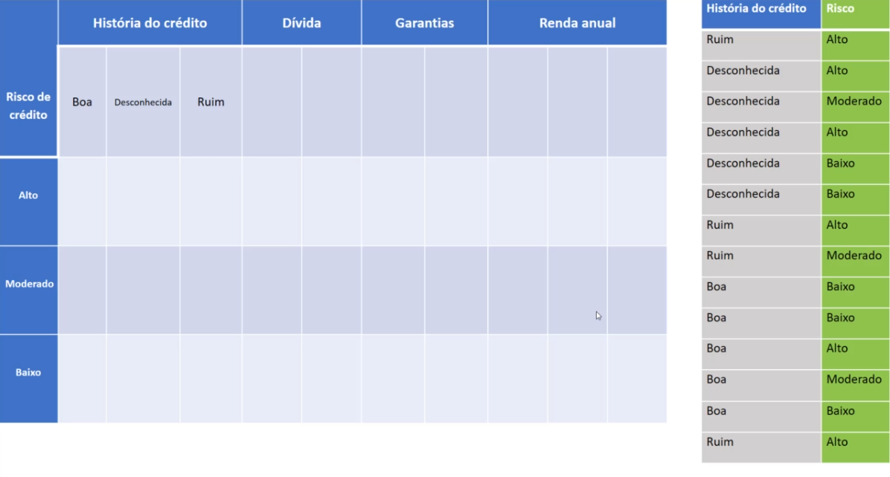

- O primeiro passo que precisamos fazer é a contagem do risco
  - colocamos na primeira coluna o que será nossa classe/target
  - as próximas colunas, separamos os atributos
    - História do crédito
      - Separamos em:
        - Boa
        - Desconhecia
        - Ruim
  - precisamos somar, quantas vezes temos o risco de crédito alto
    - Fazemos a contagem
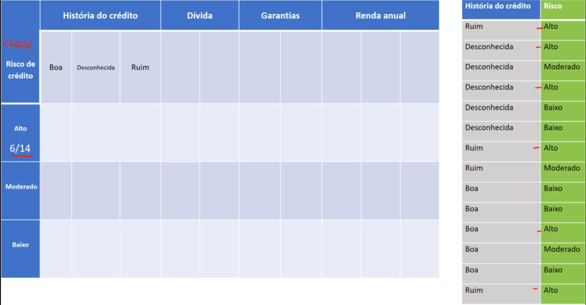
         6/14 - risco alto
    - Contagem risco moderado

         3/14 - risco moderado
    - contagem risco baixo
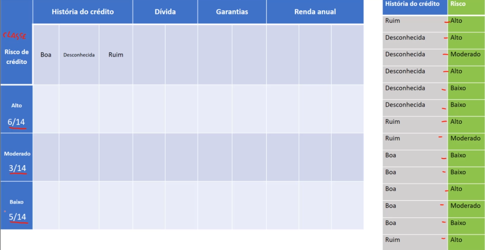
         5/14 - risco baixo
  - Agora precisamos fazer a contagem da história do crédito, se é boa, desconhecida ou ruim
    - Boa $\rightarrow$ 5
    - desconhecida $\rightarrow$ 5
    - ruim $\rightarrow$ 4
    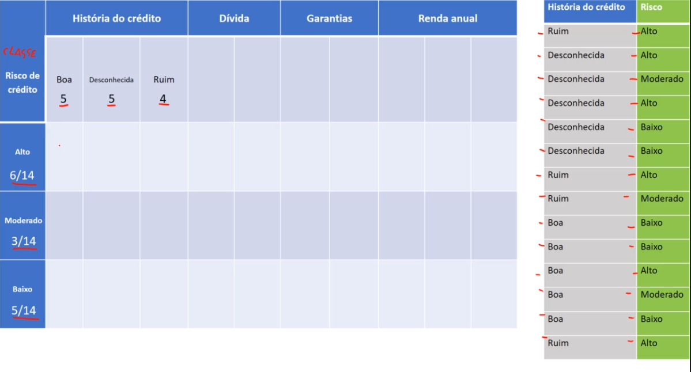
  - Agora o que precisamos fazer é intercalar os valores da história do crédito com os riscos, pegaremos as intersecções
    - História boa + risco alto $\rightarrow$ 1/6
    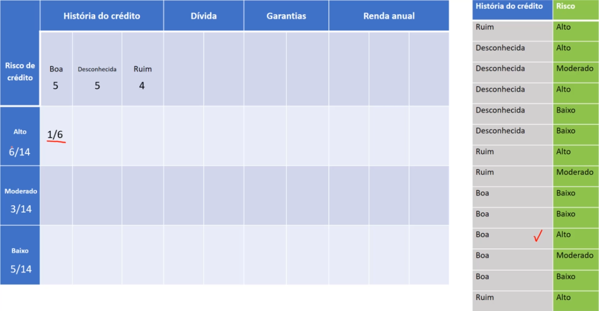
      > 1 é a quantidade de história boa que temos para o total de 6 riscos altos
    - História boa + risco moderado $\rightarrow$ 1/3
    
      > Dos 3 registros do risco moderado, 1 possui história do crédito boa
    - História boa + risco baixo $\rightarrow$ 3/5
    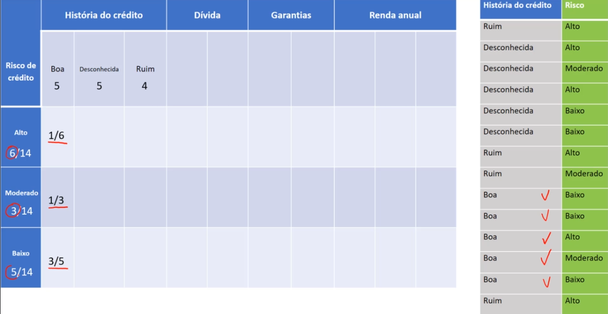
      > Dos 5 registros do risco baixo, 3 possui história do crédito boa
    > Feito isso, fazemos a soma de $1 + 1 + 3$, onde tem que dar o valor total de história boa, no caso 5
    - História desconhecida + risco alto $\rightarrow$ 2/6
    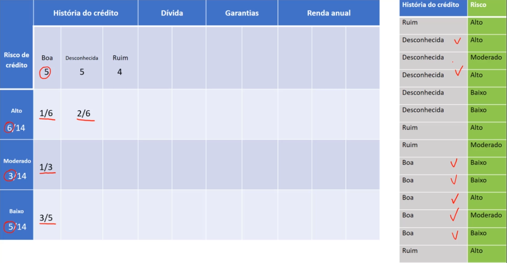
      > Dos 6 registros de risco alto, 2 deles são desconhecidos
    - História desconhecida + risco moderado
    $\rightarrow$ 1/3
    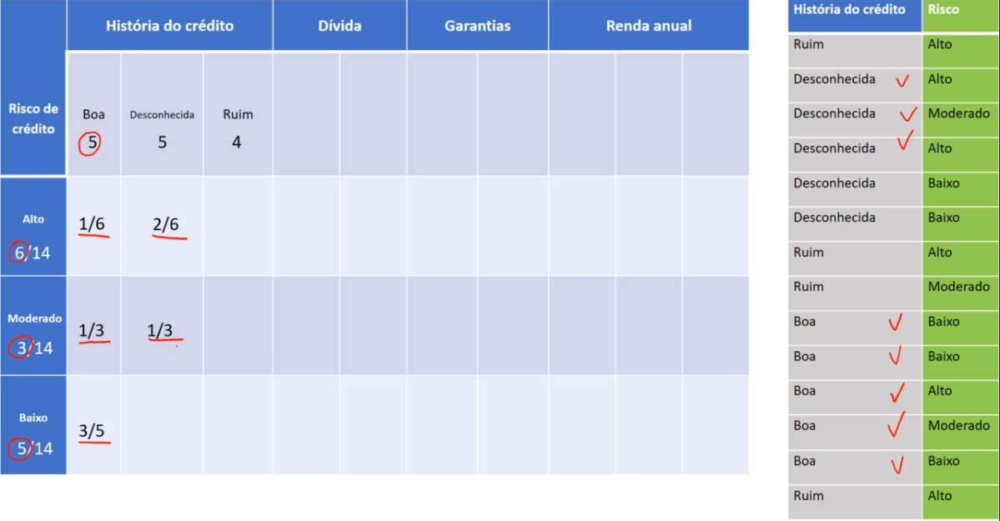
      > Dos 3 registros de risco moderado, 1 deles são desconhecidos
    - História desconhecida + risco baixo
    $\rightarrow$ 2/5
    
      > Dos 5 registros de risco baixo, 2 deles são desconhecidos
    > Fazendo o somatório de $2+1+2$, onde tem que ser igual os valor de desconhecida, no caso igual a 5
    - História ruim + risco alto $\rightarrow$ 2/6
    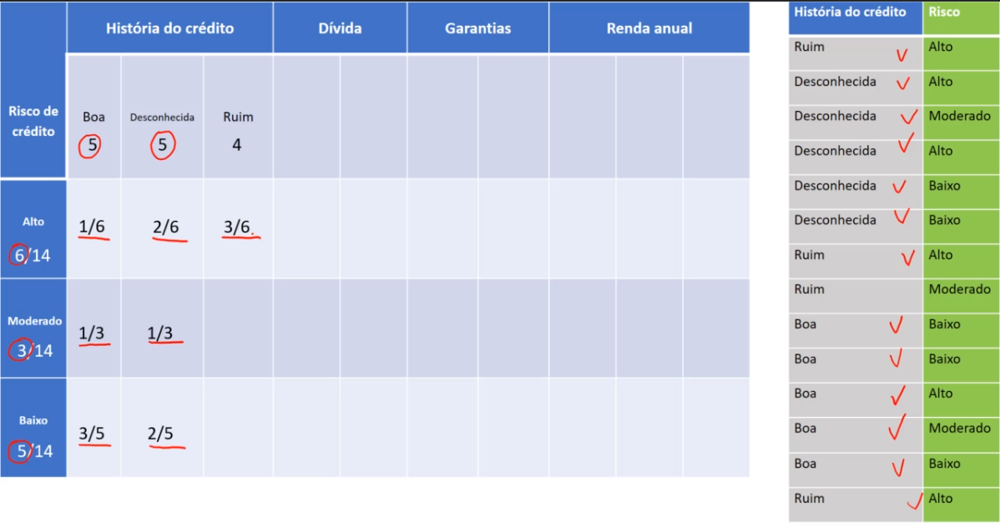
      > Note que somados as histórias boa, desconhecida e ruim, para o risco alto, temos o valor 6, o equivalente a quantidade de registros de risco alto. Dos 6 registros de risco alto, 3 deles são ruim
    - História ruim + risco moderado $\rightarrow$ 1/3
    
      > Dos 3 registros de risco moderado, 1 deles são ruim
    - História ruim + risco baixo $\rightarrow$ 0/5
    
      > Dos 5 registros de risco baixo, 0 deles são ruim

  - Agora vamos para o segundo atributo, a dívida, sendo ela, alta e baixa
    - Calculando primeiramento as dividas, temos 7 em altas e 7 em baixas
    
    - Dívida alta + risco alto $\rightarrow$ 4/6
    
    - Dívida alta + risco moderado $\rightarrow$ 1/3
    
    - Dívida alta + risco baixo $\rightarrow$ 2/5
    
    > Somando o $4+1+2$ temos 7, valor essse referente ao número de registros de dívidas altas
    - Agora vamos pegar as dívidas baixas
    - Dívida baixa + risco alto $\rightarrow$ 2/6
    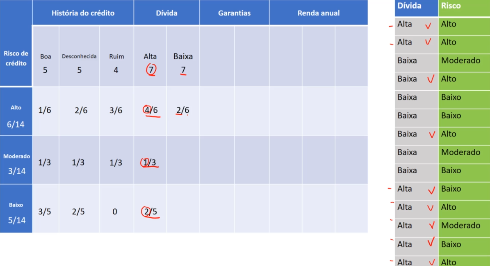
    > somando o 4 com o 2 do atributo de dívida, tem que dar 6
    - Dívida baixa + risco moderado $\rightarrow$ 2/3
    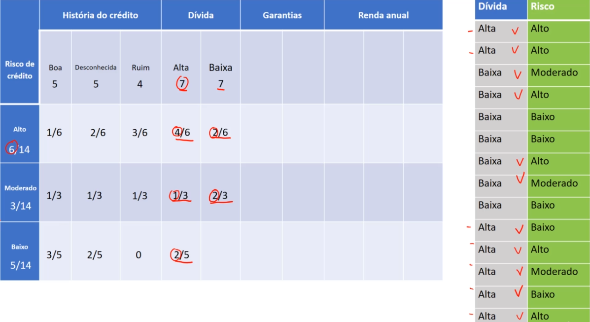
    > somando dívida alta e baixa, tem que dar 3 que corresponde ao npumero de registros de risco moderado
    - Dívida baixa + risco baixo $\rightarrow$ 3/5
    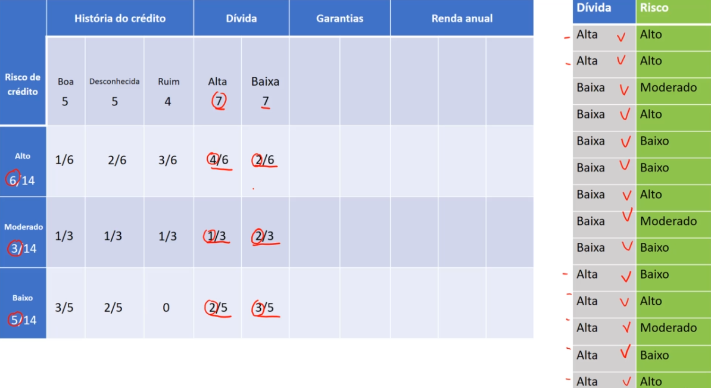
    > somando dívida alta e baixa, totaliza 5. E somando o valores do atributo dívida baixa, totaliza 7
  - Agora vamos para o terceiro atributo, as garantias, sendo ela, nenhuma e adequada
    - Calculando primeiramento as garantias, temos 11 em nenhuma e 3 em adequanda
    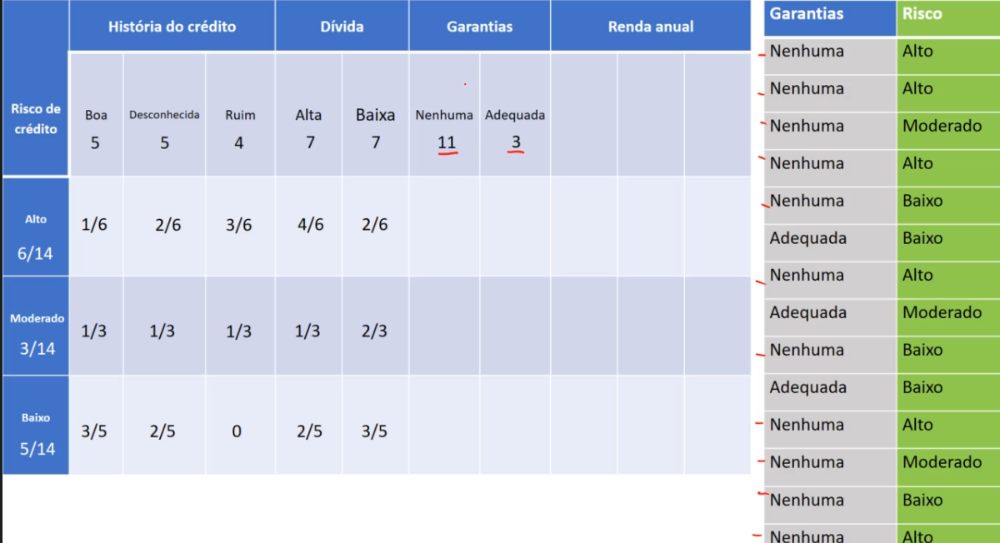
    - Garantia nenhuma + risco alto $\rightarrow$ 6/6
    
    - Garantia nenhuma + risco moderado $\rightarrow$ 2/3
    
    - Garantia nenhuma + risco baixo $\rightarrow$ 3/5
    
    > Realizamos o somatório de 6, 2 e 3 e tenha q dar o número de registros de garantia nenhuma
    - Garantia adequada + risco alto $\rightarrow$ 0/6
    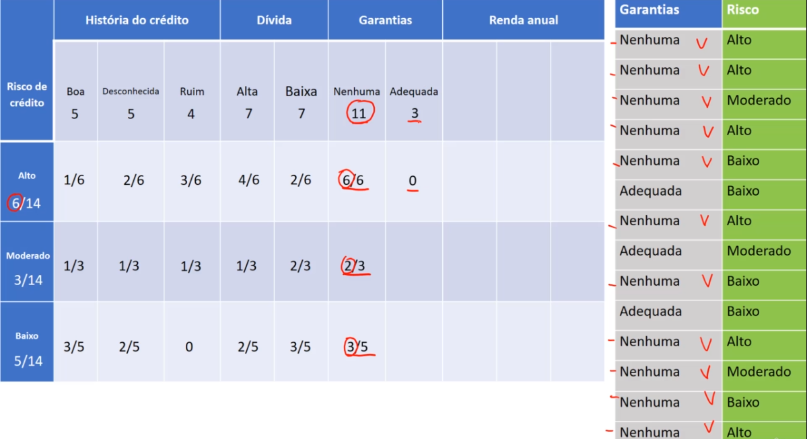
    - Garantia adequada + risco moderado $\rightarrow$ 1/3
    
    - Garantia adequada + risco baixo $\rightarrow$ 2/5
    
    > realizando o somatório temos o mesmo valor 3 do atributo agarantias adequada
  - Agora vamos para o quarto atributo, a renda anual, sendo ela, <15, >=15 <=35 e >35
    - Calculando primeiramento a renda anual, temos 3 para <15, 4 para >=15 <=35 e 7 para >35
    
    - renda < 15 + risco alto $\rightarrow$ 3/6
    
    > note que para renda inferior a 15 mil anual, todos os registros atribuidos a essa renda, se encontram em risco alto, indicando que tanto risco moderado quanto baixo, não possuem rendas inferiores a 15 mil
    - renda < 15 + risco moderado e baixo respectivamente $\rightarrow$ 0/3 0/5
    
    - renda >=15 <=35 + risco alto $\rightarrow$ 2/6
    
    - renda >=15 <=35 + risco moderado $\rightarrow$ 2/3
    
    > perceba que atingimos o valor de atributos para essa faixa de renda, nesse caso o risco baixo não possui nenhum registro nessa faixa de renda
    - renda >=15 <=35 + risco baixo $\rightarrow$ 0/5
    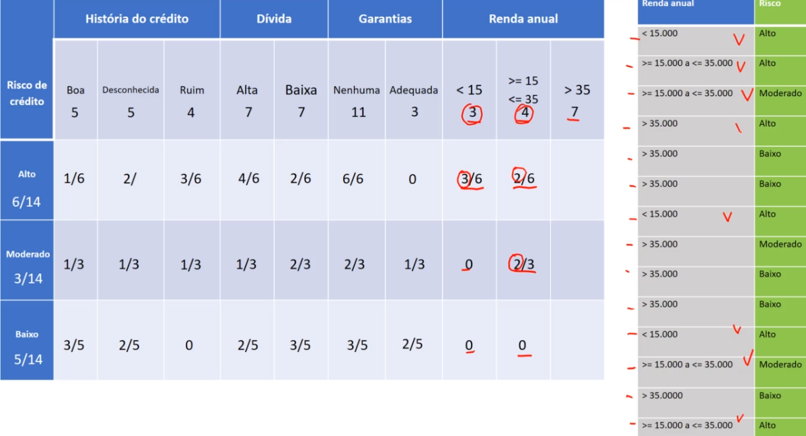
    - renda >35 + risco alto $\rightarrow$ 1/6
    
    - renda >35 + risco moderado $\rightarrow$ 1/3
    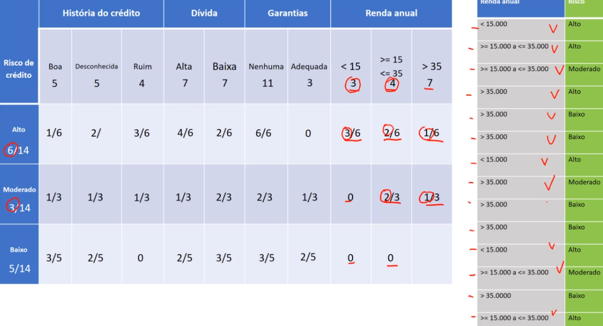
    - renda >35 + risco baixo $\rightarrow$ 5/5
    

### nossa tabela do naive bayes está pronta

> O que precisa ficar claro é que a aprendizagem de máquina nesse algoritmo é apenas isso, pegar essa tabela original e os dados históricos e ele vai fazer essas estatística básicas para montar a aprendizagem. Básicamente ele vai gerar essa tabela de probabilidade

[Continua](3%20-%20classifica%C3%A7%C3%A3o.md) $\Rightarrow$
