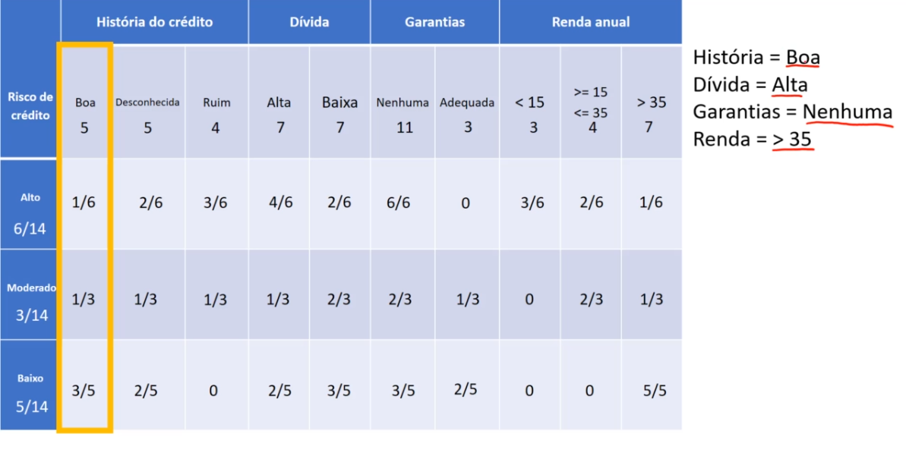

# Classificação

Vamos supor que surgiu um novo cliente, no caso um novo registro no banco de dados, e o gerente precisa saber se para gerar um emprestimo para esse novo cliente, o risco vai ser alto, moderado ou baixo. Entao foi pego os dados desse cliente

O que é preciso fazer agora é submeter esses dados para o nosso algoritmo naive bayes e ele nos dirá qual vai ser a porcentagem do risco de conceder empréstimo para esse cliente, alto moderado ou baixo, e copm isso o gerente do banco vai poder tomar a decisão do valor que ele vai conceder de empréstimo

> Lembrando que essa tabela de probabilidade é efetivamente a aprendizagem do algoritmo naive bayes, ele analisa os dados e aprende essa tabela

E o que vamos fazer é  selecionar somente as partes dessa tabela de acordo com as características desse cliente

------

- perceba que a história de crédito dele é boa, então é feita somente a seleção do atributo história do crétido sendo boa, o desconhecida e ruim não vamos utilizar

------

- Nossos novo cliente, possui uma dívida alta, por tanto, iremos selecionar apenas a característica alta do nosso atributo dívida, a dívida baixa descartamos

------

- A garantia desse nosso cliente é nenhuma, portanto selecionamso a mesma e descartamos a garantia adequada

------

- A renda é superior a 35 mil, por tanto descartamos as ontras

------

## Estimativas

Agora faremos as estimativas  de probabilidade para cada classe

1. Começaremos com a classe alto
    $P(Alto) = 6/14\; \cdot \; 1/6 \; \cdot \; 4/6 \; \cdot \; 6/6 \; \cdot \; 1/6$
    $P(Alto) = 0,0079$
    > vamos simplemente multiplicar cada uma das probabilidade, e esse valor indica o risco de crédito ser alto para esse cliente, mas não podemos tomar uma decisão ainda, pois precisamos fazer as estimativas para o moderado e o risco baixo
2. Calculamos a estimativa do risco moderado
    $P(moderado) = 3/14\; \cdot \; 1/3 \; \cdot \; 1/3 \; \cdot \; 2/3 \; \cdot \; 1/3$
    $P(moderado) = 0,0052$

3. Calculamos a estimativa do risco baixo
    $P(baixo) = 5/14\; \cdot \; 3/5 \; \cdot \; 2/5 \; \cdot \; 3/5 \; \cdot \; 5/5$
    $P(baixo) = 0,0514$

------

## Comparação

Agora vamos comparar os 3 valores:

Note que a probabilidade do risco ser baixo é maior. Então quer dizer que esse novo cliente com essas características, quando ele chegar no banco, jogamos esses dados para o sistema/ algoritmo, e vamos então classificar o risco de empréstimo para ele como baixo

Como o risco foi baixo, o cliente pode facilmente solicitar 10 mil e o banco vai liberar, ou até mesmo poder oferecer 15 ou 20 mil para esse cliente, pois ele tem uma tendência grande de pagar, mas considerando que o risco dele tenha sido moderado ao invés de baixo, a atitude do banco seria de liberar apenas 7 mil, pois já estamos lidando com um risco moderado e no caso de um risco alto, podemos dizer que seria apenas liberado 2, 3 mil

Geralmente é isso que acontece quando é solicitado um empréstimo ao banco, por trás dos panos, ta rodando um algoritmo que fará os cálculos estatístico, onde irá dizer quanto que você vai ganhar do empréstimo, baseado no risco

## Porcentagem

Vamos realizar a transformação em porcentagem desses valores, para isso somamos as 3 porcentagems atribuida aos riscos, e assumimos que é equivalente a 100%

Soma: $0,0079 + 0,0052 + 0,0514 = 0,0645$

> **0,0645** equivale a 100%

Agora para calcular a porcentagem é muito simples

$P(Alto) = 0,0079/0,0645 \; \cdot \; 100 = 12,24$ **%**

$P(Moderado) = 0,0052/0,0645 \; \cdot \; 100 = 8,06$ **%**

$P(Baixo) = 0,0514/0,0645 \; \cdot \; 100 = 79,68$ **%**
