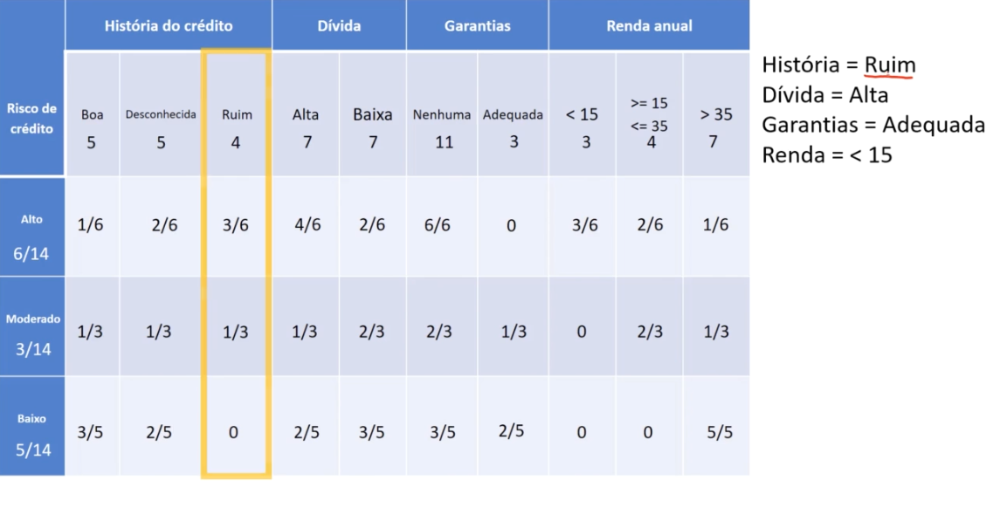
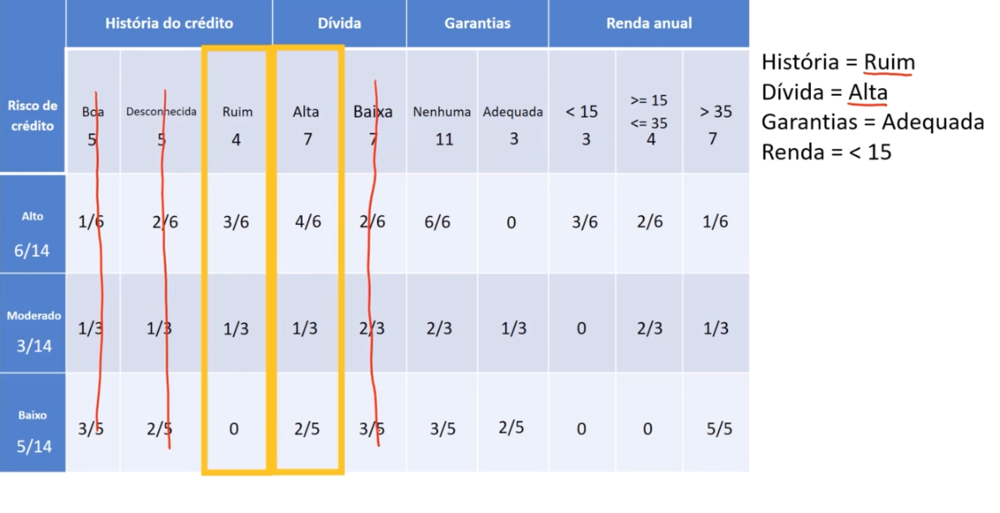
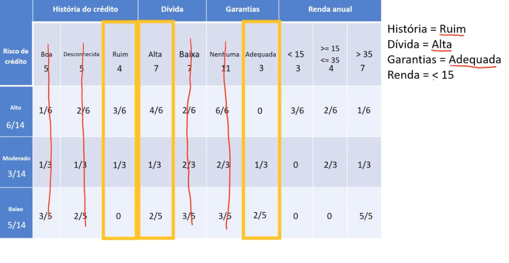
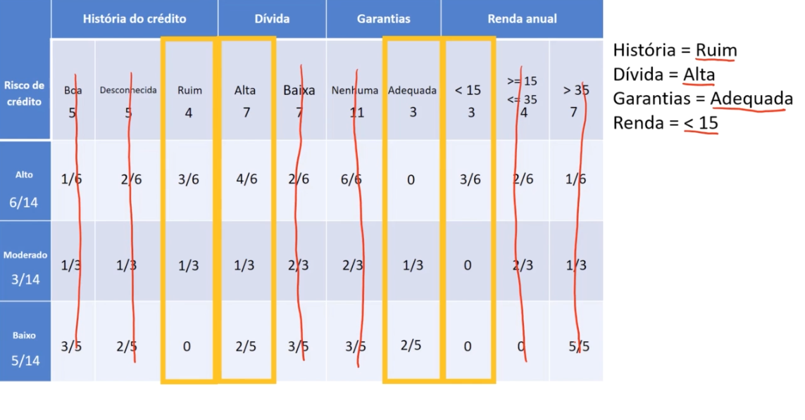
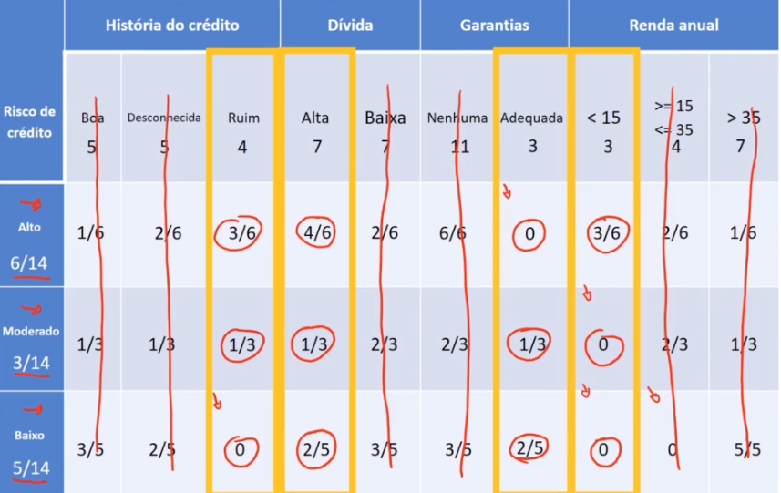
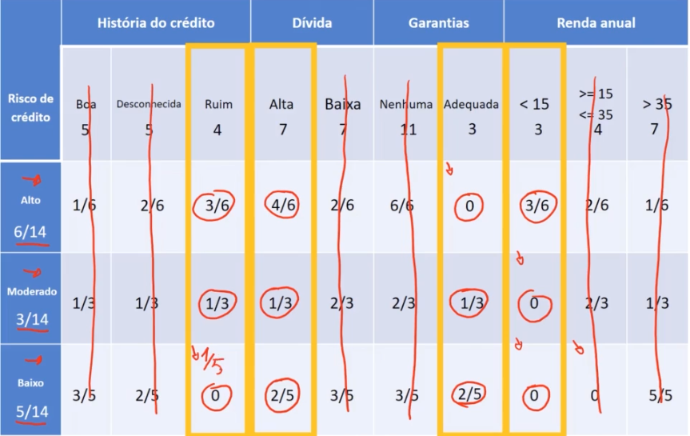
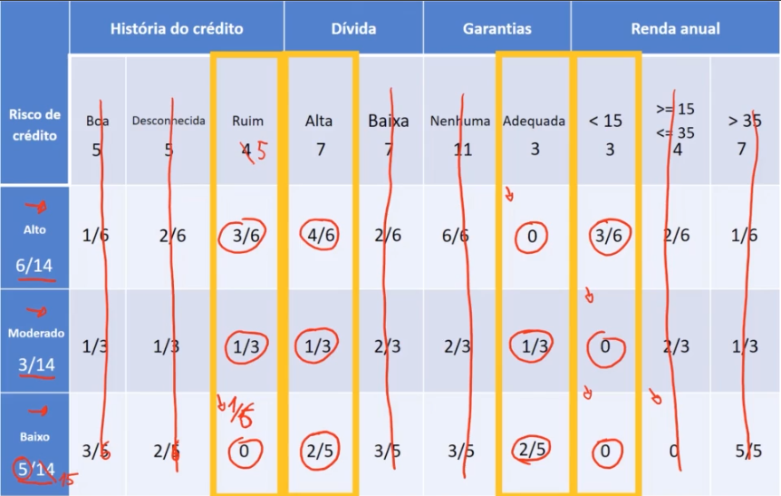

# Correção laplaciana

Veremos um novo exemplo, onde chega um novo cliente no banco, onde possuim uma história de crédito ruim

---

- selecionamos somente a característica ruim do atributo história de crédito, excluindo assim a história de crédito boa e desconhecida.

---

- A dívida é alta, portanto excluimos a dívida baixa

---

- A garantia é adequada, por tanto tiramos nenhuma garantia

---

- A renda anual é menor qu 15 mil, por tanto excluimos as demais opções

---

## Estimativas

- Agora para estimarmos, pegamos as probabilidades de risco alto, moderado e baixo

1. Risco alto

    $P(Alto) = 6/14 \cdot 3/6 \cdot 4/6 \cdot 0 \cdot 3/6$

    $P(Alto) = 0,0$

2. Risco moderado

    $P(Moderado) = 3/14 \cdot 1/3 \cdot 1/3 \cdot 1/3 \cdot 0$

    $P(Moderado) = 0,0$

3. Risco baixo

    $P(Baixo) = 5/14 \cdot 0 \cdot 2/5 \cdot 2/5 \cdot 0$

    $P(Baixo) = 0,0$

> note que nos trÊs casos resultou em zero, e devido a isso não tem como classificar a qual classe esse cliente pertence, pois deu tudo zero. Para esses casos temos um artifício desse algoritmo que é chamado da **Correção Laplaciana**

## Correção Laplaciana

- É utilizado justamente para essa bases de dados menores, para caso tenha valores zerados, Ele vai precisar fazer uma correção, para adicionar um novo registro e para não dar essas multiplicações por zero
- O que ele fará é adicionar um novo registro

- no atributo história de crédito, para o risco baixo, note que não temos nenhum registro, está com o valor zerado. Então quer dizer que precisamos acionar mais um registro aqui

---

- para esse registro vamos ta adicionando 1/5

> Lembrando que o número 5 é da quantidade de riscos baixo

---

- Como foi adicionado um novo registro, então temos que atualizar todos os demais.
- O risco baixo onde era 5/14, vai passar a valer 6/15, como demostrado na tabela

atributos  |  valor | valor atualizado
-----------|--------|------
Risco de crédito(Baixo) | 5/14  | 6/15
Hist. de crédito(Boa) | 3/5   | 3/6
Hist. de crédito(Desconhecida) | 2/5   | 2/6
Hist. de crédito(Ruim) | 0     | 1/6
Dívida(Alta) | 2/5   | 2/6
Dívida(Baixa) | 3/5   | 3/6
Garantias(Nenhuma) | 3/5   | 3/6
Garantias(Adequada) | 2/5   | 2/6
Renda anual(<15) | 0     | 1/6
Renda anual(>15 <=35) | 0     | 1/6
Renda anual(>35) | 5/5   | 5/6

---

- e onde ruim que tinha uma quantidade de 4, passa a valer 5, pois foi onde adicionamos um registro

> Realizando o somatório do atributo história do crétido, na característica ruim, note que vai dar 5, no lugar de 4, por isso atualizamos também esses valores

---

Então essa correção Laplaciana, vai adicionar quantos registros forem necessários na base de dados, para que não aconteça essas multiplicações por zero

> isso será feito para todos os registros zerados, então os valores adicionados na base de dados, vão influenciar nos cálculos da [probabilidade](#estimativas), pois também teram valores alterados devido as adições. Por isso o ideal a se fazer, é adicionar todos os novos registros na base de dados, pra só depois então contruir a tabela de probabilidade e realizar as estimativas.

Analisando um cenário com uma base de dados pequena e uma outra grande, no cenário com a base de dados pequena, essa correção laplaciana, adicionando um registro, com certeza irá influenciar nos resultamos, porém quando tratamos de base de dados grandes, com 15, 30 mil registros, a adição de um novo registro, nos cálculos de probabilidade, essas multiplicações não trará muita diferença.

[Continua](5%20-%20mais%20conceitos.md) $\Rightarrow$
