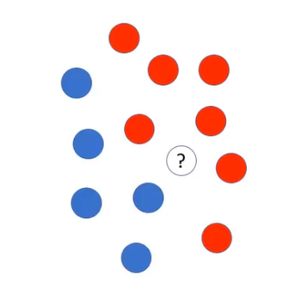
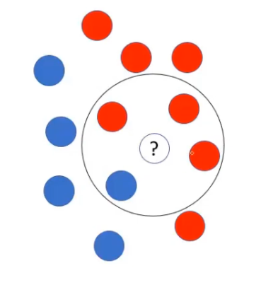

# Mais conceitos

## aprofundamento da teoria do algoritmo Naive Bayes

- Vamos supor que temos esses pontos, que demostram 2 classes, vermelha e azul. Nosse temos um ponto, onde não sabemos a quem pertence
- Precisamos então realizar as estimativas de probabilidade, as multiplicações, para que possa ser feita a previsão se o ponto, será vermelho ou azul

Temos então a probabilidades desse ponto:

$P(vermelho) = 7/12$

$P(azul) = 5/12$

> O Naive Bayes, possui várias implementações que tem um parâmetro chamado **Radius**

- **Radius**, nada mais é que o raio. Onde sua função é pegar os pontos que estão dentro desse raio, pontos mais próximos.

- Realizando a função **radius**, ele vai centralizar o ponto ao qual queremos descobrir a qual classe pertence, e dentro desse raio estaram os pontos mais próximos a ele.

- Feito isso agora é possível realizar a estimativa de probabilidade

$P'(vermelho) = 3/7$
> 3 se refere a quantidade de elementos que estão dentro do raio, e o 7 se refere a quantidade total de pontos vermelhos

$P'(azul) = 1/5$
> O mesmo vale para aqui, 1 ta se referindo a quantidade de elementos que está dentro do raio, e 5 se refere a quantidade total de elementos azuis

---

## Probabilidades a priori

$P(vermelho) = 7/12$

$P'(vermelho) = 3/7$

$P(azul) = 5/12$

$P'(azul) = 1/5$

Essas probalilidades são chamada de **Probabilidades a priori**

Onde seu significado indica, que já conhece com antecedência, somente analisando a base de dados, consegui-se chegar a essas [conclusões](#probabilidades-apriori)

---

## Estimativas

Agora vamos estimar o P", onde será o resultado final

- vamos começar calculando a probabilidade de ser vermelho:

$P"(vermelho) = 7/12 \cdot 3/7 = 21/84 = 0,25$
> pegamos 7/12, que é a probabilidade de ser vermelho e multiplicamos por 3/7, onde é a probabilidade dentro desse raio, seu resultado é 21/84, que é o mesmo que 0,25.

- Agora vamos fazer a estimativa da probabilidade de ser a classe azul:

$P"(azul) = 5/12 \cdot 1/5 = 5/60=0,08$
> pegamos 5/12, que é a probabilidade dele ser azul e multiplicamos por 1/5, que é a probabilidade de dentro do raio.

perceba que tivemos uma estimativa maior para o ponto ser vermelho e por tanto será classificada com a cor vermelha

---

## Probabilidades a posteriori

$P"(vermelho) = 7/12 \cdot 3/7 = 21/84 = 0,25$

$P"(azul) = 5/12 \cdot 1/5 = 5/60=0,08$

Essas probalilidades são chamada de **Probabilidades a posteriori**

Por tanto se usa a probabilidade a priori, que são os dados que já conhecemos, para calcular a probabilidade a posteriori. Ele é o resultado final da classificação.

## Vantagens X desvantagens

veremos as vantagens e desvantagens do algoritmo naive bayes:

- Vantagens:
  - Rápido
    - comparado com redes neurais, com SVM, em montar essa tabela de probabilidades, ele é bastante rápido, e não requer muito esforço computacional
  - Simplicidade de interpretação
    - É muito fácil realizar as estimativas de probabilidade, baseado nos valores da tabela da aprendizagem
  - Trabalha com altas dimensões
    - Altas dimensões, significa, com muitos atributos, possui um bom desempenho e consegue de certa forma generalizar bem e aprender bem, utilizando vários atributos
  - Boas previsões em bases pequenas 
    - Consegue também, realizar boas previsões em bases de dados pequenas, quando falamos pequena, não significa usar uma base de dados de 14 registros, mas sim uma com 200, 300 ou 400 registros
- Desvantagens:
  - Combinação de características(atributos independentes) - cata par de características são independentes - nem sempre é verdade
    - ele considera os atributos independentes, assumindo assim, que não há nenhuma correlação entre os atributos

> Esse algoritmo tem um desempenho bem interesante em tarefas de classificação de textos

[Continua](6%20-%20base%20risco%20de%20cr%C3%A9dito.md) $\Rightarrow$
