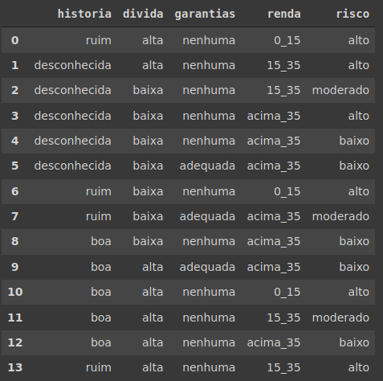
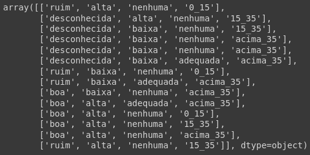
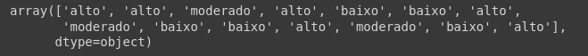
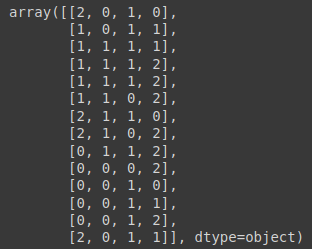
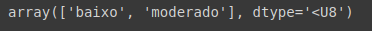
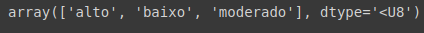
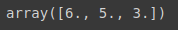
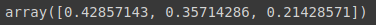

# Base risco de crédito

## Importando naive Bayes e base de dados

- Começamos com a importação do algoritmo naive bayes:

    ```python
    from sklearn.naive_bayes import GaussianNB
    ```

> GaussianNB, é o nome de uma distribuição estatística, que é chamada da dristribuição normal. Ele é mais usado para problemas genéricos.

---

- Importamos a base de dados risco de crédito:

    ```python
    base_risco_credito = pd.read_csv('/content/risco_credito.csv')
    ```

- Visualizamos:

    ```python
    base_risco_credito
    ```

    

    > Lembrando que vamos prever o risco de conceder empréstimo para um determinado cliente.

- Feito isso, agora iremos para o pré-processamento, começando pela separação dos dados, em previsores e classe.

## Pré-processamento

1. Primeira etapa, divisão da base de dados.

    - Começamos pelos previsores:

        ```python
        X_risco_credito = base_risco_credito.iloc[:, 0:4].values
        X_risco_credito
        ```

        
        > Lembrando que quando usamos intervalos na função iloc, o final do nosso intervalo não está incluso, nesse caso temos um conjunto(0,1,2,3).
    - Agora pegamos a nossa classe, ou target:

        ```python
        y_risco_credito = base_risco_credito.iloc[:, 4].values
        y_risco_credito
        ```

        

    > Note que temos muitas variaveis categoricas to tipo string.

    - Finalizada essa primeira etapa do pré-processamento, agora é preciso transformar as variaveis categoricas em variaveis numéricas.

    ---

2. Segunda etapa, transformar variaveis categoricas em variaveis numéricas.

    Para isso vamos importar o `LAbelEncoder`:

    ```python
        from sklearn.preprocessing import LabelEncoder

        label_encoder_historia = LabelEncoder()
        label_encoder_divida = LabelEncoder()
        label_encoder_garantia = LabelEncoder()
        label_encoder_renda = LabelEncoder()
    ```

    Realizada as importações efetuamos as transformações, utilizando o método `fit_transform`:

    ```python
        X_risco_credito[:, 0] = label_encoder_historia.fit_transform(X_risco_credito[:, 0])
        X_risco_credito[:, 1] = label_encoder_divida.fit_transform(X_risco_credito[:, 1])
        X_risco_credito[:, 2] = label_encoder_garantia.fit_transform(X_risco_credito[:, 2])
        X_risco_credito[:, 3] = label_encoder_renda.fit_transform(X_risco_credito[:, 3])
    ```

    Agora vamos visualizar os nossos previsores:

    

    > note que foi realizada a transformação de categoricos em numéricos.

    Como essa base de dados é muito pequena, não vamos aplicar o `OneHotEncoder`, justamente pelo fato de que nós teriamos que adicionar varias outras colunas.

---

## Salvando dados

Agora vamos importar o `pickle`, ele é responsável por salvar nossos previsores e classe:

```python
import pickle
with open('risco_credito.pkl', 'wb') as f:
  pickle.dump([X_risco_credito, y_risco_credito], f)
```

> Realizamos a importação do `pickle`, e salvamos nossos previsores e classe.

---

## Treinamento

Vamos agora efetivamente realizar o treinamento do nosso algoritmo:

```python
naive_risco_credito = GaussianNB()
naive_risco_credito.fit(X_risco_credito, y_risco_credito)
```

> O método `fit`, que vai efetivamente gerar a tabela de probabilidades.

Treinamento concluido, próximo passo é realizar as provisões, para isso vamos pegar os dois exemplos utilizados, o primeiro cliente usado como exemplo, foi da [classificação](3%20-%20classifica%C3%A7%C3%A3o.md) e nosso segundo cliente que vamos utilizar que também foi nosso exemplo teórico, foi da [correlação laplaciana](4%20-%20corre%C3%A7%C3%A3o%20laplaciana.md).

mas por fins didáticos, vamos coloca as características de cada  novo cliente aqui, com o intuito de facilitar a compreenção:

Clientes | história | dívida | garantia | renda
---------|---------|---------|---------|---------
Cliente 1 |  boa |  alta | nenhuma |  > 35
Cliente 2 |  ruim | alta | adequada | <15

Entendido isso, vamos realizar nossa previsão.

para isso, precisamos entender a correlação feita pelo `LabelEcoder`, descobrir para cada característica, qual número foi atribuido. Basta visualizar a ordem dos atributos de antes do `LabelEncoder`.


Podemos então criar uma tabela para simplificar a visualização:

Clientes | história | dívida | garantia | renda
---------|---------|---------|---------|---------
Cliente 1 |  0 |  0 | 1 |  2
Cliente 2 |  2 |  0 | 0 |  0

Agora vamos realizar a previsão com esse valores, passamos os dois novos clientes, para a função predict.

```python
previsao = naive_risco_credito.predict([[0,0,1,2],[2,0,0,0]])
```

E por fim, visualizamos o resultado.

```python
previsao
```



> note que para nosso primeiro cliente ele recebeu um risco baixo, e nosso segundo cliente risco moderado, assim como em nossa teoria.

## Alguns recursos a mais

- Podemos aqui visualizar as classes:

    ```python
    naive_risco_credito.classes_
    ```

    

- Podemos visualizar a contagem de quantas classes temos:

    ```python
    naive_risco_credito.class_count_
    ```

    

- Podemos visualizar as probabilidades do a priori:

    ```python
    naive_risco_credito.class_prior_
    ```

    

    > Os registros da classe alto que possuem a quantidade de 6 registros, representao 42% da base de dados, os registros da classe baixo, com 5 registros, representam 35% da base de dados, e a classe moderado com 3 registros, representa 21% da base de dados

[Continua](7%20-%20base%20cr%C3%A9dito.md) $\Rightarrow$
