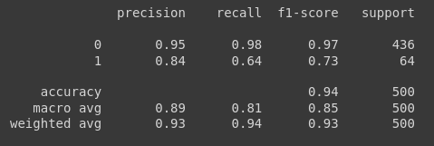

# Base Crédito

Primeiramente precisamos importar o base de dados, para isso vamos pegar a base que já realizamos o pré-processamento e salvamos com o pickle

abrimos o arquivo seu nome que foi salvo e a extensão pkl, e o segundo parâmetro é de leitura do arquivo, `rb`. Feito isso definimos nossos previsores treinamento e teste e o mesmo com a classe.

```python
with open('credit.pkl', 'rb') as f:
  X_credit_treinamento, y_credit_treinamento, X_credit_teste, y_credit_teste = pickle.load(f)
```

Vamos visualizar o formado das nossas variaveis, utilizamos o `shape`:

```python
X_credit_treinamento.shape, y_credit_treinamento.shape
```


```python
X_credit_teste.shape, y_credit_teste.shape
```


Agora vamos realizar o treinamento do algoritmo

```python
naive_credit_data = GaussianNB()
naive_credit_data.fit(X_credit_treinamento, y_credit_treinamento)
```

Terminado o treinamento vamos realizar as previsões

```python
previsoes = naive_credit_data.predict(X_credit_teste)
previsoes
```


Vamos comparar com a classe, os valores reais, e ver se as previsões foram boas


Para que possa ser feita uma comparação melhor e não ter que ficar analisando número por número, vamos importar algumas funções:

```python
from sklearn.metrics import accuracy_score, confusion_matrix, classification_report
```

Vamos utilizar o `accuracy_score`, ele vai nos mostrar quanto de acertividade nosso algoritmo tem

```python
accuracy_score(y_credit_teste, previsoes)
```


> tivemos uma accuracy de 93% ...

Vamos gerar uma matrix de confusão e analisar onde tivemos mais e menos acertos

```python
confusion_matrix(y_credit_teste, previsoes)
```


> Note que temos duas linhas e duas colunas, as quais se referem a paga a dívida e não paga a dívida, a primeira linha temos quem paga as dívidas e foram classificadas corretamente 428 e 8 dos que deveria ter sido classificado com paga dívidas, foram classificados com não pagam a dívida, já para segunda linha, são os que não pagam a dívida, foram classificados corretamente os que não pagam a dívida 41 e 23 que deveriam ter sido classificados como não pagam a dívida, foram classificados como quem paga a dívida

Para termos uma visualização ainda melhor sobre essas informações, vamos gerar um gráfico, para isso vamos utilizar o `ConfusionMatrix` do `pacote yellowbrick`, começamos importando-o:

```python
from yellowbrick.classifier import ConfusionMatrix
cm = ConfusionMatrix(naive_credit_data)
cm.fit(X_credit_treinamento, y_credit_treinamento)
cm.score(X_credit_teste, y_credit_teste)
```


> note que temos a accuracy de nosso algoritmo e temos onde ele acertou e onde errou, seguimos o mesmo padrão do `confusion_matrix` anterior. 428 foram classificados corretamente, coluna e linhas 0, 8 foram classificados incorretamente, coluna 1 e linha 0, 23 foram classificados incorretamente, coluna 0 linha 1, e 41 foram classificados corretamenteo colinha e linha 1

Vamos analisar mais dados com o `classification_report`, do pacote `sklearn.metrics`.

Vamos fazer um print utilizando o `classification_report`:

```python
print(classification_report(y_credit_teste, previsoes))
```



> Vai ser retornado algumas métricas com a precisão, recall, f1-score, temos o accuracy, que são os mesmos valores que calculamos anteriormente

- Observando o **support**, nessa base de dados teste, temos 436 registros que pagam e 64 registros que não pagam

- O **recall**, pode ser interpretado como o algoritmo consegue identificar corretamente 98% dos clientes que pagam o empréstimo e quando o algoritmo identifica um cliente que paga o empréstimo, ele tem uma precisão de 95% de acerto, isso indica que o algoritmo tem um ótimo desempenho para identificar pessoas que pagam o empréstimo, porém, ele não é tão bom assim para identificar as pessoas que não pagam o empréstimo. O algoritmo consegue identificar corretamente, somente 64% dos registros que não pagam e com uma precisão de 84%, o que que dizer que 84% dos casos onde ele identifica um cliente que não paga, ele acerta.

[Continua](8%20-%20base%20censo.md) $\Rightarrow$
