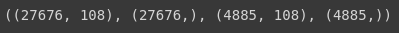
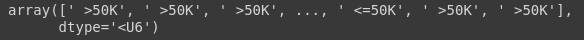
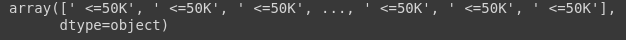
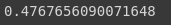
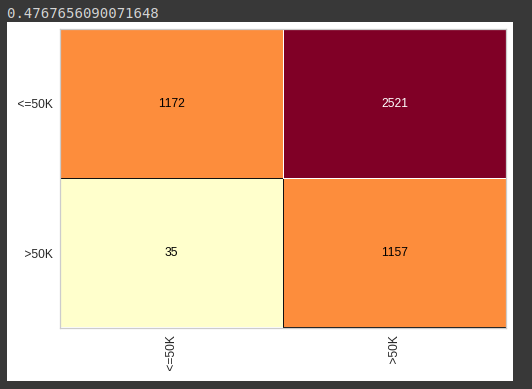
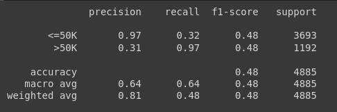

# Base census

Vamos começar importanto o arquivo pkl gerado [anteriormente](machineLearning/algoritmos/Classificação/Documentacao/2 - censo-data/7 - Salvar as bases de dados.md).

Para isso importamos o pickle, e fazemos uma leitura do arquivo desejado usando o parâmetro `rb`, e criamos as variaveis necessárias:

```python
import pickle
with open('census.pkl', 'rb') as f:
  X_census_treinamento, y_census_treinamento, X_census_teste, y_census_teste = pickle.load(f)
```

Feito isso, analisamos o shape das variaveis previsores e classe, verificando se foi carregada corretamente:

```python
X_census_treinamento.shape, y_census_treinamento.shape, X_census_teste.shape, y_census_teste.shape
```



Verificado, vamos agora criar o algoritmo naive bayes:

- Vamos fazer o treinamento, com o `.fit`
- e realizar as previsoes, com o `.predict`

```python
naive_census = GaussianNB()
naive_census.fit(X_census_treinamento, y_census_treinamento)
previsoes = naive_census.predict(X_census_teste)
previsoes
```



Vamos comparar com nossa classe, que são nossas respostas reais e analisar os resultados:



> Note que olhando os valores listados, temos muito erro de classificação do nosso algoritmo

Vamos então calcular o accuracy, que é a taxa de acerto:

```python
accuracy_score(y_census_teste, previsoes)
```



> Note que temos um percentual de acerto bem baixo, com somente 47%, e para avaliarmos esse resultado, podemos verificar que nesse estudo de caso, existe somente duas classe, ou seja, maior que 50 ou menor que 50, accuracy, a taxa de acerto desse algoritmo é menor do que 50%. Logo era mais fácil, jogar uma moeda e decidir no cara ou coroa as classes. E possível ter uma melhoria no accuracy, se não realizar o escalonamento, chegando aproximadamente 70%

Vamos criar a matrix de confusão, para termos mais algumas informações, do comportamento do algoritmo

```python
cm = ConfusionMatrix(naive_census)
cm.fit(X_census_treinamento, y_census_treinamento)
cm.score(X_census_teste, y_census_teste)
```



> Note que ele ta errando bastante, as pessoas que ganham mais do que 50 mil, estão sendo classificas em suam maioria como que ganham menos que 50 mil, porém note que não se aplica para a classificação dos menor que 50 mil, temos um acerto muito maior para identifica-los, de 1157 acertos para 35 erros

Vamos agora visualizar o `classification_report`:

```python
print(classification_report(y_census_teste, previsoes))
```



> É interessante fazer essa analise quando temos dados desbalanceados, note que temos a classe que recebe acima de 50 mil  é quase que três vezes maior que a quantidade de registros da classe menor que 50 mil

Vamos realizar uma analise do recall e do precision:

- O algoritmo consegue identificar 97% dos registros que ganham mais do que 50 mil, e quanto ele identifica esses registros, a precisão é de 31%, com relação a outra quase, onnde errou bastante, temos 32% dos registros que o algoritmo conseguiu identificar corretamente, porém qando ele consegue identifica-lo a sua precisão é de 97%.
