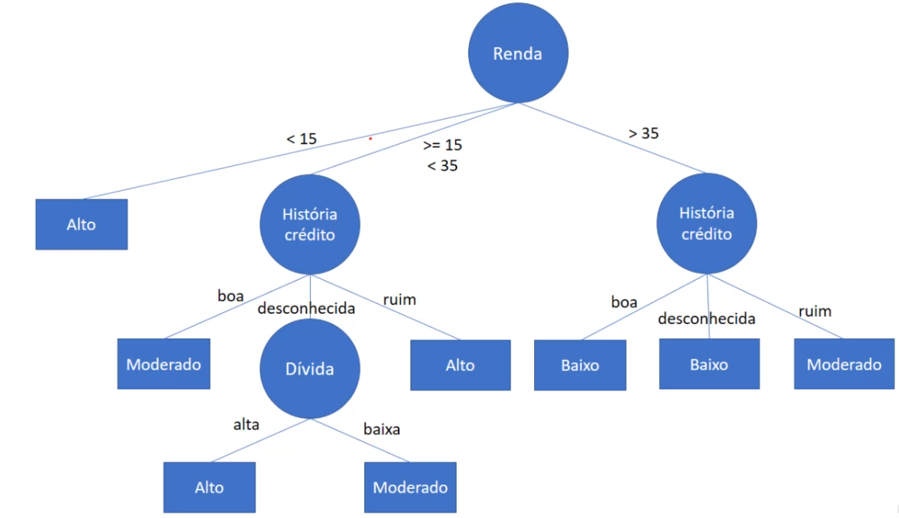
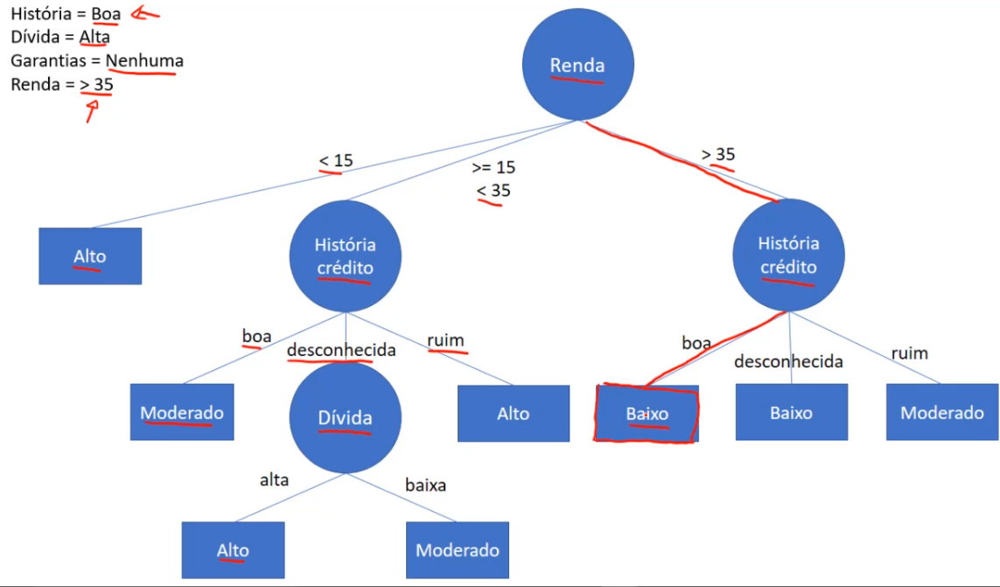
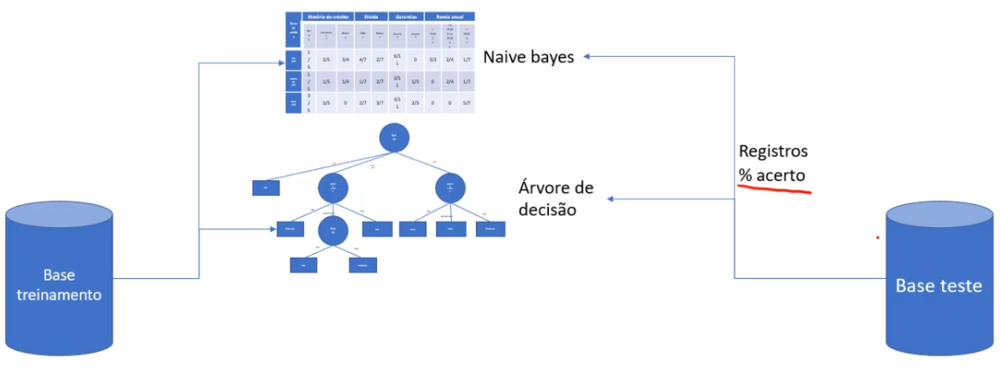

# Árvore de decisão

Daremos início ao entendimento teórico do funcionamento do algoritmo de árvore de decisão.

O algoritmo funciona da seguinte maneira:

- Ele vai analisar a base de dados original, e como o nome do algoritmo já indica, ele vai gerar uma árvore de decisão.
- Note qu eos atributos estão com o contorno circular, e perceba que qm cada um dos ramos da árvore, temos os valores, como é o caso da renda, onde ela pode ser < 15, >=15 <35 e >35.
- Perceba qndo ele vai para história de crédito, ele tem os valores, boa, desconhecida e ruim. Que é conforme temos na base de dados.
- Note os retangulos, nós teos os valores da classe, Alto, Moderado e Baixo.

> Então o objetivo desse algoritmo é fazer a leitura da base de dados histórica, e construir uma árvore de decisão conforme pode ser notado na imagem.

E caso queira classificar um novo registro:

- Temos uma pessoa que acabou de chegar no banco, e a sua história de crédito é boa, sua dívida é alta, não há garantias e a renda é maior que 35 mil.
- Então o que faremos é pegar esses dados da pessoa e submeter a essa árvore de decisão
- Note que pegando a renda dessa pessoa, temos uma renda maior que 35, portanto ele segue o ramo mais a direita da renda, indo para a história de crédito, que por sua vez a dessa pessoa é boa, por tanto temos uma classificação de risco **Baixo**

> Quer dizer que uma pessoa com essas características, realizando o percorrimento da árvore, o risco de conceder empréstimo para essa pessoa vai ser **baixo**, e é dessa maneira que funciona a classificação, quando se trabalha com árvores de decisão, simplismente pega os atributos e vai percorrendo a árvore.

Perceba qua nesse registro ele não usou o valor da dívida, ele só vai usar o valor da dívida, quando a renda for entr 15 a 35 mil, ai ele verifica a história de crédito e se for desconhecida, só ai então ele analisa o valor da dívida.

> Note que para esse registro, nem a dívida nem as garantias foram usadas para classificar-lo, e incluseve as garantias nem aparecem nessa árvore de decisão, e isso significa que, ao algoritmo realizar a aprendizagem para gerar a árvore de decisão, ele chegou à clonclusão de que esse atributo não tem importancia para realizar a classificação. Por isso que **nesse exemplo**, ele não entrou na árvore de decisão

Temos mais um novo registro para classificar:

- História ruim, dívida alta, garantias adequada e renda menor que 15
- Como em nossa árvore a renda é o valor principao, entao sempre vamos começar por ela, note que pelo fato da renda ser menor que 15, ele já é classificada como risco de conceder empréstimo alto, independente de suas outras características

> Perceba que ele não usou a história de crédito, nem a dívida e nem as garantias, baseado nessa árvore de decisa ele só vai verificar a renda e se a renda for menor que 15 mil, ele já vai categorizar como risco alto.

Agora uma questão importante, é como que na estrutura da árvore de decisão, o valor renda foi definido na raiz da árvore e toda sua estrutuda senguinte. Existem vários cálculos que são feito em seu treinamento, e o mesmo é efetifamente para se encontrar essa ordem.

E para contextualizar esse processo de aprendizagem de máquina, temos uma base de dados de treinamento, analisamos essa base de dados, e no algoritmo naive bayes, é gerada uma tabela de probabilidade, em um algoritmos de árvore de decisão, gera-se uma árvore. E quando queremos realizar testes de avalização desses algoritmos, precisamos de uma base teste, onde pegamos esses registros da basa de dados e submetemos para a tabela de probabilidade naive bayes e para a árvore de decisão e o que teremos de resposta é o percentual de acerto

> Desse jeito conseguimos realizar um comparativo entre cada um dos algoritmos, com base em sua accuracy

[Continua](2%20%20-%20Aprendizagem%20I.md) $\Rightarrow$
