# Aprendizagem I

Vamos aprender como funciona o processo de treinamento ou da geração de uma árvore de decisão, por meio de uma base de dados

> Conforme foi visto [aqui](1.1%20-%20%C3%81rvores%20de%20decis%C3%A3o%20-%20introdu%C3%A7%C3%A3o.md), o objetivo desse algoritmo de árvore de decisão é fazer a leitura de uma base de dados original e gerar uma árvore de decisão, onde se coloca os atributos ordenados por grau de importância. E para classificar um novo registro, será analisado cada um dos atributos e vai seguindo os ramos da árvore de acordo com suas características

---

## Construção da árvore de decisão

Para essa construção, possuimos duas fórmulas matemáticas

- Primeiro temos o cálculo da entropia:

    $Entropy(S) = \sum_{i=1}^{c} -p_i\log_2p_i$

- Segundo temos a fórmula do ganho de informação:

    $Gain(S,A) = Entropy(S) - \sum_{v\epsilon Values(A)} \frac{|S_v|}{|S|}Entropy(S_v)$

> Essa é a abordagem mais comum que se pode encontrar sobre árvore de decisão. Realizar o cálculo dos atributos, então, analisar atributo por atributo, para descobrir qual deles é mais importante, se utilizando das dusa fórmulas

---

### Entropy

Vamos inicialmente realizar um cálculo de entropia, para minha base de dados inteira, note que pegamos apenas a classe, onde temos o risco alto, moderado e baixo

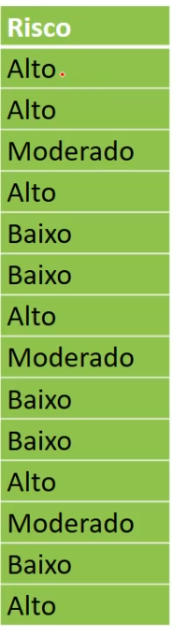

- Risco Alto
  - Vamos então contar quantas fezes aparecem o risco alto

  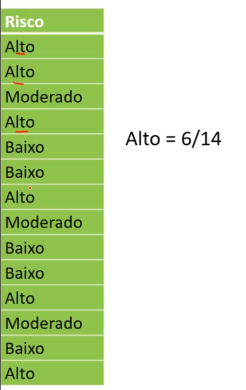

  > Temos 6 de 14, 14 é nosso total de registros

- Risco Moderado
  
  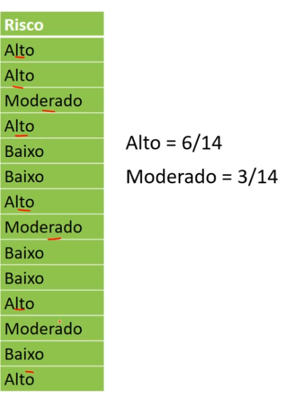

  > temos 3 de 14

- Risco Baixo

  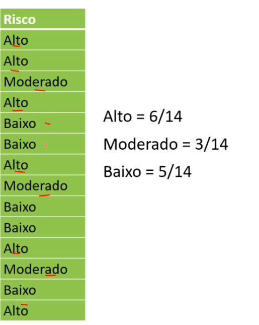

  > Temos 5 de 14

---

Realizada a contagem, o que é preciso fazer agora é o cálculo da entropia

$Entropy(S) = \sum_{i=1}^{c} -p_i\log_2p_i$

> Basicamente ele vai medir, o qual desorganizado os dados então na base de dados. E essa utilização desses cálculos vem da [teoria da informação](http://www.esalq.usp.br/lepse/imgs/conteudo_thumb/Entropia--Ganho-de-informa--o-e-Decision-trees.pdf)

---

### Entropia Geral

- atribuindo os valores na fórmula:

$Entropy(S) = -\frac{6}{14} \cdot \log(\frac{6}{14})_2-\frac{3}{14}\cdot \log(\frac{3}{14})_2-\frac{5}{14}\cdot \log(\frac{5}{14})_2 = 1,53$

---

### Ganho de informação do atributo história de crédito

> Agora realizamos os cálculos do ganho para cada um dos atributos, com o intuito de descobrir qual é mais importante, para que fique na raiz da árvore de decisão

Temos um total de registros de 14 e nosso atributos história de crédito possui 3 valores:

- Boa
- Desconhecida
- Ruim

Vamos cálcular a probabilidade para o **Boa**:

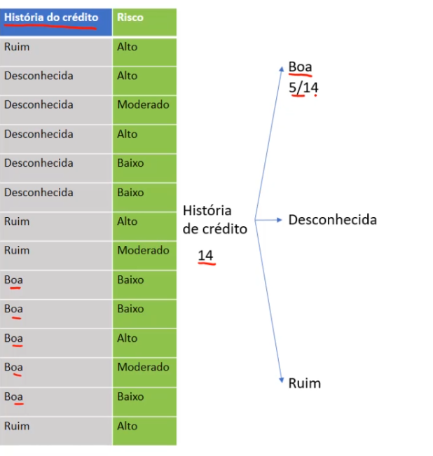

Vamos cálcular a probabilidade para o **Desconhecida**:

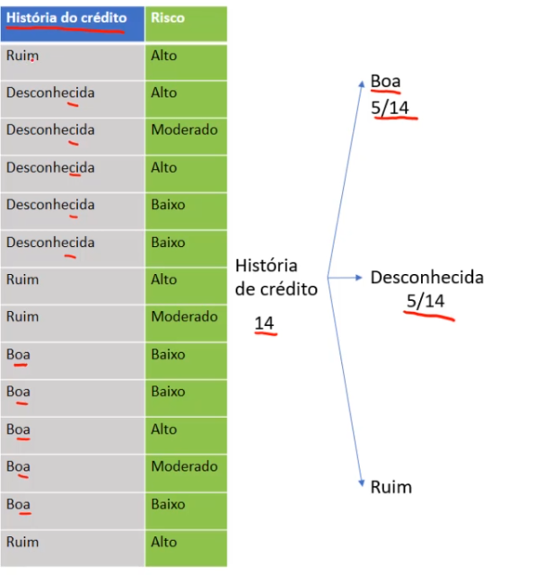

Vamos cálcular a probabilidade para o **Ruim**:

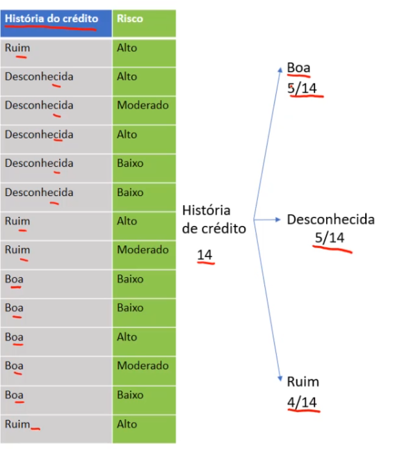

> O somatório deles tem que bater com o total de registros

Agora vamos ramificar um pouco mais:

- História de crédito boa:
  - H. cred-boa-alto

    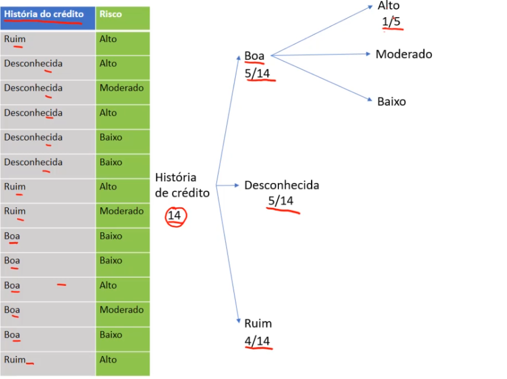

  - H. cred-boa-moderado

    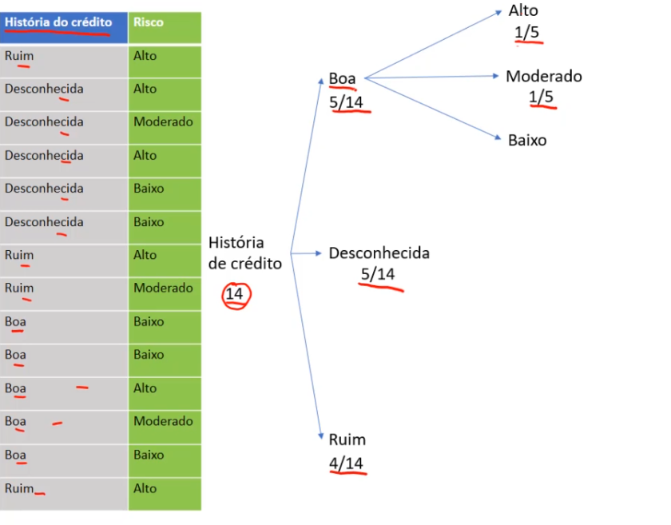

  - H. cred-boa-baixo

    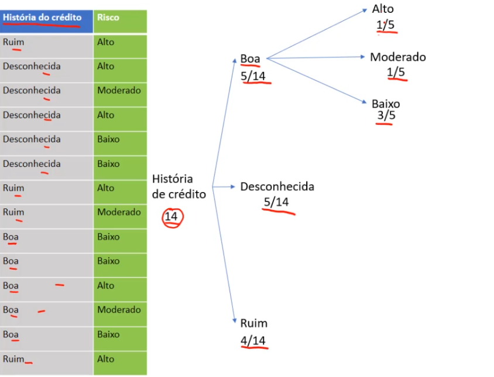

- História de crédito Desconhecida:
  - H. cred-desconhecida-alto

    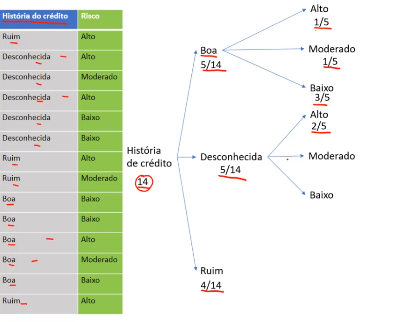
  
  - H. cred-desconhecida-moderado

    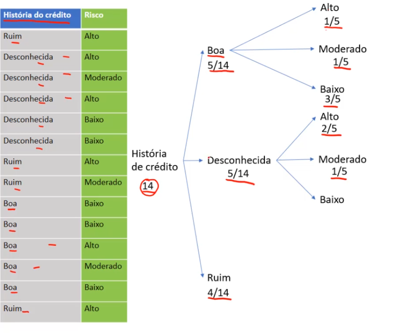
  
  - H. cred-desconhecida-baixo

    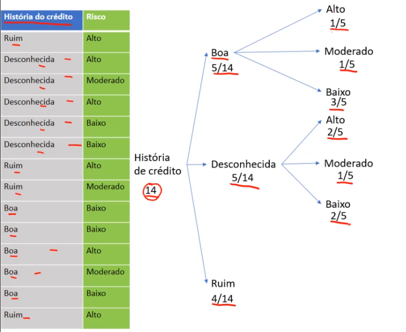

- História de crédito Ruim:
  - H. cred-ruim-alto

    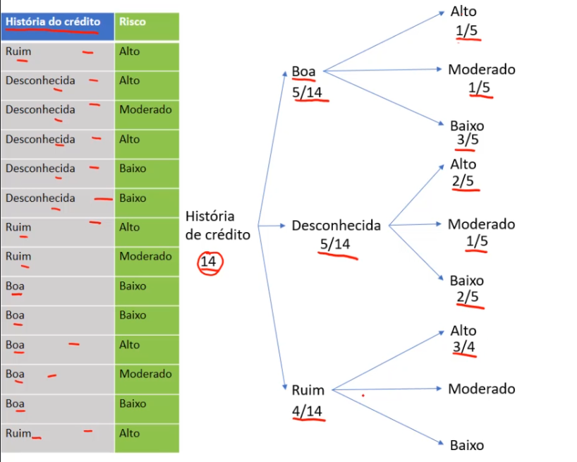
  
  - H. cred-ruim-moderado

    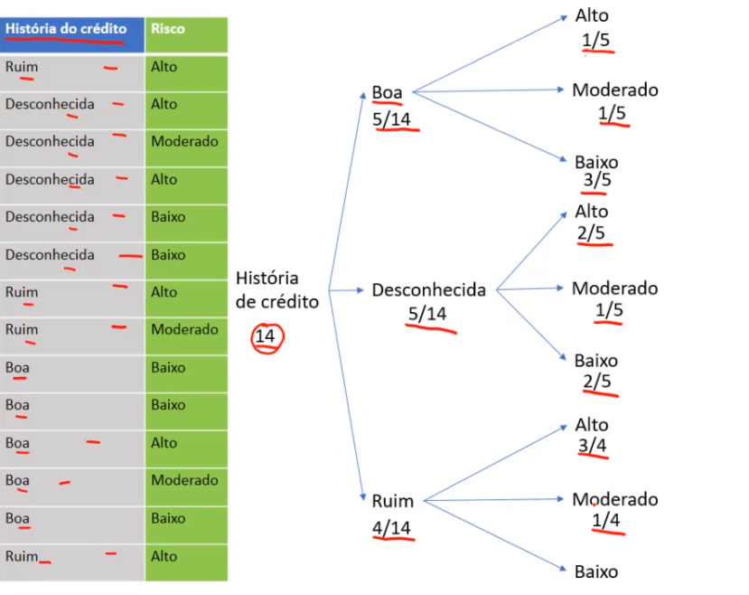
  
  - H. cred-ruim-baixo

    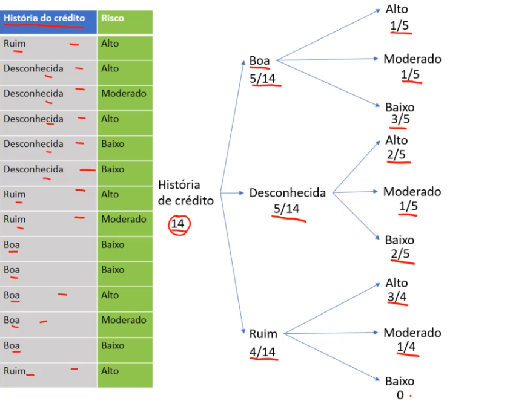

> Feito esse desmenbramento, vamos aplicar novamente a fórmula de entropia

### Entropia História de crédito Boa

- Aplicando a fórmula:

  $Entropy(S) = -\frac{1}{5}\cdot \log(\frac{1}{5})_2 -\frac{1}{5} \cdot \log(\frac{1}{5})_2 -\frac{3}{5} \cdot \log(\frac{3}{5})_2 = 1,37$

### Entropia História de crédito Desconhecida

- Aplicando a fórmula:

  $Entropy(S) =-\frac{2}{5}\cdot \log(\frac{2}{5})_2 -\frac{1}{5} \cdot \log(\frac{1}{5})_2 -\frac{2}{5} \cdot \log(\frac{2}{5})_2 = 1,52$

### Entropia História de crédito Ruim

- Aplicando a fórmula:

  $Entropy(S) = -\frac{3}{4}\cdot \log(\frac{3}{4})_2 -\frac{1}{4} \cdot \log(\frac{1}{4})_2 -0\cdot \log(0)_2 = 0,81$

---

### Gain

Agora vamos aplicar a fórmula do ganho da inforação

$Gain(S,A) = Entropy(S) - \sum_{v\epsilon Values(A)} \frac{|S_v|}{|S|}Entropy(S_v)$

> Essa fórmula consiste em pegar o valor da entropia geral, menos o somatório da divisão de sSv por S e multiplicado pela entropia de Sv

- Ganho da história

  $Gain(Historia) = 1,53-(\frac{5}{14} \cdot 1,37)-(\frac{5}{14}\cdot1,52) - (\frac{4}{14}\cdot0,81) = 0,26$

> E com isso chegamos que p ganho da informação para o atributo história é de 0,26, e para saber se esse ganho é bom ou ruim, é necessário fazer esses mesmos cálculos para os demais atributos, e só assim podemos fazer o comprativo e saber qual tem maior importancia para ser a nossa raiz da árvore de decisão

[Continua](2.1%20-%20Aprendizagem%20II.md) $\Rightarrow$
