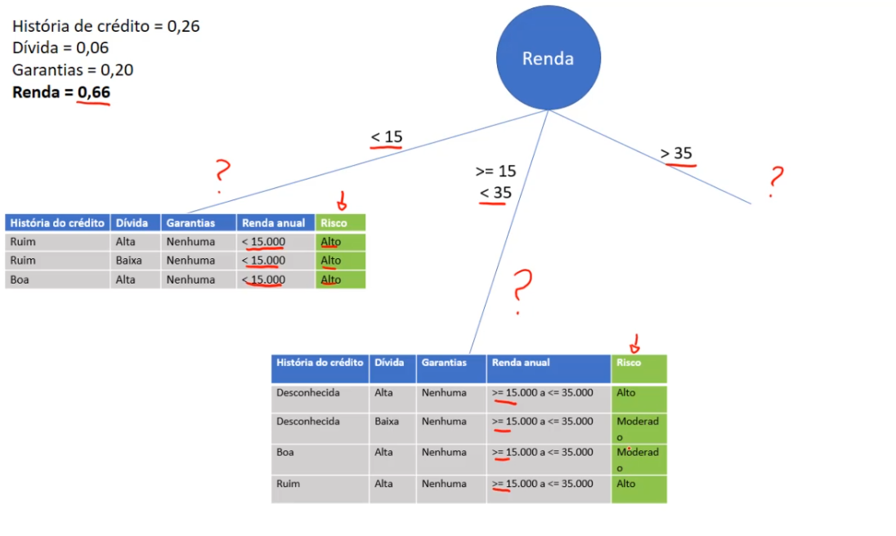

# Aprendizagem II

## Continua os cálculos

Vamos continuar com os cálculos de entropya e ganho pra que no final possamos descobrir qual é o atributo raiz da árvore de decisão

---

### Ganho de informação do atributo dívida

Iniciamos com os 14 registros no total e a dívida pode ser:

- Alta
- Baixa

Vamos calcular a probabilidade para a dívida ser **alta**:

> nós temos 7 registros sendo de característica, dívida alta, e como possuimos 14 registros ao todo, por tando temos 7 registros para a característica baixa também

Agora vamos ramificar cada um desses valores, com o atributo risco, sendo eles, alto, moderado e baixo

- vamos calcular o risco alto para a dívida alta:

    

- Dívida alta, risco moderado:

    

- Dívida alta, risco baixo:

    

Agora faremos a dívida baixa e suas ramificações:

- Dívida baixa, risco alto

    

- Dívida baixa, risco moderado

    

- Dívida baixa, risco baixo

    

Feito isso vamos aplicar a fórmula de entropia

### Entropia Dívida alta

- Aplicando a fórmula:

$Entropy(S) = -\frac{4}{7}\cdot\log(\frac{4}{7})_2-\frac{1}{7}\cdot\log(\frac{1}{7})_2-\frac{2}{7}\cdot\log(\frac{2}{7})_2 = 1,38$

### Entropia Dívida baixa

- Aplicando a fórmula:

$Entropy(S) = -\frac{2}{7}\cdot\log(\frac{2}{7})_2-\frac{2}{7}\cdot\log(\frac{2}{7})_2-\frac{3}{7}\cdot\log(\frac{3}{7})_2 = 1,56$

---

### Gain Dívida

Agora vamos aplicar a fórmula do ganho da informação

- Ganho da Dívida:

$Gain(Divida) = 1,53-(\frac{7}{14}\cdot1,38)-(\frac{7}{14}\cdot1,56) = 0,06$

> Perceba que tivemos um ganho para esse atributo de 0,06, e o ganho para o atributo história de crédito foi de 0,26. Logo temos uma importância maior para a história de crédito

---

### Ganho de informação do atributo garantias

Iniciamos com os 14 registros no total e ele pode ser dividido em:

- Nenhuma
- Adequada

Vamos calcular a probabilidade para a dívida ser **Nenhuma**:

> nós temos 11 registros sendo de característica, sendo garantias nenhuma e como seu complemento para chegarmos em 14 registros totais, temos 3 registros para adequada

Agora vamos ramificar cada um desses valores, com o atributo risco, sedno eles, alto, moderado e baixo

- vamos calcular o risco alto para a garantias nenhuma:

    

- Garantias Nenhuma, risco moderado

    

- Garantias Nenhuma, risco baixo

    

Agora faremos a garantias adequandas e suas ramificações:

- Garantias Adequada, risco alto

    

- Garantias Adequada, risco moderado

    

- Garantias Adequada, risco baixo

    

Realizado isso vamos aplicar a fórmula de entropia

### Entropia Garantias nenhuma

- Aplicando a fórmula:

$Entropy(S) = -\frac{6}{11}\cdot\log(\frac{6}{11})_2-\frac{2}{11}\cdot\log(\frac{2}{11})_2-\frac{3}{11}\cdot\log(\frac{3}{11})_2 = 1,44$

### Entropia Garantias adequada

- Aplicando a fórmula:

$Entropy(S) = -0\cdot\log(0)_2-\frac{1}{3}\cdot\log(\frac{1}{3})_2-\frac{2}{3}\cdot\log(\frac{2}{3})_2 = 0,92$

---

### Gain Garantias

Agora vamos aplicar a fórmula do ganho da informação

- Ganho da Garantias:

$Gain(Garantias) = 1,53-(\frac{11}{14}\cdot1,44)-(\frac{3}{14}\cdot0,92) = 0,20$

> Perceba que tivemos um ganho para esse atributo de 0,06 para a dívida, e o ganho para o atributo história de crédito foi de 0,26, e agora tivemos um ganho de 0,20 para as garantias. Logo temos uma importância maior para a história de crédito, as garantias  com segundo maior grau de importância e por último a dívida

---

### Ganho de informação do atributo Renda anual

Iniciamos com os 14 registros no total e ele pode ser dividido em:

- $<15.000$
- $>=15.000 ; <=35.000$
- $>35.000$

Vamos calcular a probabilidade para a renda ser **$<15.000$**:

> nós temos 3 registros sendo de característica, sendo renda $<15.000$

> nós temos 4 registros sendo de característica, sendo renda $>=15.000 ; <=35.000$

> nós temos 4 registros sendo de característica, sendo renda $>35.000$

Agora vamos ramificar cada um desses valores, com o atributo risco, sedno eles, alto, moderado e baixo

- vamos calcular o risco alto para a renda $<15.000$:

    

    > Para o risco alto temos 3 registros de um total de 3 registros para renda $<15.000$, por tanto os demais riscos foram atribuidos com valores zerados

Agora faremos a renda $>=15.000 ; <=35.000$ e suas ramificações:

- Renda $>=15.000 ; <=35.000$, risco alto

    

- Renda $>=15.000 ; <=35.000$, risco moderado

    
    > renda de $>=15.000 ; <=35.000$ para baixo foi zerada também, pois dos 4 registros, 2 pertencem ao risco alto e 2 ao risco moderado.

Agora faremos a renda $>35.000$ e suas ramificações:

- Renda $>35.000$, risco alto

    

- Renda $>35.000$, risco moderado

    

- Renda $>35.000$, risco baixo

    

Vamos agora aplicar a fórmula de entropia

### Entropia Renda $<15.000$

- Aplicando a fórmula:

$Entropy(S) = -\frac{3}{3}\cdot\log(\frac{3}{3})_2-0\cdot\log(0)_2-0\cdot\log(0)_2 = 0$

### Entropia Renda $>=15.000 ; <=35.000$

- Aplicando a fórmula:

$Entropy(S) = -\frac{2}{4}\cdot\log(\frac{2}{4})_2-\frac{2}{4}\cdot\log(\frac{2}{4})_2-0\cdot\log(0)_2 = 1$

### Entropia Renda $>35.000$

- Aplicando a fórmula:

$Entropy(S) = -\frac{1}{7}\cdot\log(\frac{1}{7})_2-\frac{1}{7}\cdot\log(\frac{1}{7})_2-\frac{5}{7}\cdot\log(\frac{5}{7})_2 = 1,15$

> Note que quando menor for o valor de entropia mai fácil de classificar e quanto maior for o seu valor mais difícil, perceba a entroupia da renda $<15.000$, tivemos uma entropia baixa, no caso, zerada, analisando os valores nós temos apenas o valor de risco alto preenchido para essa renda, logo fácil de classificar, em contra partida, temos a renda entre $>=15.000; <35.000$, tivemos uma entropia igual a 1, logo mais difícil de classificar, analisando a distribuição de registros para essa renda, temos de 4 registros, 2 em risco alto, e 2 em risco moderado, temos 50% de chance para cada um dos dois riscos.

---

### Gain Renda anual

Agora vamos aplicar a fórmula do ganho da informação

- Ganho da Renda:

$Gain(Garantias) = 1,53-(\frac{3}{14}\cdot0)-(\frac{4}{14}\cdot1)-(\frac{7}{14}\cdot1,15) = 0,66$

> Perceba que tivemos um ganho para esse atributo de 0,06 para a dívida, e o ganho para o atributo história de crédito foi de 0,26, tivemos um ganho de 0,20 para as garantias, e por fim, um ganho de 0,66 para renda. Colocando então, a renda como atributo raiz pata nossa árvore de decisão.

---

> Note que depois de definido a renda como raiz, precisamos repitir todos os cálculos de entropia e ganho de informação para cada um dos ramos, para saber quais atributos entram em sequência, então podemos dizer que esse algoritmo recursivo, caso queira fazer uma implementação manual.

E para seguirmos adiante, precisamos analisar cada ramo, começando por:

- Renda $<15.000$:

> Vamos colocar somente os registros com a renda menor que 15, e vamos apenas considerar essa base de dados como se fosse a base total, e então calculamos a entropia geral, utilizando o risco,note que só temos o valor **alto**, e depois faremos todos os cálculos novamente, até decidir qual atributo será colocado nesse ramo. Mas para esse caso, como temos um risco apenas alto, já temos como tomar uma decisão, para esse ramo.

- Pegando agora entre 15 e 35:

> Vamos pegar somente os 4 registros, que são pertencentes a essa faixa de renda, tendo uma nova base de dados, e precisamos tambérealizar o cálculo de entropia geral, considerando esses valores desse ramo.

- Por fim, pegando maior que 35:

> Vamos pegar os valores maires que 35, e como feito com os anteriores, vamos considerar como a nova base de dados e assim aplicar a fórmula de entropia geral e as outras fórmulas

Uma observação com relação ao ganho da dívida, é que por ele ter sido muito pequeno, tem uma alta chance dele nem se quer aparecer na árvore de decisão, por tem baixa influienção não tomadas de decisão.

[Continua](3%20-Mais%20conceitos.md) $\Rightarrow$
