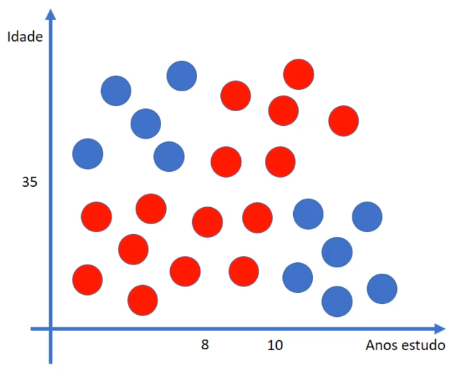
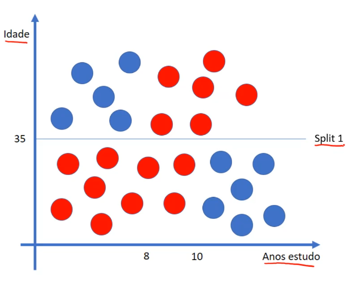
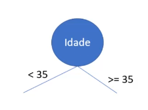
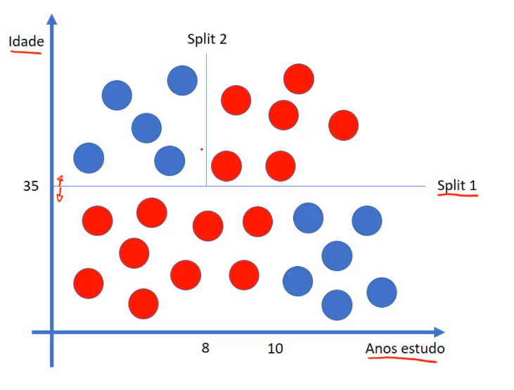
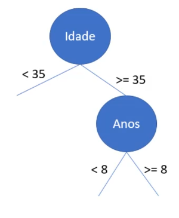
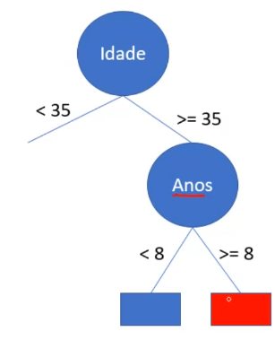
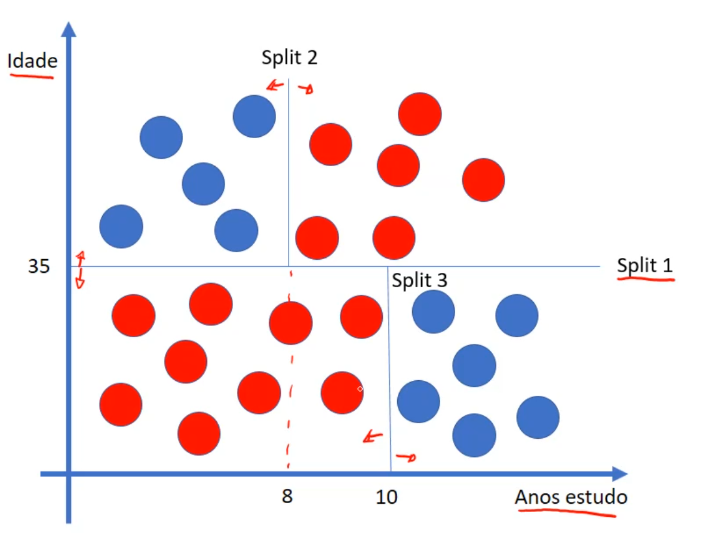

# Mais conceito

Temos uma outra forma de compreender uma árvore de decisão



- Vamos considerar 2 classes, a azul e a vermelha, baseadas nos atributos idade e anos de estudo

Vamos então trabalhar nesse gráfico, vamos colocar um split



- split, se ouve muito em parametrização de árvores de decisão. Quando for pegar algum algoritmo que precise verificar quais parâmetros recebe, estará no melhor o split, cujo significar, divisão
- Seguindo essa divisão feita no gráfico, criamos duas classes, acima da idade 35 temos uma e abaixo dela outra. Onde então podemos começar a representar a árvore de decisão dessa maneira:

    

- Onde se a idade for maior ou igual a 35, pegará os registros que se encontram na parte superior do gráfico, cortado pelo split, e se for menor que 35, englobará os registros da parte inferior

    

- Podemos criar mais um split, onde dividirá ainda mais os dados, dessa vez por anos de estudo, onde a esquerda do segundo split temos menor que 8 anos de estudo, e a direita temos maior ou igual a 8, representando assim na árvore de decisão:

    

- Podemos comcluir que se a pessoa for maior igual a 35 anos de idade e tiver menor que 8 anos de estudo ele é classificado como azul, mas se ele for maior igual a 8 anos de estudo ele será classificado como vermelho.



Vamos criar mais um split, que vai dividir os anos de estudos entre menor que 10 e maior igual a 10



Que por sua vez, também podemos classificar como azul, aqueles registros com idade inferior a 35 e com 10 anos ou mais de estudo, e classificamos como vermelhos, aqueles com menor que 35 anos de idade e com menos de 10 anos de estudo.


> A ideia de trabalhar com árvore de decisão, é criar o melhor conjunto dessas divisões(splits)

E essa divisorias, viram regras, IF/ELSE

```python
if idade >=35 and anos >= 8:
    registro = 'vermelho'
if idade >=35 and anos < 8:
registro = 'azul'
if idade <35 and anos >= 10:
    registro = 'azul'
if idade <35 and anos < 10:
registro = 'vermelho'
```

> Basicamente o algoritmo de árvore de decisão vai encontrar o melhor conjunto de divisores. Essa é uma outra maneira de trabalhar com árvores de decisão, além da maneira onde se calcula a entropia e o ganho dos atributos

---

## Conceito de poda

Onde se gera uma árvore de decisão completa e depois pode realizar as podas, naqueles atributos onde tenha pouco ganho de informação

### Poda em árvores de decisão

- Bias(viés)
  - Erros por classificação errada
- Variância
  - Erros por sensibilidade pequena a midanças na base de treinamento
  - Pode levar a **overfitting**

> Quando se realiza uma poda, ainda está sujeito a erros de classificação, pois é retirada algumas informações do algoritmo, com o intuito de evitar o overfitting, mas em geral o algoritmo se adapta bem, principalmente quando falamos de trabalhar com base de dados grande, sua tendência é de dar resultadmos melhores com a poda.

---

## Vantagens e desvantagens da árvore de decisão

### Vantagens

- Fácil interpretação
- Não precisa normalizar ou padronizar os dados
- Rápido para classificar novos registros, basta percorrer a árvores

### Desvantagens

- Geração de árvores muito complexas, gerando um overfintting
- Pequenas mudanças nos dados pode mudar a árvore(poda pode ajudar)
  - Se realizar algumas alterações em atributos, pode criar novos ramos ou um ramo classificado como falso pode ser verdadeiro
- Problema NP-completo para construir a árvore
  - é um conceito que vem da área estrutuda de dados e teoria da computação, quer dizer que é um problema bastante complexo para resolver

### Informação extra

- As árvores de decisão eram bem populares na década de 90, porém temos vários outros algoritmos hoje em dia, como redes neurais, SVM, KNN, eles tem a tendência de ter um desempenho bem melhor que uma árvore de decisão

- Tivemos alguns upgrades para melhorar o funcionamento das árvores de decisão, como random forest(florestas randômicas) melhoram o desempenho (usado no kinect da microsoft). Em alguns casos podendo ter resultados bem similares as de uma SV ou uma rede neural, que são algoritmos bem mais sofisticados que uma árvore de decisão

- CART - classification and regrssion trees
  - Termologia, que também pode ser encontrada em outros documentos de estudos

[Continua](4%20-%20Base%20risco%20cr%C3%A9dito.md) $\Rightarrow$
