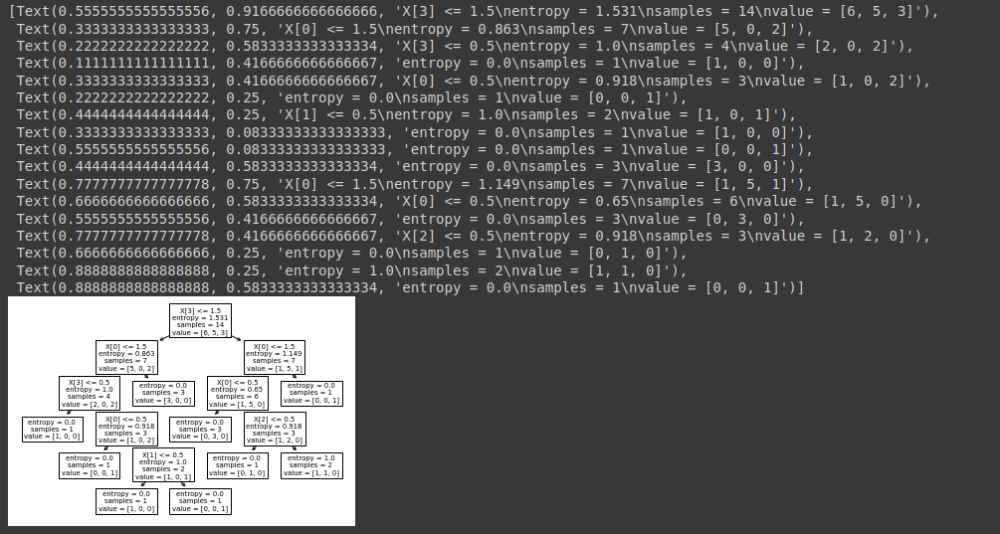

# Base risco de crédito

## Árvore de decisão

Começamos importando o algoritmo da árvore de decisão, um classificador basiade em árvore de decisão:

```python
from sklearn.tree import DecisionTreeClassifier
```

Feito isso, vamos carregar nossa base de dados que já foi realizada o pré-processamento [anteriormente](https://github.com/Mruuk/Machine_Learning/blob/master/machineLearning/algoritmos/Classifica%C3%A7%C3%A3o/Documentacao/2%20-%20censo-data/7%20-%20Salvar%20as%20bases%20de%20dados.md), então carregamos os previssores e a classe através do `pickle`, abrimos o arquivo `plk`, e salvamos as variáveis

```python
import pickle
with open('risco_credito.pkl', 'rb') as f:
  X_risco_credito, y_risco_credito = pickle.load(f)
```

Vamos visualizar as variáveis, para termos certeza que o carregamento foi realizado corretamente

```python
X_risco_credito
```


```python
y_risco_credito
```


Agora vamos criar e treina-lo efetivamente o algoritmo:

- Vamos definir um parâmetro para nossa árvore
  - criterion, onde temos o valor `gini` e `entropy`, sendo que, `gini` é o cálculo de inpureza, e temos a entropia, o que nos utilizamos na teoria, e usaremos agora também

```python
arvore_risco_credito = DecisionTreeClassifier(criterion='entropy')
arvore_risco_credito.fit(X_risco_credito, y_risco_credito)
```

Temos um recurso muito bom e se torna uma vantagem para as árvores de decisão, que é a possibilidade de retornar a importância de cada um dos atributos, como visto [aqui](2.1%20-%20Aprendizagem%20II.md).

```python
arvore_risco_credito.feature_importances_
```

> Note que o que possui o maior ganho de informação é a renda, e em segundo no grau de importância, temos a história do crédito, em seguida a dpivida e por fim as garantias.


Aqui podemos visualizar as classes que posuimos

```python
arvore_risco_credito.classes_
```


Podemos visualizar a árvore de decisão, para isso importamos todo o package `tree` do `sklearn`:

```python
from sklearn import tree
```

Agora vamos gerar o grafico:

```python
tree.plot_tree(arvore_risco_credito)
```



> Note que é exibido em formato de texto a árvore de decisão, e temos uma visualização um pouco melhor, e note que a raiz da árvore temos a renda, onde aqui está sendo chamada de `x[3]`

Vamos melhorar a visualização, para que fique mais simples de compreender

- criamos uma variavel que irá receber em formato de lista o nome de cada atributo
- passamos um novo parâmetros, para que possamos definer os nomes dos nossos atributos

```python
previsores = ['história de crédito', 'dívida', 'garantias', 'renda']
tree.plot_tree(arvore_risco_credito, feature_names=previsores)
```


- Vamos melhorar ainda mais essa visualização, para isso vamos definir uma figura e gerar uma variavel eixos, que são efetivamente os eixos, e passamos o `plt`, recurso esse da biblioteca `matplotlib`, e geramos um `subplot`, com o número de linhas, colunas e o seu tamanho.

```python
previsores = ['história de crédito', 'dívida', 'garantias', 'renda']
figura, eixos = plt.subplots(nrows=1, ncols=1, figsize=(10,10))
tree.plot_tree(arvore_risco_credito, feature_names=previsores)
```


> note que agora a visualização está melhor

O que podemos fazer também é colocar os valores das classes, se o risco é alto, moderado ou baixo, e para isso passamos um parâmetro adicional, que é exatamento o mesmo código usado logo acima para visualizar as classes

```python
previsores = ['história de crédito', 'dívida', 'garantias', 'renda']
figura, eixos = plt.subplots(nrows=1, ncols=1, figsize=(10,10))
tree.plot_tree(arvore_risco_credito, feature_names=previsores, class_names = arvore_risco_credito.classes_)
```


> Agora temos as classes nomeadas para cada nó da árvore

E por fim, vamos dar um último toque para essa árvore de decisão, utilizando o `filled`

```python
previsores = ['história de crédito', 'dívida', 'garantias', 'renda']
figura, eixos = plt.subplots(nrows=1, ncols=1, figsize=(10,10))
tree.plot_tree(arvore_risco_credito, feature_names=previsores, class_names = arvore_risco_credito.classes_, filled=True);
```


> Onde agora temos cada cor referente a uma classe, assim a identificação fica mais fácil

Para finalizar, vamos analizar a inclusão de registros novos, vamos utilizar os mesmos já definidos no [naive bayes](https://github.com/Mruuk/Machine_Learning/blob/master/machineLearning/algoritmos/Classifica%C3%A7%C3%A3o/Documentacao/3%20-%20Apredizagem%20bayesiana/6%20-%20base%20risco%20de%20cr%C3%A9dito.md)

Clientes | história | dívida | garantia | renda
---------|---------|---------|---------|---------
Cliente 1 |  boa |  alta | nenhuma |  > 35
Cliente 2 |  ruim | alta | adequada | <15

Clientes | história | dívida | garantia | renda
---------|---------|---------|---------|---------
Cliente 1 |  0 |  0 | 1 |  2
Cliente 2 |  2 |  0 | 0 |  0

```python
# história boa, dívida alta, garantia nenhuma, renda > 35
# história ruim, dívida alta, garantias adequada, renda < 15
previsoes = arvore_risco_credito.predict([[0,0,1,2],[2,0,0,0]])
previsoes
```


- Podemos simular o percorrimento de um registro na árvore de decisão

- Vamos realizar a simulação para o cliente 1:

> O atributo raiz é a renda, onde nosso cliente possui 2 de renda, e a condição é de: $<=1,5$, logo ele vai para a direita, por ser maior que $1,5$


> Agora será verificada a ahistória de crédito, onde de nosso cliente, é igual a 0, por tanto, vamos para no nó da esquerda, já que a condição é história $<=1,5$


> e verifica novamente a história de crédito, sendo $<=0,5$, onde nosso cliente é igual a 0, assim pegando o ramo da esquerda


> E temos a classificação do nosso cliente sendo risco baixo, asim como foi realizado pelo algoritmo.

O mesmo pode ser feito para o cliente 2:

> Nosso cliente 2 tem 0 de renda, por tando irá para o ramo da esquerda, classificado como $<=1,5$


> Ainda verificando a renda, agora sendo ela $<=0,5$, e como nosso cliente 2 tem uma renda de 0, então irá para o nó-flolha, e por sua vez, será classificado como risco alto.


> Perceba que, muitas vezes, não há uma necessidade de utilizar todos os atributos para que seja possível classifica-los, em nosso cliente 2, só houve a necessidade de utilizar o atributo renda, e o mesmo para o cliente 1, onde só necessitou do atributo renda e história de crédito

[Continua](4.1%20-%20Base%20cr%C3%A9dito.md) $\Rightarrow$
