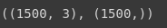
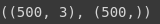
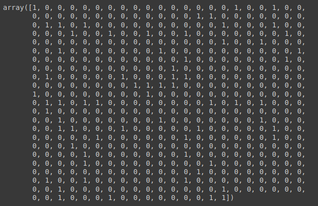
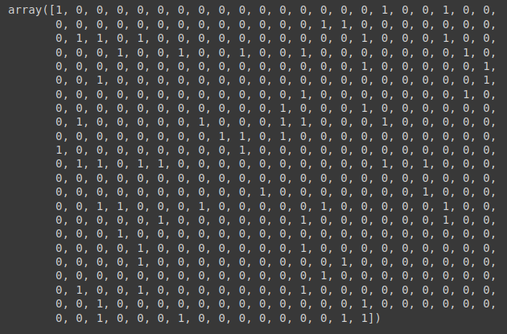
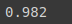
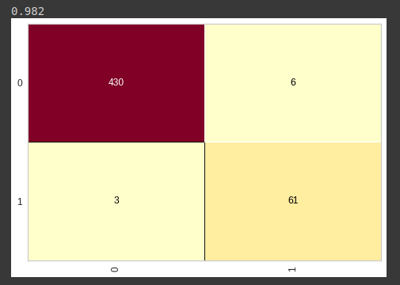
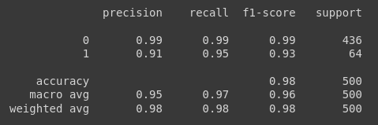
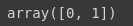
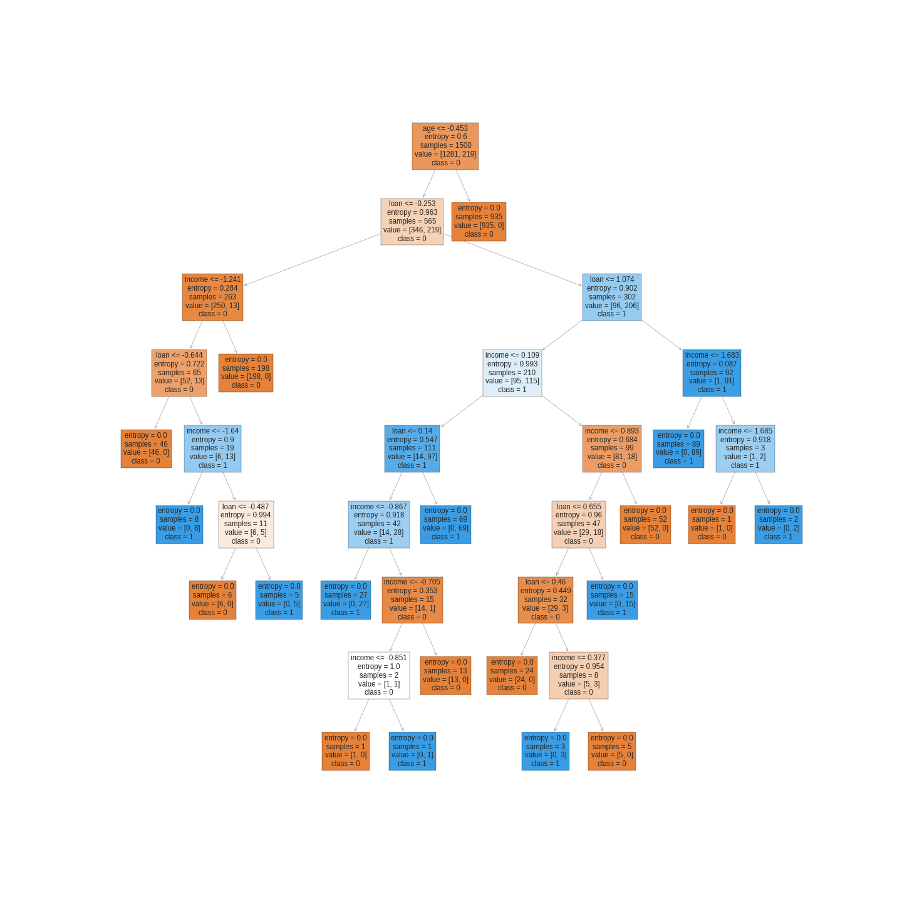

# Base credit data

Começamos carregando nossa base de dado, onde já passou pelo pré-processamento

```python
with open('credit.pkl', 'rb') as f:
  X_credit_treinamento, y_credit_treinamento, X_credit_teste, y_credit_teste = pickle.load(f)
```

Analizamos se foi carregado corretamente, olhando o formato

- Previsores

```python
X_credit_treinamento.shape, y_credit_treinamento.shape
```



- Classes

```python
X_credit_teste.shape, y_credit_teste.shape
```



Vamos agora iniciar nossa arvore de decisão e treina-la

- Colocamos o parametro `criterion`, para incluir o cálculo de entropia e colocamos o random_state igual a 0, para que sempre que o algoritmo for rodar ele tenha o mesmo valor de accuracy
- Feito essas inicializações, treinamos o algoritmo

```python
arvore_credit = DecisionTreeClassifier(criterion= 'entropy', random_state = 0)
arvore_credit.fit(X_credit_treinamento, y_credit_treinamento)
```

Agora vamos realizar a previsão, utilizamos os previsores testes para isso

```python
previsoes = arvore_credit.predict(X_credit_teste)
previsoes
```



Aqui são as respostas reais, no qual a previsão tem que se igualar

```python
y_credit_teste
```



Vamos importar da biblioteca metrics dos packages, o accuracy_score e classification_report, eles vão ajudar a comparar a previsão da classe

```python
from sklearn.metrics import accuracy_score, classification_report
```

Feita as importações vamos usar o `accuracy_score` para saber o qual bom está nosso algoritmo

```python
accuracy_score(y_credit_teste, previsoes)
```



> Note que estmos com um accuracy maior que o accuracy do naive bayes de 93%

Feito isso vamos avaliar graficamente com a matrix de confusão, os acertos e erros do algoritmo

```python
from yellowbrick.classifier import ConfusionMatrix
cm = ConfusionMatrix(arvore_credit)
cm.fit(X_credit_treinamento, y_credit_treinamento)
cm.score(X_credit_teste, y_credit_teste)
```



Agora vamos analizar o `classification_report`

```python
print(classification_report(y_credit_teste, previsoes))
```



> Note que temos uma `recall` de 99%, ou seja, ele identifica 99% das vezes e dessas 99% sua precisão é de 99%, ou seja, das 99% vezes que o algoritmo encontra, 99% delas ele acerta a classe 0, e para a classe 1 95% de recall, ou seja, ele identificou 95% das vezes e das 95%, ele acertou 91% a classe 1. Agora realizando um comparativo entre essas estimativas e o do naive bayes, note que o naive bayes, errava muito para a classe 1 e acertava bem a classe 0, já a árvore de decisão, possuiu bons resultados em identificar as duas classes, tornando-o, para esse caso, superior ao naive bayes.

Agora vamos plotar um gráfico da árvore de decisão, como feiro para a [base de risco](4%20-%20Base%20risco%20cr%C3%A9dito.md)

- temos aqui as variáveis, perceba que estão no formado array

```python
arvore_credit.classes_
```



- Vamos plotar o gráfico
  - para o `class_names`, inicialmente foi usado `str(arvore_credit.classes_)`, parem ocoreu um erro e por tanto, colocamos os valores da classe manualmente. Lembrando que é necessário que o parâmetro seja passado como string.
  - Por fim salvamos a imagem com o método `fig.savefig`.

```python
from sklearn import tree 
previsores = ['income', 'age', 'loan']
fig, axes = plt.subplots(nrows = 1, ncols = 1, figsize = (20,20))
tree.plot_tree(arvore_credit, feature_names=previsores, class_names=['0','1'], filled=True);
fig.savefig('arvore_credit.png')
```



[Continua](4.2%20-%20Base%20censo.md) $\Rightarrow$
