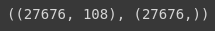
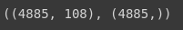
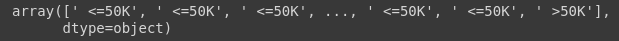
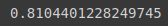
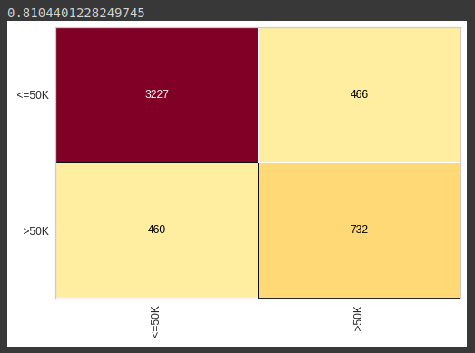
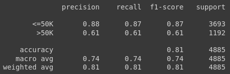
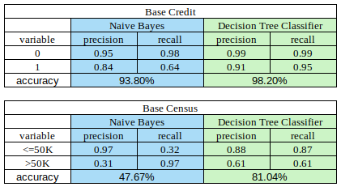

# Base census

Iniciamos com a importação da base de dados onde já foi realizada o pré-processamento, importamos através do `pickle`, e já definimos as variaves previsores treinamento e teste, e o mesmo para as classes treinamento e teste:

```python
with open('census.pkl', 'rb') as f:
  X_census_treinamento, y_census_treinamento, X_census_teste, y_census_teste = pickle.load(f)
```

Feito isso verificamos o shape, para certificarmos de que a importação foi bem sucedida

- Verificamos nossas variaveis treinamento:

```python
X_census_treinamento.shape, y_census_treinamento.shape
```



- Verificamos as variaveis teste:

```python
X_census_teste.shape, y_census_teste.shape
```



Verificado seu formado, vamos iniciar nossa árvore de decisão , primeiramente importamos o package:

```python
from sklearn.tree import DecisionTreeClassifier
```

E agora vamos instanciar o algoritmo na variável `arvore_census`, passando como parâmetro o critério, onde será igual a `entropy`, isso fará como que, nosso algoritmo realizar os cálculos de entropia e ganho da informação, e passamos também o `random_state` igual a 0, para que sempre que iniciarmos o algoritmo ele traga os mesmos resultados. Feito isso, vamos treina-lo, passando nossos previsores e classe:

```python
arvore_census = DecisionTreeClassifier(criterion='entropy', random_state= 0)
arvore_census.fit(X_census_treinamento, y_census_treinamento)
```

Treinamento realizado, faremos uma previsão, usando o método `predict`, e passando nossos dados previsores teste, pois eles, não foram vistos pelo nosso algoritmo, permitindo assim, uma analise melhor e nada tendênciosa:

```python
previsoes = arvore_census.predict(X_census_teste)
previsoes
```



Agora o que faremos é uma analise entre nossa previsão e nossa classe teste, que são os valores reais

Para isso vamos importar dois package do `metrics`, o `accuracy_score` e o `classification_report`, primeiro utilizaremos o `accuracy_score`, para analisar o quão acertivo nosso algoritmo é:

```python
from sklearn.metrics import accuracy_score, classification_report
accuracy_score(y_census_teste, previsoes)
```



> note que tivemos um ganho considerável de accuracy do naive bayes para a árvore de decisão, onde saimos de 47.67%, para 81.04%, mesmo ainda não sendo o ideal, mas tivemos um resultado melhor que o anterior

Agora vamos visualizar a matrix de confusão e entender melhor os acertos e erros do algoritmo

```python
from yellowbrick.classifier import ConfusionMatrix
cm = ConfusionMatrix(arvore_census)
cm.fit(X_census_treinamento, y_census_treinamento)
cm.score(X_census_teste, y_census_teste)
```



> Perceba tivemos um valor alto de registros classificados corretamente para $<=50K$, porém tivemos muito erros ao tentarmos classificar os registros que são $>50K$, para entendermos melhor, vamos gerar um `classification_report`:

```python
print(classification_report(y_census_teste, previsoes))
```



> Analizando o `report`, temos um recall de 87% para a classe, $<=50K$, e um `precision` de 88%, logo, dos 87% que o algoritmo encontrou, teve uma precisão de 88%, temos boas porcentagens, mas o desenpenho cai de forma considerável quando vamos tentar classificar a class $>50K$, o algoritmo encontrou 61% e desses 61, teve uma precisão de 61% também. Tivemos sim, uma melhoria do Naive Bayes para a árvore de decisão, mas podemos melhorar ainda mais com outros modelos.

----

## Desempenho dos modelos

Analizando os dois modelos até o momento, tivemos o Naive Bayes e o Decision Tree Classifier, e tivemos ganhos consideráveis quando utilizado o Decision Tree Classifier, vamos visualizar o empenho em uma tabela de cada algoritmo:



[Continua](5%20-%20Random%20forest%20(floresta%20rand%C3%B4mina).md) $\Rightarrow$
