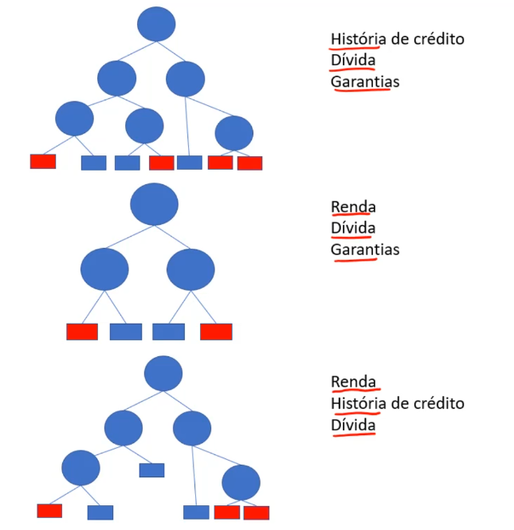

# Random Forest

Hoje em dia utilizar uma árvore de decisão simples, não é capaz de ter um bom desempenho para problemas mais complexos, não chegando perto do desempenho de uma SVM, ou uma rede neural.

O random forest, é uma melhoria da árvore de decisão, ela vem para acompanhar o desempenho feito pelos demais algoritmos. E para isso vamos utilizar mais de uma árvore, e cada uma das várias árvores teram sua decisão, e elas são combinadas no final. Então a ideia de como funciona é essa, são geradas várias árvores e delas, são combinadas suas decisões.

- O random forest, está dentro da área `Ensemble learning`(aprendizagem em conjunto)

- A ideia desse tipo de aprendizagem, de "consultar diversos profissionais para tomar uma decisão", exemplo do mundo real.
- Vários algoritmos juntos para construir um algoritmo mais "forte".
- Usa a média (regressão) ou votos da maioria(classificação) para dar a resposta final.
  - Exemplificando, se tem 3 árvores, onde duas classificaram como "sim" e um classificou como "não", como é um caso de classificação, o voto da maioria vence, logo será classificado como "sim". No caso da regreção, tirasse a média de todas as árvores

> Lembrando que quanto mais árvores se coloca maior a chance de ter um overfitting, onde ele se adequa muito a base de dados.

E o motivo para ser chamada de **Random** Forest, porque, ele escolhe de forma aleatória K atributos para comparação da métrica de pureza/impureza(impureza de gini/entropia)

- Vamos supor que criamos 3 árvores onde o K foi definido 3 também, e peganndo aquela nossa base de dados de crédito, temos 4 atributos previsores, são eles: História de crédito, dívida, garantias e renda. E gerando essas árvores, onde cada uma delas randomicamente vão pegar 3 dos 4 atributos:

> É bastante comum, quando for definir o K para calcular a impureza de gini, utilizar raiz quadrada, ou em alguns caso também existem outras fórmulas como tirar o logaritmo

Artigo: [Real-Time Human Pose Regonition in Parts from Single Depth Images](https://www.microsoft.com/en-us/research/wp-content/uploads/2016/02/BodyPartRecognition.pdf), para mais conhecimento com relação ao random forest aplicado nesse cenário.

[Continua](5.1%20-%20Random%20forest%20-%20base%20cr%C3%A9dit.md)$\Rightarrow$
