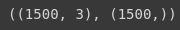
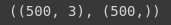
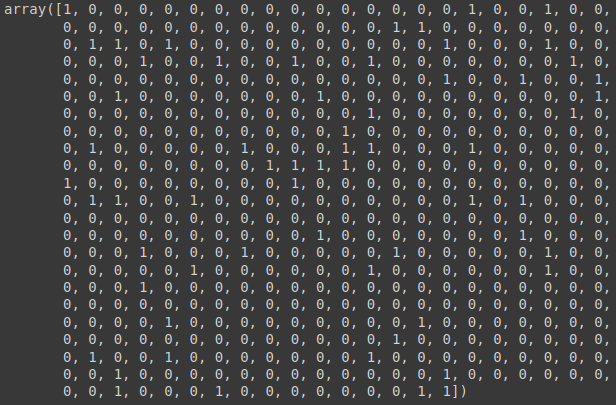
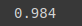
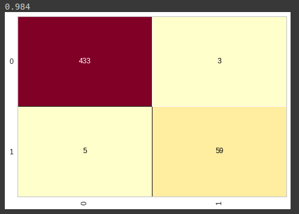
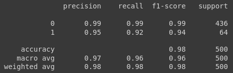

# Random Forest - Base credit data

Iniciamos a importação do nosso algoritmo `RandomForestClassifier`, pela biblioteca `ensembele`, e já importamos também o `pickle`, para carregar nossa base já pré-processada

```python
from sklearn.ensemble import RandomForestClassifier
import pickle
```

Realizado isso, carregaremos nossa base de dados `credit.plk`

```python
with open('credit.pkl', 'rb') as f:
  X_credit_treinamento, y_credit_treinamento, X_credit_teste, y_credit_teste = pickle.load(f)
```

Por fim vamos verificar se a base foi carregada corretamente e iniciamos o processo de treinamento

```python
X_credit_treinamento.shape, y_credit_treinamento.shape
```



```python
X_credit_teste.shape, y_credit_teste.shape
```



```python
random_forest_credit = RandomForestClassifier(n_estimators=40, criterion= 'entropy', random_state = 0)
random_forest_credit.fit(X_credit_treinamento, y_credit_treinamento)
```

> Em nosso treinamento instanciamos o algoritmo random forest classifier, e como parâmetros vamos incluir o `n_estimator`, o que representa o número de árvores que serão geradas pelo nosso algoritmo. Passamos o `entropy` como critério e o `random_state` igual a 0. Por fim realizamos o treinamento com o método `fit`.

Agora vamos realizar as previsões, para então avaliar nosso algoritmo:

```python
previsoes = random_forest_credit.predict(X_credit_teste)
previsoes
```



Vamos precisar comparar as `previsoes` com nossa classe, que representa as respostas reais, para isso vamos importar o `accuracy_score`, e o `classification_report`, onde poderemos avalizar com melhor propriedade o algoritmo.

- Vamos verificar a acertividade do RandomForestClassifier para esse caso

```python
from sklearn.metrics import accuracy_score, classification_report
accuracy_score(y_credit_teste, previsoes)
```



> Note que temos um accuracy de 98.4%, o que representa 0.2% de ganho de acertividade se comparado com a `DecisionTreeClassifier`, o que indicar que não há uma necessidade para esse caso de um algoritmo mais complexo como esse para atinger desempenhos semelhantes ao `DecisionTreeClassifier`, que por sua vez é um algoritmo de certa forma, menos complexo

Vamos importar também o `Confusion_matrix`:

```python
from yellowbrick.classifier import ConfusionMatrix
```

Vamos criar uma matriz de confusão para analizar onde nosso algoritmo está acertando e errando

```python
cm = ConfusionMatrix(random_forest_credit)
cm.fit(X_credit_treinamento,y_credit_treinamento)
cm.score(X_credit_teste, y_credit_teste)
```



E por fim vamos analizar o `classifiction_report`, com um pouco mais de detalhes

```python
print(classification_report(y_credit_teste, previsoes))
```



> Analizando o `report`, para classe 0, nosso algoritmo encontrou 99% dos registros e desses, sua precisão foi de 99%, em contra partida, para a classe 1, o algoritmo encontrou 92% dos registros e sua precisão foi de 95%.
