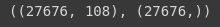
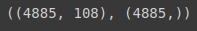
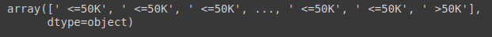
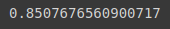
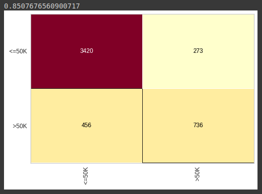
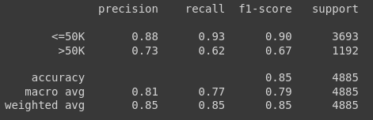

# Random Forest - Base census

Vamos começar com o carregamento da base já pré-processada:

```python
with open('census.pkl', 'rb') as f:
  X_census_treinamento, y_census_treinamento, X_census_teste, y_census_teste = pickle.load(f)
```

Verificamos se o carregamento da base foi realizado comrretamente:

```python
X_census_treinamento.shape, y_census_treinamento.shape
```



```python
X_census_teste.shape, y_census_teste.shape
```



Vamos agora iniciarlizar nossa random forest, vamos definimos inicialmente o `n_estimator` de 40, já que foi o mesmo para base de crédito, mas verificamos também valores maiores e obtivemos melhor resultado com um `n_estimator` = 100, o critério usamos o `entropy`, e random_state igual a 0.

```python
random_forest_census = RandomForestClassifier(n_estimators=100, criterion = 'entropy', random_state = 0)
random_forest_census.fit(X_census_treinamento, y_census_treinamento)
```

Realizamos as previsões com mo método `predict`:

```python
previsoes = random_forest_census.predict(X_census_teste)
previsoes
```



Agora vamos para etapa de comparação das previsoes do nosso algoritmo com os valores reias da classe, para isso importamos o `accuracy_score` e o `classification_report`. Utilizando o `accuracy_score`, obtivemos uma acertividade de 85%

```python
from sklearn.metrics import accuracy_score, classification_report
accuracy_score(y_census_teste, previsoes)
```



Para analizarmos em mais detalhes, onde o algoritmo está errando e acertando usamos a matriz de confusão

```python
from yellowbrick.classifier import ConfusionMatrix
cm = ConfusionMatrix(random_forest_census)
cm.fit(X_census_treinamento, y_census_treinamento)
cm.score(X_census_teste, y_census_teste)
```



> Note que o desempenho dele para a classe $<=50K$ é consideravelmente boa, mas ele ainda está errando muito quando se trata de acertar a classe $>50K$, de 1192 registros ele acerta apenas 736, ainda está muito abaixo do que gostariamos

Vamos analizar um pouco mais de detalhes com o `report`:

```python
print(classification_report(y_census_teste, previsoes))
```



> O `report`, nos mostra um desempenho bom para a classe $<=50K$, de 93% dos registros encontrados pelo algoritmo, sua precisão é de 88%, mais o desempenho baixa muito quando tentamos classificar os registros da classe $>50K$, onde ele encontra 62% e sua precisão para os 62% é de 73%.

Houve sim uma melhoria, porém não satisfatória.

[Continua](6%20-%20Refer%C3%AAncias%20complementares.md) $\Rightarrow$
