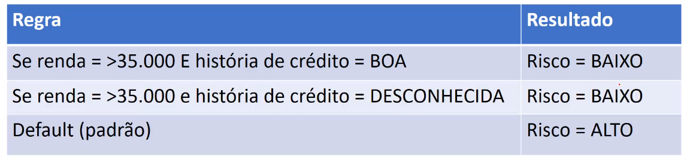
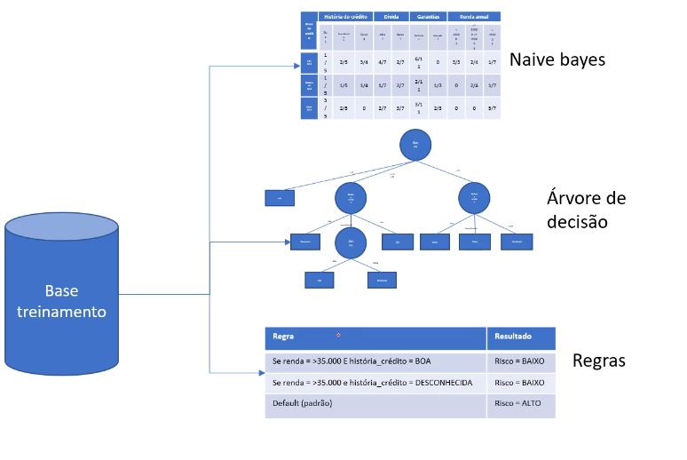

# Aprendizagem por Regras

Na aprendizagem por regras, assim como nos demais algoritmos, vai ser realizada uma leitura da base de dados e como o nome já diz, será geradas algumas regras.

> Aqui temos essa tabela que nos mostra alguns exemplos, como se a renda for maior ou igual a 35 mill e a história de crédito for boa, então o algoritmo irá classificar como risco baixo, e assim as demais regras. Temos uma regra default, que basicamente é como o else, caso não entre em nenhum dos casos anteriores, nossos if's, então a condição será o default, que nesse caso classifica como risco alto. Mas o que é bom que fique claro, é que dado uma nova base de dados, o algoritmo fará alguns cálculos e processamentos e com isso definir as regras, por tanto, elas são mutáveis.

- Vamos pegar um exemplo de um novo registro/cliente e aplicar al algoritmo, que nada mais é que aplicar às regras.

ID | história | dívida | garantias | renda
----|-------|------|------|------
cliente 1 | Boa | Alta | Nenhuma | >35

Pegando esse client, vamos passar os dados regra por regra, até que encaixe em alguma dessas condições definidas pelo algoritmo. E logo de cara temos a primeira regra, onde a renda é $>=35$, e a história é boa, o que são definições desse novo cliente, por tanto, podemos classifica-lo como **risco baixo**

> Note que para essas regras, seu condicional é o `and` ou  `e`, onde implica que as duas condições declaradas, necessitam que seja verdadeiras para que então possa ser classificado se encaixando na regra

- Vamos pegar um outro registro/cliente

ID | história | dívida | garantias | renda
----|-------|------|------|------
cliente 2 | Ruim | Alta | Adequada | <15

Então ele vai testar, regra por regra, buscando que o registro de adeque a algumas delas, caso isso não aconteça, o que é o nosso caso, o algoritmo define o registro com a regra default, classificando-o como risco **alto**

---

## Algoritmos review

1. Começamos tendo uma base de dados de treinamento, que é uma base de dados histórica
2. Se for trabalhar como o Naive Bayes, ele vai pegar os dados e gerar uma tabela de probabilidade
3. Se for trabalha com uma árvore de decisão, ele vai gerar uma árvore
4. Se for trabalhar com abordagem de regras, será analisada a base de dados e constriuda uma série de regras

[Contunia](2%20-%20Algoritmo%20OneR%20I.md) $\Rightarrow$
