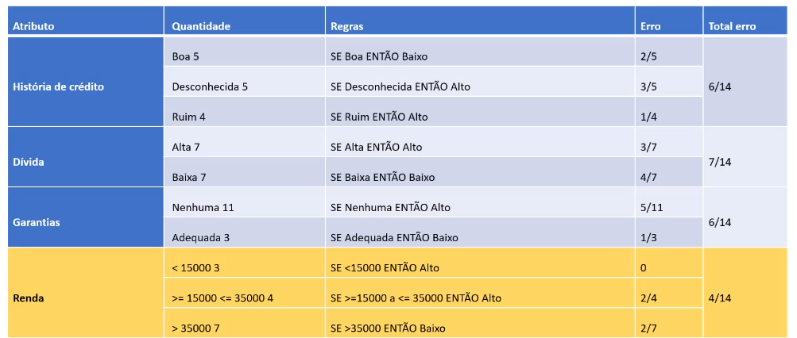
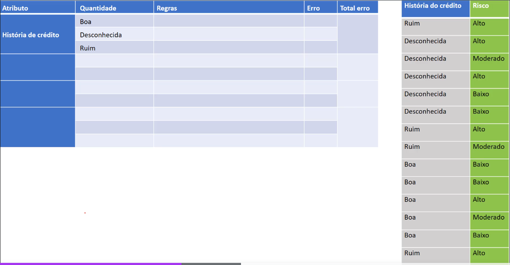
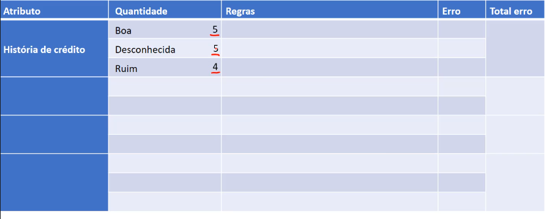
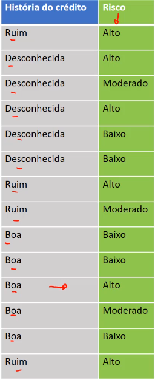
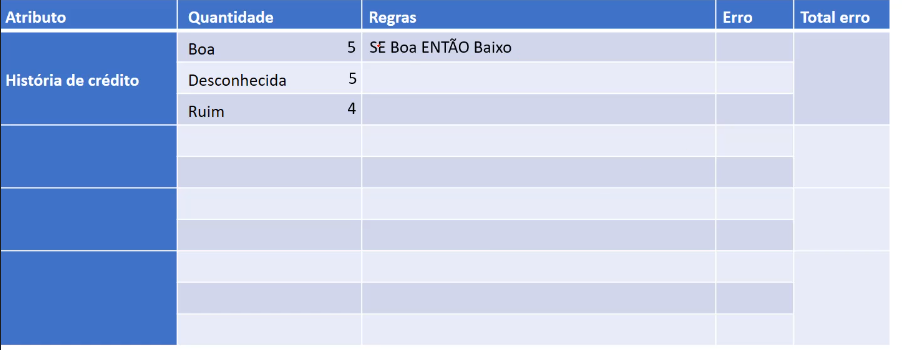
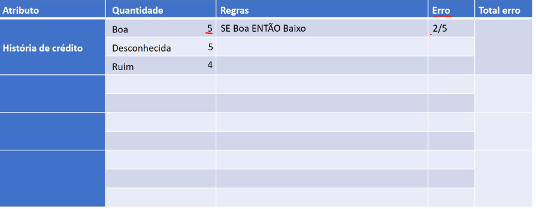
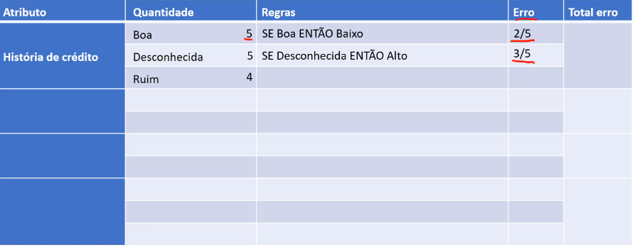
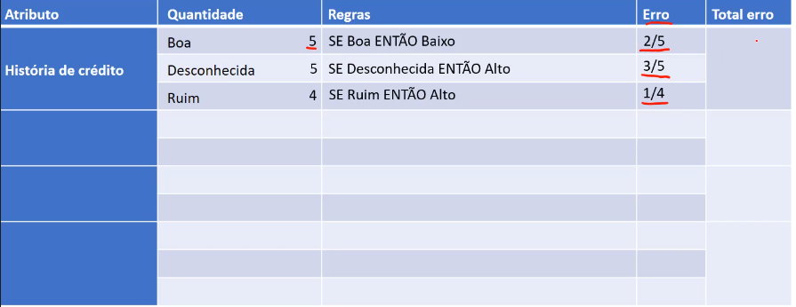
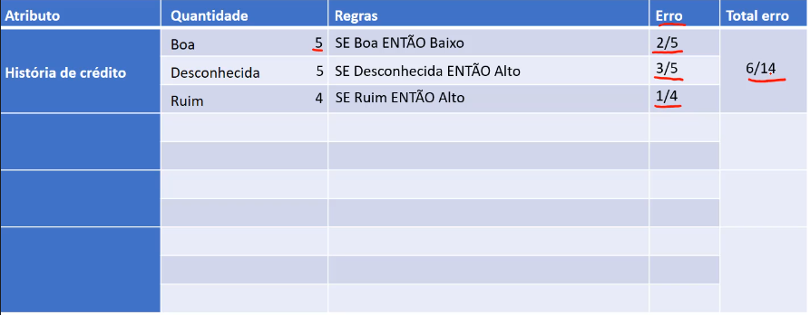

# Algoritmo OneR

Veremos a aplicação do algoritmo OneR, onde fará a geração de uma regra, para que possa entender o processo

O nome OneR, significa uma regra, onde seu R significa rules. Ele vai utilizar somente um atributo para geração de regras, e ele é um algoritmo bastante simples.

- Testar coisas simples primeiro
    > Sua premissa é baseada em que, deve-se realizar o teste das coisas simples.
- Um atributo faz todo o trabalho
    > Então analisa-se qual o atributo mais importante para que o algoritmo se basei nele para geração de regras. Se asemelha a árvore de decisão, onde temos que calcular a entropia, e o ganho da informação, para chegar no atributo mais importante, e defini-lo como raiz.

> O resultado da analise do nosso algoritmo na base dados risco de crédito, é uma tabela, que se assemelha com essa.

Levaremos em consideração apenas o atributo renda

- Temos a estimativa de erro, onde a menor é a do atributo renda, com 4/14. O que quer dizer, que as regras geradas por esse atributo renda, têm o menor erro nessa base de dados
- As regras geradas para renda, ele usa somente um atributo, realiza uma série de cálculos e chega a conclusão de que esse atributo renda, possui o menor erro, e com base nisso ele vai utilizar as  essas regras simples, para fazer a classificação, não usando nenhum outro atributo.
- Vamos realizar o passo-a-passo de como chegar nessa tabela.

---

## pocesso matemático

> iniciamos a tabela zerada, e comoeçamos com o atributo história de crédito, que possuem os valores, `boa`, `desconhecida` e `ruim`.

- Primeiro passo é fazer a contagem de quantos registros temos para `boa`, `desconhecida` e `ruim`, na base de dados.

    

    > Temos 5 registro classificados como boa

- Para Desconhecido:
    
    > Temos 5 registros em desconhecida

- Para Ruim:
    
    > Temos 4 registros para ruim, lembrando que temos um total de [14 registros](#pocesso-matemático), por tanto temos que ter um resultado de 14 para o somatório desses registros

- Vamos definir algumas regras, para `boa`, `desconhecida` e `ruim`

### Regras

#### História de crédito **Boa**

**Definindo regras**:

- Se a históra de crédito for Boa Então o risco é Alto
  - SE Boa ENTÃO Alto = 1
    > Perceba que o alto recebe o valor de 1, pois a base de dados possui apenas um registro com essas condições

    

> Vamos gerar uma outra regra, mais dessa vez para o risco moderado

- SE Boa ENTÃO Moderado = 1

> Note que nesse caso, temos apenas 1 registro que atende essas condições. Agora vamos gerar uma regra para o risco baixo

- SE Boa ENTÃO Baixo = 3

> Nesse caso, temos 3 registros

**Definindo qual regras tem maior frequência:**

Agora o que é preciso fazer, é escolher uma dessas regras, e o que escolhemos, sempre será aquela que aparece mais vezes, nesse caso, temos a regras `SE Boa ENTÃO Baixo = 3`. Então na lógica, o que temos é para o caso da história de crédito ser boa, vamos determinar que o risco é baixo, pois é o que mais aparece em nossas regras geradas.

E o que faremos agora é o cálculo do erro.

**Calculando erro:**

note que:

- SE Boa ENTÃO Alto = 1
- SE Boa ENTÃO Moderado = 1
- SE Boa ENTÃO Baixo = 3

Temos 5 registros, onde 2 deles não se encaixam em nossa regra definida, por tanto temos um erro de 2/5.

Faremos esse mesmo procedimento para o próximo atributo

---

#### História de crédito **Desconhecida**

**Definindo regras**:

- SE Desconhecida ENTÃO Alto = 2
- SE Desconhecida ENTÃO Moderado = 1
- SE Desconhecida ENTÃO Baixo = 2

**Definindo qual regras tem maior frequência:**

Vamos definir qual regra aparece mais vezes, mas note que nesse caso, temos duas regras com a mesma quantidade de registros. Nesse caso, pode escolher qualquer um deles, no geral, o algoritmo vai escolher o primeiro que aparece deles, como no exemplo, seria o `SE Desconhecida ENTÃO Alto = 2`.

**Calculando erro:**

Analizando o erro, temos 5 registros no total, e a regras definida tem uma frequência de 2, por tanto nosso erro será de 3/5.

---

#### História de crédito **Ruim**

**Definindo regras**:

- SE Ruim ENTÃO Alto = 3
- SE Ruim ENTÃO Moderado = 1
- SE Ruim ENTÃO Baixo = 0

**Definindo qual regras tem maior frequência:**

Vamos novamente definir qual regra aparece mais vezes, e nesse caso temo, `SE Ruim ENTÃO Alto = 3`.

**Calculando erro:**

Analizando o erro, temos 4 registros no total, e a regras definida tem uma frequência de 3, por tanto nosso erro será de 2/4.

---

### Erro total

O que faremos agora é o cálculo do erro total, bastante simples, basta realizar o somatório do erro, a quantidade `Boa`, possui 2  erros, `Desconhecida`, 3 erros, e `Ruim`, possui 1, logo temos um total de 6 erros, para um total de 14 registros, 6/14.

> Temos quase 50% da base de dados

O que faremos agora, é o mesmo para os demais atributos, para que então possamos edfinir qual deles será nosso atributo a ser trabalhado, asemelhando-se aos cálculos de entropia e ganho para uma árvore de decisão.

[Continua](2.1%20-%20Algoritmo%20OneR%20II.md) $\Rightarrow$
