# Algoritmo OneR II

Vamos continuar com as estimativas das regras, fizemos do atributo `história de crédito` e agora faremos para o atributo `Dívida`.

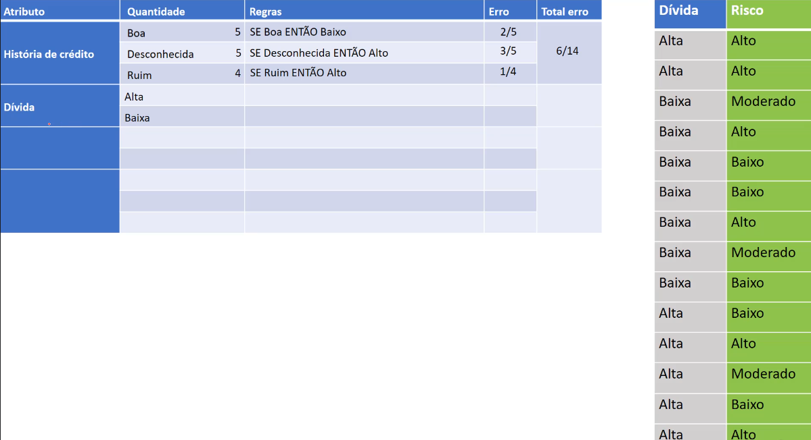

Para o atributo `Dívida`, temos apenas 2 características, `Alta` e `Baixa`, e inicialmente, teremos que realizar a contagem de quantas vezes eles aparecem nos registros

- Para Alta:

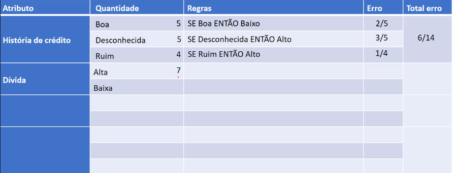
> Temos 7 registros, sendo dívida `Alta`

- Para Baixa:

> Temos 7 registros, sendo dívida `Baixa`

- Vamos precisar fazer a geração das regras, para:
  - dívida alta $\rightarrow$ risco alto
  - dívida alta $\rightarrow$ risco moderado
  - dívida alta $\rightarrow$ risco baixo

## Regras

### Dívida **Alta**

**Definindo regras:**

- SE Alta ENTÃO Alto = 4

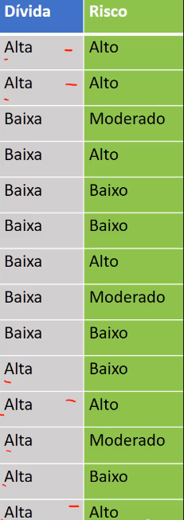

> Temos 4 registros que são Dívida Alta e risco Alto

- SE Alta ENTÃO Moderado = 1

> Temos apenas 1 registro nessas condições

- SE Alta ENTÃO Baixo = 2

> Temos 2 registros para essas condições

**Definindo qual regras tem maior frequência:**

Temos 4 registros para risco alto, 1 para risco moderado e 2 para risco baixo, por tanto definimos a regras sendo: `SE Alta ENTÃO Alto`

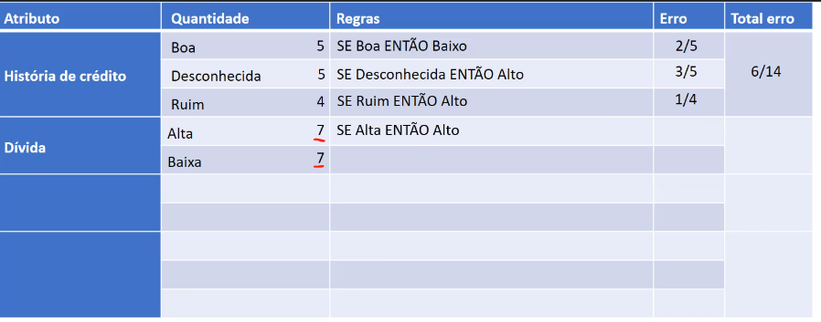

**Calculando erro:**

Note que:

- SE Alta ENTÃO Alto = 4
- SE Alta ENTÃO Moderado = 1
- SE Alta ENTÃO Baixo = 2

Se definimos como regra a `SE Alta ENTÃO Alto = 4`, por tanto o nosso erro se encontra onde os demais registros foram classificados como `Moderado` $\rightarrow$ 1, e `Baixo` $\rightarrow$ 2. Por tanto temos um erro de 3/7.

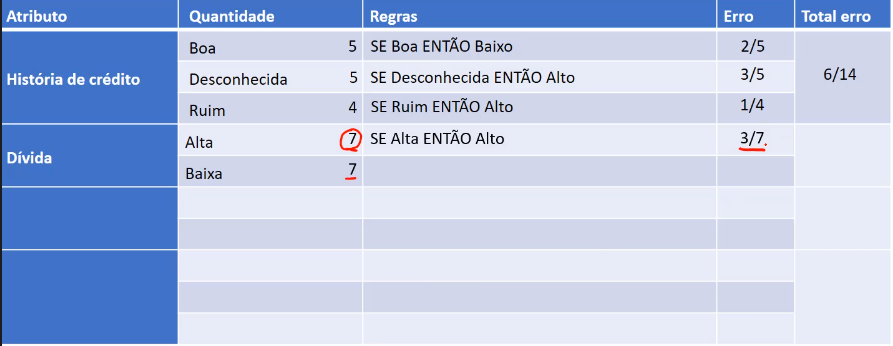

---

### Dívida **Baixa**

**Definindo regras:**

- SE Baixa ENTÃO Alto = 2

> Temos 2 registros para essa condição

- SE Baixa ENTÃO Moderado = 2

> Temos 2 registros para essa condição

- SE Baixa ENTÃO Baixo = 3

> Temos 3 registros para essa condição

**Definindo qual regras tem maior frequência:**

Agora fazendo a escolha da melhor regra, onde por definição será aquela que englobar o maior número de registros da base de dados, nesse caso será: `SE Baixa ENTÃO Baixo`, onde temos 3/7.

**Calculando erro:**

Note que:

- SE Baixa ENTÃO Alto = 2
- SE Baixa ENTÃO Moderado = 2
- SE Baixa ENTÃO Baixo = 3

Como a regra escolhina foi `SE Baixa ENTÃO Baixo`, sendo ela 3/7, por tanto o que falta para atingirmos o 100%, ou 7/7, são 4/7, que por definição é nosso erro.

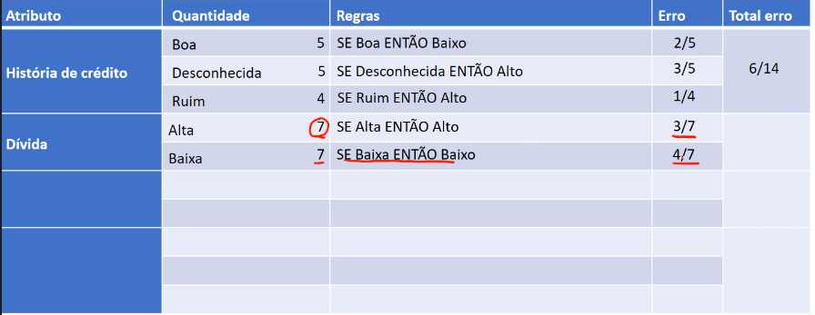

---

### Erro total Dívida

Onde realiamos a soma dos erros para obter o erro total. Temos um erro de 3 para a primeira regra, e um erro de 4 para a segunda regra, por tanto 7 erro no total, para um total de 14 registros. Logo temos 7/14.

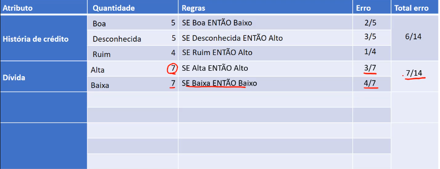

> note que atingiu 50% e com isso, já podemos fazer uma breve comparação com os dois atributos que já temos. Notadamente, é mais interessante utilizarmos o atributo `História de crédito`, com 42%, pois seu erro foi menor que o atributo `Dívida`, com 50% de erro total.

Mas para termos um comparativo final, é necessário fazer as estimativas na geração das regras dos demais atributos restantes

---

### Garantias **Nenhuma**

Vamos primeiro realizar a contagem dos registros:

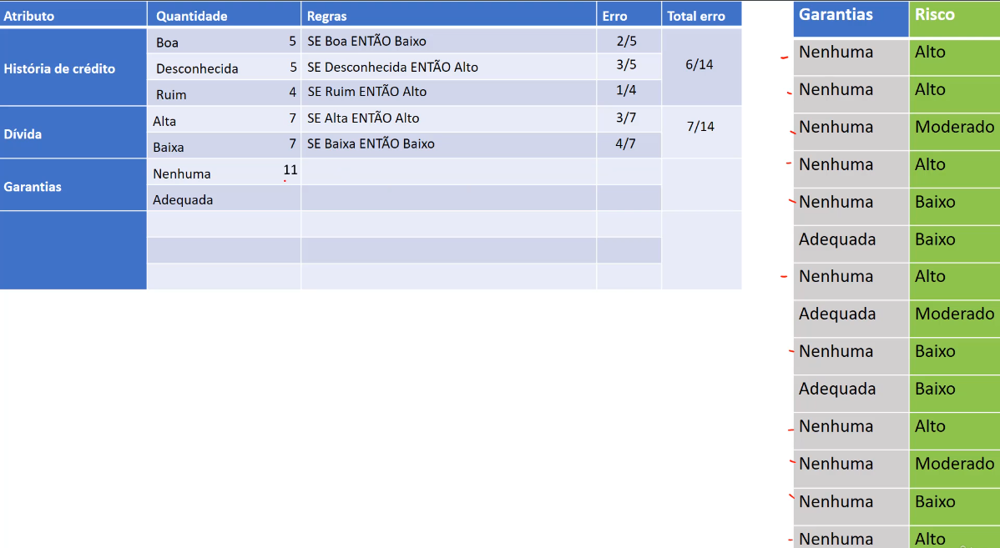

> Para `Nenhuma`, temos 11 registros

> Temos para `Adequada`, 3 retistros

**Definindo regras:**

- SE Nenhuma ENTÃO Alto = 6

> Temos 6 registros para essa condição

- SE Nenhuma ENTÃO Moderado = 2

> Temos 2 registros para essa condição

- SE Nenhuma ENTÃO Baixo = 3

> Temos 3 registros para essa condição

**Definindo qual regras tem maior frequência:**

Vamos realizar a escolha da melhor regra, aquela que possui maior frequência, e temos a: `SE Nenhuma ENTÃO Alto`, onde temos uma frequência de 6/11.

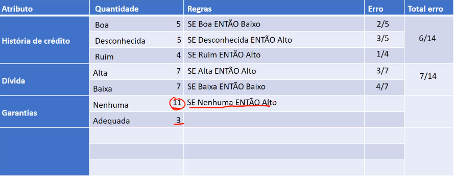

**Calculando erro:**

Note que:

- SE Nenhuma ENTÃO Alto = 6
- SE Nenhuma ENTÃO Moderado = 2
- SE Nenhuma ENTÃO Baixo = 3

Como temos a regra escolhida sendo: Nenhuma $\rightarrow$ Alto, então o que falta para completar 100% dos registros para nenhuma será nosso erro, por tanto os registros para `Moderado`, 2 e `Baixo`, 3. Por tanto, 5/11 serrá nosso erro.

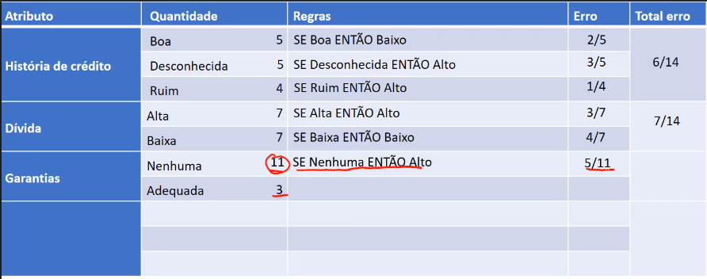

---

### Garantias **Adequada**

**Definindo regras:**

- SE Adequada ENTÃO Alto = 0

> Temos 0 registros para essa condição

- SE Adequada ENTÃO Moderado = 1

> Temos 1 registros para essa condição

- SE Adequada ENTÃO Baixo = 2

> Temos 2 registros para essa condição

**Definindo qual regras tem maior frequência:**

Escolhendo a regra com maior número de registros, temos: `SE Adequada ENTÃO Baixo`, tendo 2 registros.

**Calculando erro:**

Note que:

- SE Adequada ENTÃO Alto = 0
- SE Adequada ENTÃO Moderado = 1
- SE Adequada ENTÃO Baixo = 2

O erro para esse caso será 1/3, já que escolhemos para Adequada sendo risco baixo, o que nos resta de registro, é apenas o para adequada sendo Moderado, já que não há nenhum para o risco sendo Alto.

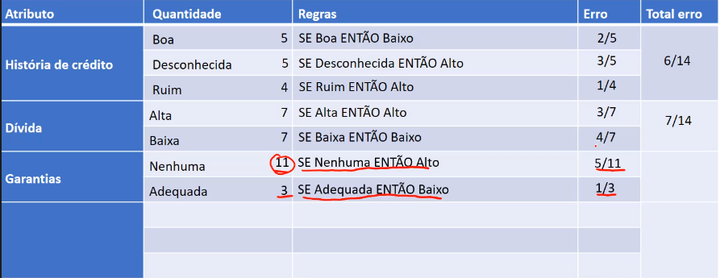

---

### Erro total Garantias

Vamos realizar o somatório dos erros, e como tivemos 5 erros para `Nenhuma` e 1 erro para `Adequada`, temos um total de 6 erros para 14 registros no total. Por tanto o erro total é de 6/14.

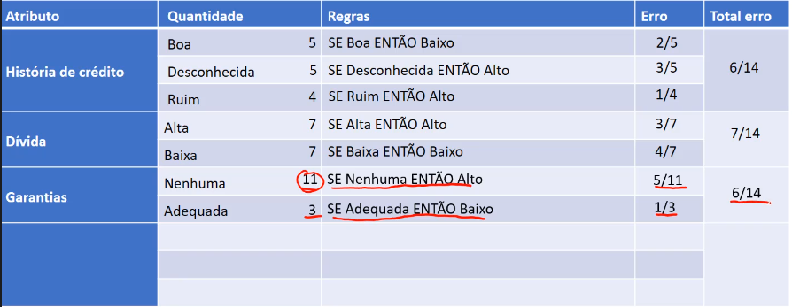

> Note que temos um empate, entre atributos, tanto o atributo `Garantias`, quanto o atributo `História de crédito`, tem 6/14 de erro total, sendo eles os menores erros até então.

Para termos certeza, vamos continuar o processo de realizar as estimativas e geração de regras para o último atributo, `Renda`.

---

### Renda

Vamos iniciar a contagem para cada quantidade:

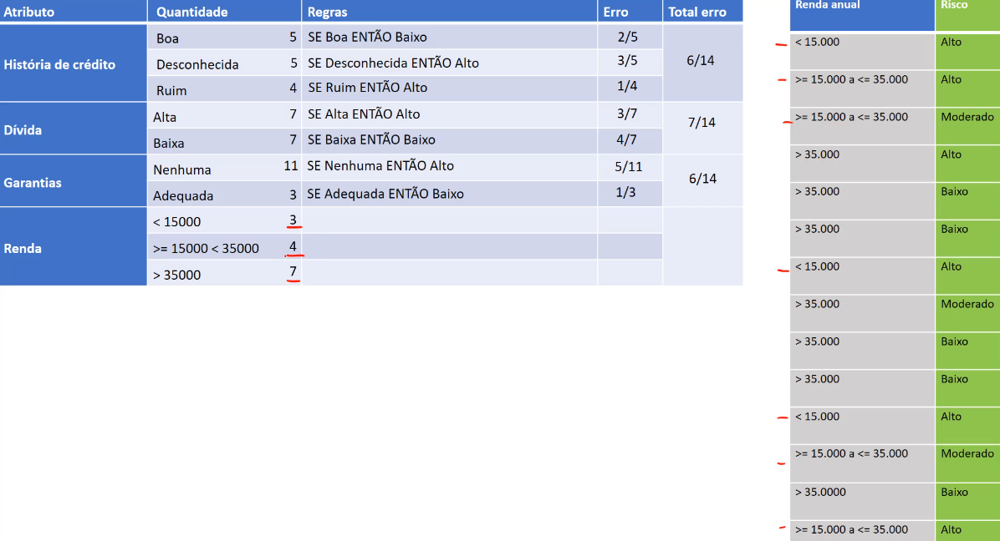

> Temos 3 registros para $< 15000$, 4 para $>=15000 < 35000$, e 7 para $> 35000$

Agora vamos para a geração das regras

### Renda **<15000**

**Definindo regras:**

- SE $<15000$ ENTÃO Alto = 3

> Temos 3 registros para essa condição

- SE $<15000$ ENTÃO Moderado = 0

> Temos 0 registros para essa condição

- SE $<15000$ ENTÃO Baixo = 0

> Temos 0 registros para essa condição

**Definindo qual regras tem maior frequência:**

Temos a regra: `SE <15000 ENTÃO Alto`, com a maior frequência, sendo 3/3.

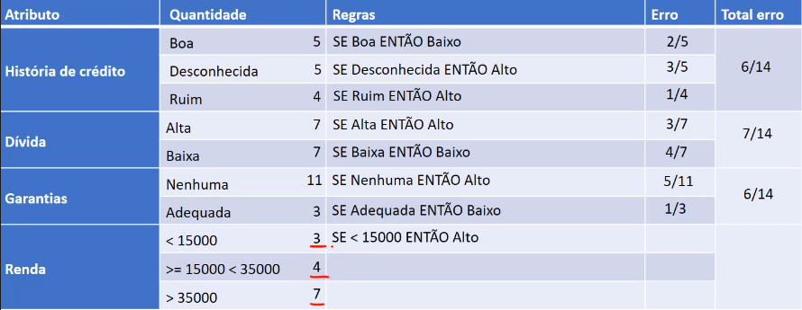

**Calculando erro:**

Note que:

- SE $<15000$ ENTÃO Alto = 3
- SE $<15000$ ENTÃO Moderado = 0
- SE $<15000$ ENTÃO Baixo = 0

Como temos apenas uma regra com todos os registros, por tanto temos 100% de acertividade, e logo, 0% de erro.

### Renda **>=15000 <35000**

**Definindo regras:**

- SE $>=15000 < 35000$ ENTÃO Alto = 2

> Temos 2 registros para essa condição

- SE $>=15000 < 35000$ ENTÃO Moderado = 2

> Temos 2 registros para essa condição

- SE $>=15000 < 35000$ ENTÃO Baixo = 0

> Temos 0 registros para essa condição

**Definindo qual regras tem maior frequência:**

Temos nesse caso um empate, por tanto tanto `Alto`, quanto `Moderado`, podem ser escolhidos, vamos pegar o `Alto`.

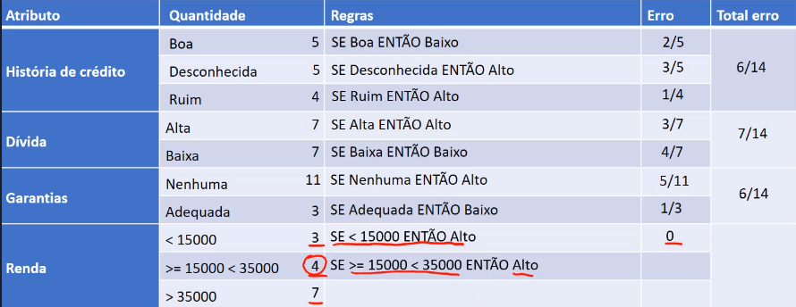

**Calculando erro:**

Note que:

- SE $>=15000 < 35000$ ENTÃO Alto = 2
- SE $>=15000 < 35000$ ENTÃO Moderado = 2
- SE $>=15000 < 35000$ ENTÃO Baixo = 0

Como escolhemos `Alto`, temos um erro de 2/4, que compõe o `Moderado`.

> Um erro de 50%

### Renda **>35000**

**Definindo regras:**

- SE $> 35000$ ENTÃO Alto = 1

> Temos 1 registros para essa condição

- SE $> 35000$ ENTÃO Moderado = 1

> Temos 1 registros para essa condição

- SE $> 35000$ ENTÃO Baixo = 5

> Temos 5 registros para essa condição

**Definindo qual regras tem maior frequência:**

Temos uma maior frequência para a regra: `SE > 35000 ENTÃO Baixo`, tendo uma frequência de 5 para 7.

**Calculando erro:**

O erro para renda sendo em $>35000$, é de 2/7, já que são os dois registros que não são englobados pela regra, `SE > 35000 ENTÃO Baixo`.

---

### Erro total Renda

Basta realizar o somatório dos erros para cada uma das condições definidas, onde temos $0 + 2 + 2$, totalizando 4 de erro total, para um total de registros de 14, por tanto 4/14.

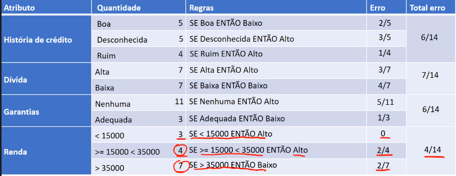

> Note que temos o menor erro total, sendo a renda, por fim, definimos qual será nosso atributo, para gerar as regras.

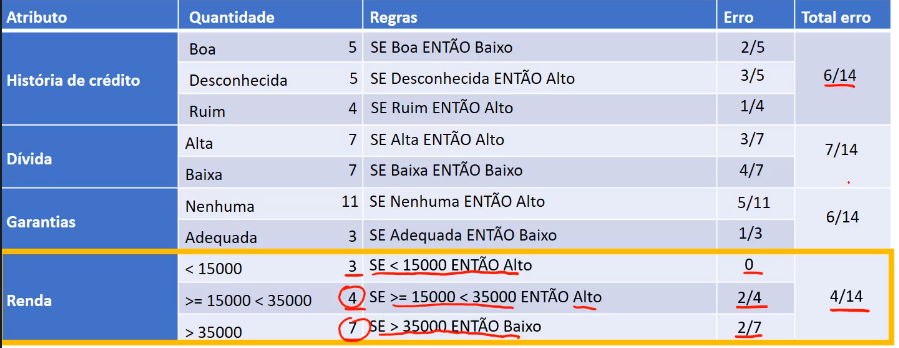

O algoritmo OneR, vai utilizar as regras geradas pelo atributo escolhido, que nesse caso foi a **renda**.

Dado um novo registro, onde não sabemos sua classe, será aplicada essas regras da renda, para que possa ser classificado. Note que ele não utilizará nenhum outro atributo para realizar essa classificação, apenas o atributo escolhido. Por isso o nome desse algoritmo é chamado de OneR, pois ele irá gerar regras baseado em somente um atributo.

> Para problemas mais básicos esse algoritmo pode trazer resultados interessantes, porém como ele se baseia apenas em um único atributo, é certo acreditar que para problemas mais complexos ele não vai ter uma eficácia boa.

Ferramenta **WECA**, experimente o algoritmo OneR.

[Continua](2.2%20-%20Algoritmo%20PRISM.md) $\Rightarrow$
