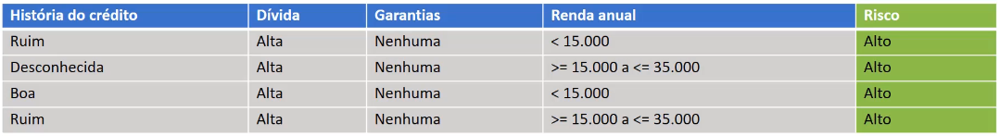

# Algoritmo PRISM

Veremos uma  maneira de realizar geração de regras compostas utilizando mais de um atributo

O algoritmo PRISM é de 1987, e vários outros algoritmos baseados em regras, tiveram origem utilizando conceitos desse algoritmo.

## Seu funcionamento

Vamos supor que queremos gerar regras, somente para o risco sendo **Alto**

> Lembrando que em nossa base de dados, temos um risco **Alto**, **Moderado** e **Baixo**.

 O objetivo principalmente com esse algoritmo é, gerar uma regra para classificar os registros como risco **Alto**, uma regra para classificar os registros como risco **Moderado** e uma regra para classificar os registros como risco **Baixo**.

---

## Regras para risco **Alto**

Agora temos somente 6 registros, que é a quantidade de vezes que o risco alto aparece em nossa base de dados completa. E como queremos gerar um regra somente para o risco alto, então os demais riscos, são ignorados e apenas serão utilizados os **Altos**.

- Vamos iniciar realizando o cálculo da **Abrangência**

onde temos que determinar qual atributo deve estrar em nossa condição: `SE ATRIBUTO ENTÃO Risco = Alto`

> O objetivo é escolher aquela que tem a maior abrangência, note que pegamos o atributo e seu valor e onde ele tem como resposta o risco **Alto**, contabilizamos.

**Note que:**

**Historia de crédito:**

História de crédito boa temos 1, e temos 1 alto para essa garantia, então:

História de crédito = Boa $\rightarrow$ 1

Risco = Alto para História de crédito = Boa $\rightarrow$ 1. Logo  $\mapsto$  1/1.

História de crédito = Desconhecida $\rightarrow$ 2

Risco = Alto para História de crédito = Desconhecida $\rightarrow$ 2. Logo $\mapsto$ 2/2.

História de crédito = Ruim $\rightarrow$ 3

Risco = Alto para História de crédito = Ruim $\rightarrow$ 3. Logo $\mapsto$ 3/3.

- Precisamos pegar aquele que tem maior abrangência, e seria o 6/6, onde a Garantia é `Nenhuma` e o risco é `Alto`

> Vamos selecionar esse atributo e fazer o preenchimento da regra, `SE ATRIBUTO ENTÃO Risco = Alto`

- `SE Garantias = Nenhuma ENTÃO Risco = Alto`

---

Vamos ter que preencher com mais um atributo, onde ficará assim: `SE Garantias = Nenhuma E ATRIBUTO ENTÃO Risco = Alto`

E para isso o que faremos é a realização de mais um filtro na nossa base de dados, perceba que estamos trabalhando somente com o risco **Alto**

Como em nossa regra temos Garantias - Nenhuma, então só iremos utilizar aqueles registros que são garantias **nenhuma** e risco é **Alto**

> Note que a base de dados vai ser a mesmo que do processo anterior, pois já tiamos para todos os registros a garantia = **Nenhuma**

Faremos os mesmo processos novamente:

E temos o atributo mais abrangênte sendo, Dívida = Alta

E agora vamos colocá-lo, em nossa regra: `SE Garantias = Nenhuma E ATRIBUTO ENTÃO Risco = Alto`, que ficará:

- `SE Garantias = Nenhuma E Dívida = Alta ENTÃO Risco = Alto`

Agora o que vamos precisar realizar, é gerar mais uma versão dessa base de dados, reduzindo os registros, onde tenha somente os registros que são garantinha **Nenhuma** e dívida **Alta**

> Agora temos poucos registros, são apenas 4. Note que dívida é **Alta**, que as garantias são **Nenhuma** e por fim, risco **Alto**.

E agora o que vamos precisar fazer, é preencher mais um atributo para essa regras, `SE Garantias = Nenhuma E Dívida = Alta  E ATRIBUTO ENTÃO Risco = Alto`

Agora vamos realizar o cálculo de abrangência novamente para essa versão de base de dados que possuimos. Lembrando que utilizamos os atributos que ainda não foram calculados.

Note que temos um empate para 3 atributos, e o que faremos agora é selecionar qualquer uma desseas 3 regras, pois temos o mesmo valor para elas.

> Pegaremos a História de crédito = **Ruim**

E então termos a regra parcial: `SE Garantias = Nenhuma E Dívida = Alta  E ATRIBUTO ENTÃO Risco = Alto`, que ficará assim:

- `SE Garantias = Nenhuma E Dívida = Alta  E História de crédito = Ruim ENTÃO Risco = Alto`

E faremoz a última rodada desse processo, note que temos apenas dois registros agora.

e o que precisamos é colocar mais uma condição para nossa regras parcial: `SE Garantias = Nenhuma E Dívida = Alta  E História de crédito = Ruim E ATRIBUTO ENTÃO Risco = Alto`

Que será nosso atributo **Renda**

> Perceba que temos um empate novamente, pois como só havia 2 registros um para cada condições da renda, naturalmente, o resultado seria esse, então como feito em processos anteriores, vamos selecionar uma regras das duas que temos, pegaremos novamento o primeiro.

E nossa regra ficará assim:

`SE Garantias = Nenhuma E Dívida = Alta  E História de crédito = Ruim E Renda < 15 ENTÃO Risco = Alto`

Essa sendo a regra final, depois de analisada toda a base de dados como foi visto.

E feito isso, o que é preciso realizaer é a geração da regra para o risco **Moderado** e para o risco **Baixo**, e com isso temos as regras para cada um dos valores do atributo `Risco`

> Outro ponto é que essas regras acabaram ficando muito específicas, registros que aparecem 1/1, podendo assim gerar o **Overfitting**

- Overfitting : Quando o algoritmo se adapta muito a base de dados e com isso quando sebmetemos valores fora dessa base de dados, o algoritmo tende a ter resultados não tão bons.

E baseado nesse problema, assim como em Árvores de decisão, aqui também podemos utilizar o conceito de poda. Podemos podar atributos que possuem poucos dados, como é o caso da Renda nesse ultimo processo.

---

## Árvores X Regras

Comparativo entres os algoritmos:

- Compreensibilidade
  - Tanto para regras, quando para árvores, é muito fácil entender o resultado do algoritmo.
- Pouco espaço de armazenamento
- Mais lento
  - Em geram um algoritmo de Regras é mais lento que um de árvores
- Em geral, regras não apresentam melhores resultados do que árvores de decisão.

> A abordagem de Regras, já não é tão disseminada no mercado, não há hoje em dia mais aplicações com a utilização de Regras.

[Contunua](3%20-%20Base%20risco%20c%C5%95edito.md) $\Rightarrow$
