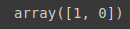
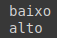

# Regras

Primeiramente, vamos fazer a instalação de uma outra biblioteca. Pois atualmente, o `sklean` não possui algoritmo específico para geração de regras, devido a ssim vamos utilizar o `Orange3`.

```python
!pip install Orange3
```

> Além de ser uma biblioteca que pode ser codificada em python, é também possível utilizar uma interface gráfica, para construir os algoritmos de forma totalmente visual.

Para certificar que a instalação foi feita corretamente, fazemos um import:

```python
import Orange
```

## Base risco de crédito

Tabalhando com a base de risco de crédito, primeiramente importamos a base, e note que vamos realizar essa importação de modo diferente, onde anteriormente, era realizada através do `pandas`, agora vamos realizar através do próprio `Orange`, e fezemos através dele pois necessitamos manter ele no formato **csv**, que é o formato que o `Orange` trabalha.

Para isso vamos usar o package `data` do orange, e nele chamamos o formato `Table`.

- Pandas: formato **Dataframe**
- Orange: formato **Table**

```python
base_risco_credito = Orange.data.Table('risco_credito_regras.csv')
```


> c#risco, o **c#** vai indicar para o `Orange` qual é o atributo target/classe. É necessário realizar essa alteração no aruivo csv, para que o `Orange`, possa realizar a identificação do atributo classe.

Digitanto :

```python
base_risco_credito
```

Podemos observar os registros


> Note que o nosso atributo classe está separado por um pipe. o c# colocado em nosso arquivo csv, serve justamente para que o `orange` realize essa separação dos atributos.

Podemos também observar o domínio

```python
base_risco_credito.domain
```


> Perceba que vai ser exibido as colunas, história, dívida, garantias e renda, e nossa classe, o nosso objetivo que é o risco de conceder crédito ao cliente.

Vamos criar o algoritmo, vamos trabalhar com uma outra versão de algoritmos de regras de associação, chamado de CN2, que se assemelha aos algoritmos na etapa [teórica](2%20-%20Algoritmo%20OneR%20I.md).

> Algoritmo antigo, foi criado em meados de 1982.

Acessamos o `Orange`, utilizando o package classification e rules, e dentro desse package, temos variados algoritmos baseados em regras. VAmos utilizar a classe CN2Learner. Em seguida craimos as regras, instânciamos o algoritimo cn2 e passamos a base de dados

```python
cn2 = Orange.classification.rules.CN2Learner()
regras_risco_credito = cn2(base_risco_credito)
```

Podemos verificar as regras geradas, utilizando um for para percorrer a lista de regras, passada pela função rule_list

```python
for regras in regras_risco_credito.rule_list:
  print(regras)
```


Feito isso, agora vamos realizar a previsão dos registros novos, vamos utilizar os mesmos dois registros que viemos usando.

Clientes | história | dívida | garantia | renda
---------|---------|---------|---------|---------
Cliente 1 |  boa |  alta | nenhuma |  > 35
Cliente 2 |  ruim | alta | adequada | <15

Para isso criamos a variável e chamamos a `regras_risco_credito` e passamos em formato de matriz nossos **cliente 1** e **cliente 2**

```python
previsoes = regras_risco_credito([['boa','alta','nenhuma','acima_35'],['ruim','alta','adequada','0_15']])
previsoes
```



Tivemos a classificação para o **Cliente 1** e **Cliente 2**:

Cliente 1 | Cliente 2
----------|----------
1         |      0

> Note que não utilizamos o predict para realizar as previsões, basta só passar os parametros. Outro ponte é qu não há uma necessidade de transformar os valores categóricos em numéricos, pois esse algoritmo consegue trabalhar com atributos categóricos, por tanto não utilizamos o LabelEncoder aqui.

Para que possamos classificar de forma mais intuitiva, vamos analisar as classes e determinar os valores, para isso acessamos o domain.class_var

```python
base_risco_credito.domain.class_var
```


> note que ele vai mostrar os valores

Se indicarmos que queremos pegar apenas os valores, ele vai limpar mais o output:

```python
base_risco_credito.domain.class_var.values
```


> Ele trouxe apenas a lista com os valores

Agora podemos fazer um for para percorrer as previsssões e classificar de forma mais intuitiva elas

```python
for i in previsoes:
  print(base_risco_credito.domain.class_var.values[i])
```

> Note que repetimos o mesmo código `base_risco_credito.domain.class_var.values`, só passando o `i`, para que seja feita a associação e retorne o nome.



[Continua](3.1%20-%20Base%20cr%C3%A9dito.md) $\Rightarrow$
