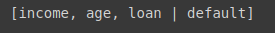

# Base credit data

Iniciamos com a importação da base de dados, seguindo o mesmo processo [anterior](3%20-%20Base%20risco%20c%C5%95edito.md):

```python
base_credit = Orange.data.Table('credit_data_regras.csv')
```

Realizada a importação vamos olhar a base de dados


> Note que temos **i#** para `clienteid`, ele indica pata o algoritmo que deve ignorar o atributo com essa marcação, e para o atributo `default`, temos o c#, que o marca para que o algoritmo defina-o como classe.

Vamos visualizar os seu valores

```python
base_credit
```


> Note que não temos mais o `clienteid` e estamos com a separação do atributo `default`, por ser nossa classe.

Vamos olhar os atributos, utilizando o `domain`

```python
base_credit.domain
```



> Aqui podemos analizar melhor a ausência do `clienteid` e do `default` sendo nossa classe

Vamos agora dividir nossa base de dados em treinamento e teste, para isso vamos utilizar um package do `Orange`, o evaluation, dentro dele temos o testing.sample. Passamos como parâmetro a base de dados cujo vamos dividir e o parâmetro `n` irá definir a porcentagem dessa divisão

```python
base_dividida = Orange.evaluation.testing.sample(base_credit, n = 0.25)
```

para visualizar a base dividida

```python
base_dividida
```


> Note que temos um array com duas posições, a posição [0] será nossa `base_teste` e a posição [1] será nossa `base_treinamento`.

Vamos visualizar a base_dividida na posição [0]

```python
base_dividida[0]
```

![posicao[0]](img/3_1_base_dividida%5B0%5D.png)

Vamos visualizar a base_dividida na posição [1]

```python
base_dividida[1]
```

![dividida[1]](img/3_1_base_dividida%5B1%5D.png)

Feito isso vamos criar nossas bases teste e treinamento, só para efeito de melhor compreensão do código

```python
base_treinamento = base_dividida[1]
base_teste = base_dividida[0]
```

Para confirmação vamos olhar o tamanho deles, lembrando que a `base_teste` tem que ter 25% da base completa, já que foi o valor definido na criação da `base_dividida`

```python
len(base_treinamento), len(base_teste)
```


Vamos realizar o treinamento da base, para isso vamos iniciar o nosso algoritmo

```python
cn2 = Orange.classification.rules.CN2Learner()
regras_credit = cn2(base_treinamento)
```

Feito isso, vamos analisar as regras geradas pelo nosso algoritmo

```python
for regras in regras_credit.rule_list:
  print(regras)
```


Agora efetivamente vamos realizar as previsões, para isso chamamos o package `evaluation` do **Orange** novamente e passamos a classe `TestOnData`, pertencente ao `testing`, o parâmetro passada será nossa `base_treinamento`, `base_teste` e o diferente até agora será a criação de uma função em tempo de execução por meio do comando `lambda`, o nome dela será testdata e o passamos o nome do algoritmo.

```python
previsoes = Orange.evaluation.testing.TestOnTestData(base_treinamento, base_teste, [lambda testdata: regras_credit])
```

Feito isso vamos visualizar a previsão

```python
previsoes
```


> Note que não retornou as `previsoes` como de costume, o que temos é um classe no formato exibido em nosso output, e para que possamos visualizar a **accuracy** de nossas `previsoes`, precisamos utilizar o package `evaluation` e chamar a métrica CA, passando a variável `previsoes`

- CA: Classification Accuracy

```python
Orange.evaluation.CA(previsoes)
```


Note que temos várias funções fora o CA, com o f1, visto no `classification_report` do `sklearn`


> Note que tivemos um resultado do nosso accuracy de 98%, superando apenas o algoritmo Naive Bayes com 93.80%.

[Continua](4%20-%20Instala%C3%A7%C3%A3o%20do%20Orange.md) $\Rightarrow$
