# Base censo + interface gráfica

Em [documentos](3.1%20-%20Base%20cr%C3%A9dito.md) passados, utilizamos a codificação no Orange, nesse vamos utilizar sua interface gráfica.

Abra o **Orange**, no meu caso, estou utiliando `anaconda` para isso.

Com o Orange aberto, o que faremos é importar nossa base de dados

- Em **Data**, arrastamos para nosso ambiente o componente `file`

    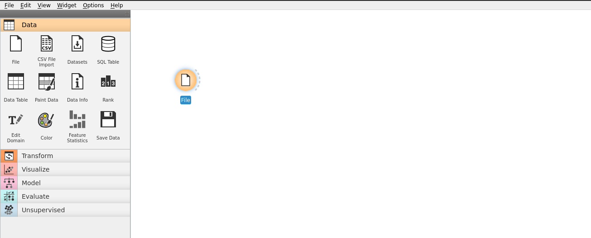

- Com dois cliquei, abrimos o `file`, e buscamos nossa base de dados

    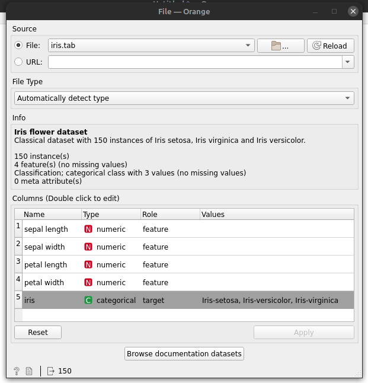

- Selecionando a base `census.csv`, note que em Columns, já aparece os dados da nossa base, e em detalhes, indicando atributos categóricos e numéricos.

    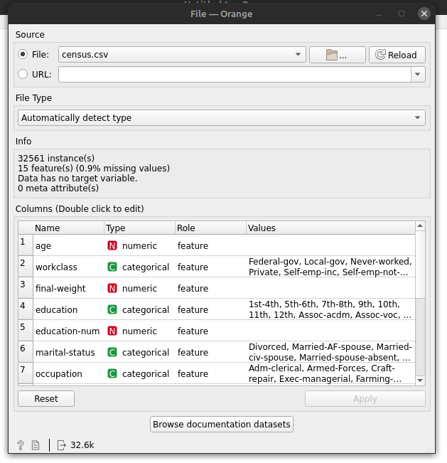

- Feito isso precisamos indicar para o **Orange** quem será nosso atributo classe/Target, para isso precisamos ir em nosso atributo `income` e mudar o valor do `role` de `feature` para `target` e dar um **apply**.

    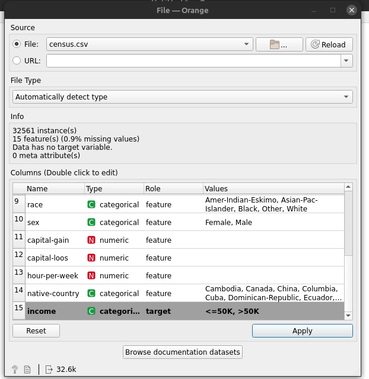

- Feito isso podemos fechar a janela e para visualizarmos os dados da nossa base vamos incluir mais um componente em nosso ambiente. O `Data Table`.

    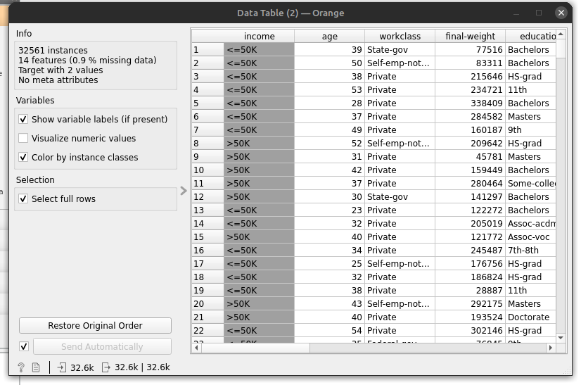

> Note que temos 32 mil registros, temos que reduzir os dados que iremos trabalhar, pois isso vai afetar nosso processamento, para não perdermos muito tempo treinando o algoritmo com essa base, vamos reduzi-la.

- Vamos incluir outro componente ao nosso ambiente, o `Data Sampler`, ele se encontra na coluna `Transform`.

    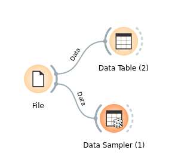

feito a conexão dessa forma, agora vamos transformar nossos dados.

- Com dois cliques no `Data Sampler`, podemos definir qual o tamanho de dados que vamos trabalhar, através do `Fixed proportion of data`.

    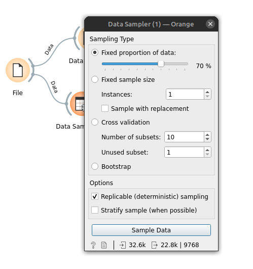

- Definimos o `Fixed proportion of data` em 8%, o que nos dá, 2606 dados, definimos com o **Sample data**.

    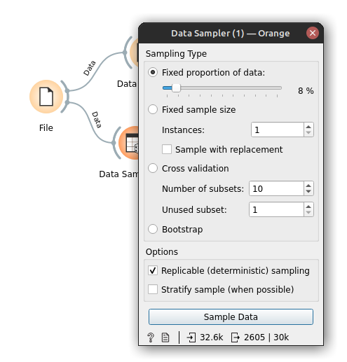

Realizada a transformação vamos visualizar com o `Data Table`. Vamos fazer a conexão dos componentes:

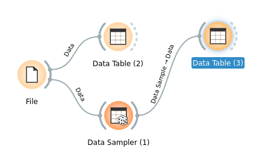

Para visualizar basta dois cliques no componente incluido

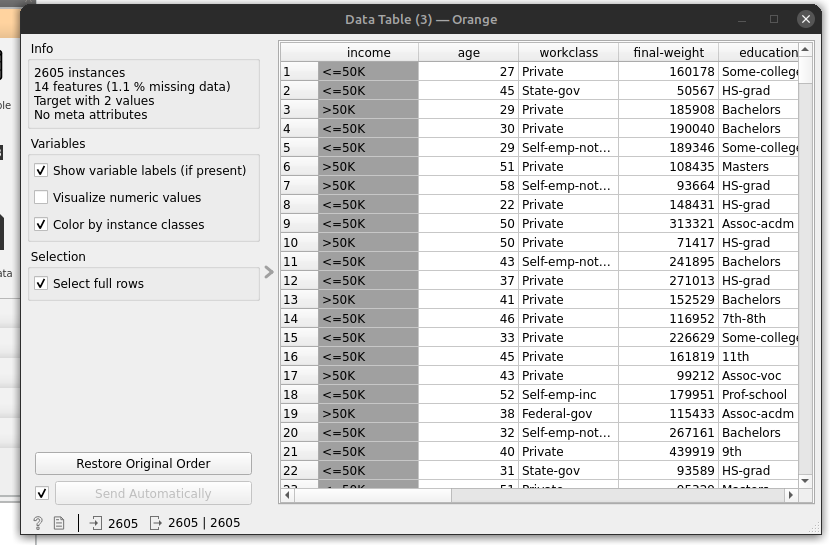

> Note que temos apenas 2605 dados/instâncias.

Agora vamos iniciar no algoritmo e realizar o treinamendo dele para essa base de dados.

- Em **model**, temos os algoritmos oferecidos pelo **Orange**, e vamos utilizar o `CN2 Rule Induction`, pegamos e conectamos com nosso `Data Sampler`.

    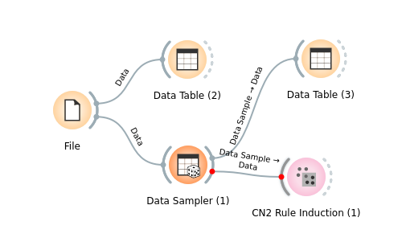

    > Note que ao conectarmos, ele já vai realizar o treinamento. Assim que o treinamento estiver comcluido, sua conexão em vermelho, passarar a ficar cinza.

- Temos ao abrirmos o algoritmo cn2, algumas configurações

    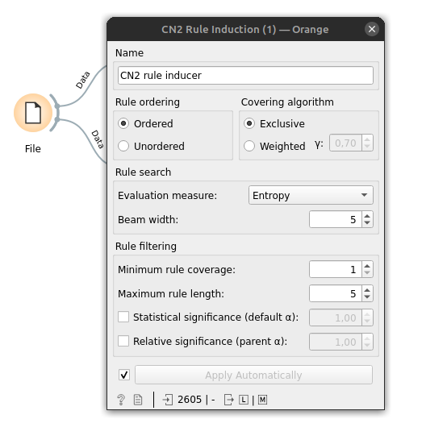

- Realizado o treinamento, para visualizarmos as regras que o algoritmo gerou, vamos adicionar um componente chamado `CN2 Rule Viewer`, encontrado em **Visualize**.

    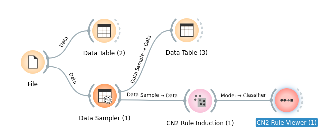

- Aqui temos as regras geradas

    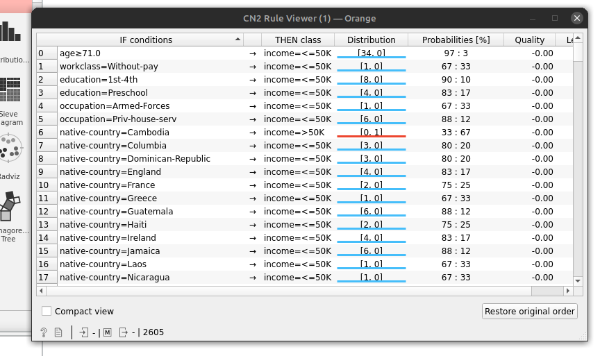

    > Note que é oferecido algumas informações a mais, como a probabilidade de cada regra e até sua distribuição.

Por fim, vamos realizar o teste do nosso algoritmo e termos o nosso accuracy.

- Para isso vamos incluir mais um componente ao ambiente, `Test and Score`, encontrado na coluna **Evaluate**.

    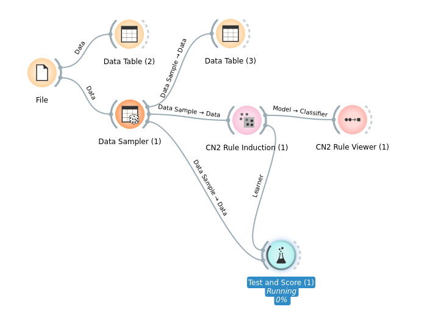

    > Note que a ligação é feita com as regras geradas e a base de dados, pois é necessário saber quais as regras e os dados. Perceba também que o teste nessa imagem está rodando, ele demora um pouco para trazer o resultado, isso considerando que reduzimos nossa amostragem de dados.

Ao finalizar o teste, temos algumas métricas, `CA`, nosso classification Accuracy, f1,Precision e Recal.

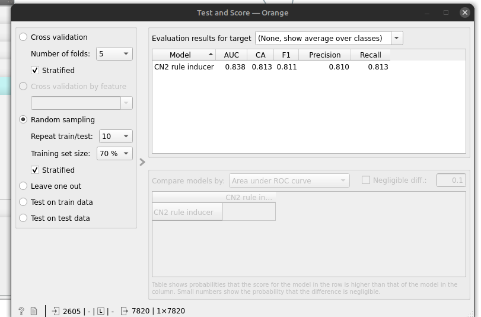

> Note que podemos rodar varios modelos estatísticos e o `Test and Score` irá exibir todos eles e suas respectivas métricas.

- Podemos realizar uma cros-validation, onde tivemos um sucesso maior

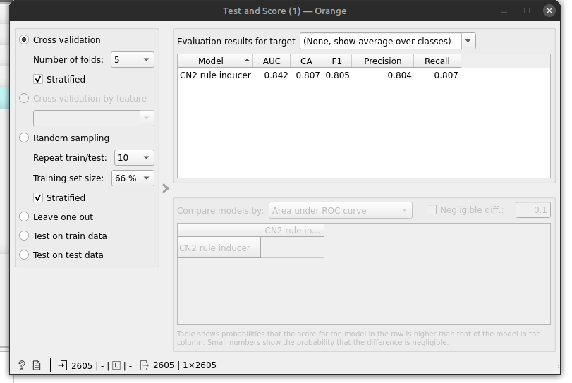

- Random Sampling: Defino o tamanho do traning set e a quantidade de vezes que será repetido o teste e com isso tira a média, resultando no classification accuracy
- Cross-validation: Define o numero de folds, onde o treinamento será realizado parte por parte, na base de dados inteira, isso oferece melhores resultados para o accuracy.

[Continua](5.1%20-%20Base%20cr%C3%A9dito%20%2B%20Interface%20gr%C3%A1fica.md) $\Rightarrow$
