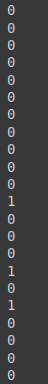

# Classificador base

Vamos trabalhar com um classificador base que é o **majority learner** e também vamos utilizar a biblioteca **Orange**.

E de fato o majority não se trata de um algoritmo que vai aprender algo com os dados. Vai simplesmente realizar a classificação dos registros baseado na maioria dos dados na base de dados.

Vamos supor que a maioria dos clientes em um bando pagam o empréstimo. E quando um novo cliente chega ao banco e não sei a classe a qual pertence. Como a maioria dos clientes pagam empréstimo, consequentimente esse cliente também será classificado como alguém que pagará o empréstimo.

Esse algoritmo é muito utilizado na realização de avaliação dos outros algoritmos.

---

Vamos importar a base de dados

```python
base_credit = Orange.data.Table('credit_data_regras.csv')
```

Podemos visualizar o domain da base de dados

```python
base_credit.domain
```


> Note que está separando corretamente os atributos previsores da classe

Vamos criar o nosso algoritmo

```python
majority = Orange.classification.MajorityLearner()
```

E agora podemos retornar previsões, passamos a mesma base tanto para o teste quanto para o treinamento, e isso nos mostra que não há um treinamento com esse algoritmo. Passamos também o objeto que criamos com o nosso classificador base.

```python
previsoes = Orange.evaluation.testing.TestOnTestData(base_credit, base_credit, [majority])
```

Vamos realizar a avaliação/classificação

```python
Orange.evaluation.CA(previsoes)
```


> Temos o valor de 0.8585

Podemos observar os valores das previsões, para isso vamos usar um `for`, e o `print` passamos o registro.

```python
for registro in base_credit:
  print(registro)
```


> notamos que, como foi passado a mesma base de dados, que foram passadas como parâmetro, isso indica que estamos fazendo a classificação para cada um dos registros. Ele ta mostrando os atributos previsores juntamente com a classe.

usaremos o método `get_class()` para retornar somente o valor da classe.

```python
for registro in base_credit:
  print(registro.get_class())
```



O que faremos é uma importação do `collections`, o `Counter`, ele irá contar quantos registros classificados como [0] e [1]

- passamos como `str` o nosso valor pois ele não trabalha com variáveis discretas.

```python
from collections import Counter
Counter(str(registro.get_class()) for registro in base_credit)
```


> Perceba que temos um total de 1717 para  classe [0] e 283 para classe [1], temos uma maioria sendo classe [0]

Se dividirmos o valor:

```python
1717 / 2000
```


> note que temos o nosso accuracy. Com isso concluimos que, como a maioria dos registros são da classe [0], isso indica que, quando formos classificar um novo registro que não sabemos qual a classe ele pertence, todos os registros novos, serão classificados como [0], pois são a maioria na base de dados.

E interessante usarmos esse `Majority learner`, para termos um ponto base para avaliação dos algoritmos. Onde se nessa base de dados tivermos um algoritmo que acerte menos que **85%**, é muito mais fácil classificarmos os registros baseado na maioria das classes da base de dados.

Em outras palavras se tivermos um valor abaixo de 85%, indica não é interessante utilizarmos determinado algoritmo de aprendizagem de máquina.

---

## Comparativo


> Note que nenhum dos algoritomos utilizados na base de crédito, tiveram um accuracy inferior à 0.8585. Isso indica que vale a pena utilizar todos esses outros algoritmos, pelo fata de que eles acabam passando dessa linha base.

[Continua](6.1%20-%20Classificador%20base%20(majority%20learner)%20-%20base%20censo.md) $\Rightarrow$
