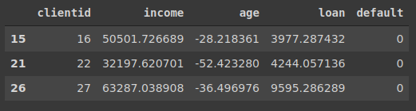
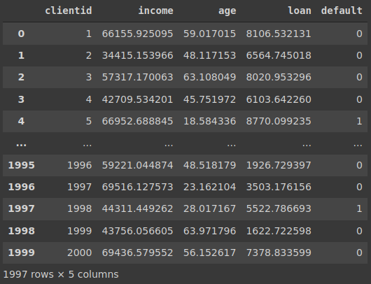

# Tratamento de valores incosistentes

## É importante esse processo de limpeza, pois caso haja dados incosistentes, eles certamente irão prejuticar no aprendizado dos algoritmos de machine learning. Por tanto o primeiro passo é fazer a análise dos dados e tentar fazer a correção desses valores

## Note que já havia sido detectado esses valores com idades inválidas, por tanto necessário uma correção

### primeiro faremos a localização desses registros

- usaremos a função `loc` do pandas, que serve para localizar algum registro
- buscamos na base de dados pelo atributo age na condição que ele seja menor que 0

```python
base_credit.loc[base_credit['age'] < 0]
```

### Note que tivemos 3 registros com valores menor que 0



### Outra maneira de executar esse mesmo código, utilizando o filtro diretamente sem aplicação do `loc`

```python
base_credit[base_credit['age'] < 0]
```

### Perceba que temos o mesmo resultado, são duas maneiras de se chegar ao mesmo resultado


### Técnicas para tratar essas idades inválidas

### 1 $\mapsto$ Apagar a coluna inteira (de todos os registros da base de dados)

- Nesse caso, temos 2 mil registros e somente 3 registros que estão com incosistencia, então acaba não sendo a melhor alternativa. Porém em um caso onde com uma base de dados com 2 mil registros e temos 1997 registros incosistentes em um atributo, nesse caso é bem inviável fazer qualquer tipo de correção, sendo assim mais interessante apagar toda a coluna desse respectivo atributo
- vamos criar uma base_credit2, para que possamos avaliar o resultado da manipulação sem qualquer alteração na base original

```python
base_credit2 = base_credit.drop('age', axis = 1)
base_credit2
```

### perceba que ouve a exclusão da coluna idade


### 2 $\mapsto$ Apagar somente os registros com valores incosistentes

- para apagarmos os registros desejados é necessário indicarmos os índices deles, para isso utilizamos o, `.index`

```python
base_credit3 = base_credit.drop(base_credit[base_credit['age'] < 0].index)
base_credit3
```



### Perceba o que retornna apenas com o `index`, sem o uso do `drop`

```python
base_credit[base_credit['age'] < 0].index
```

### Output 1

#### Os índices dos registros com o atributo age menor que 0

- É como se passasemos uma lista para a função `drop`

```python
Int64Index([15, 21, 26], dtype='int64')
```

### Apenas para certificar se os registros foram apagados

```python
base_credit3.loc[base_credit3['age'] < 0]
```

### note que nenhum registro retornou

### Output 2

```python
clientid income age loan default
```

### 3 $\mapsto$ Preencher os valores incosistentes manualmente

### Preencher com a média

```python
base_credit.mean()
```

.png)

### podemos acessar apenas a média desse atributo

```python
base_credit['age'].mean()
```

### Output 3

```python
40.80755937840458
```

### Porém precisamos retirar os registros que estão com os valores incosistentes, se não retirarmos eles vão alterar o valor da média

- note que o valor sofreu uma leve alteração, mas devido ao fato de termos apenas 3 resgitros inconsistentes

```python
base_credit['age'][base_credit['age'] > 0].mean()
```

### Output 4

```python
40.92770044906149
```

### Agora o que faremos é localizar os registros com essa incosistencia e faremos a devida alteração nos valores

```python
base_credit.loc[base_credit['age'] < 0] = 40.92
```

### apenas para checar, que foi alterado

```python
base_credit.loc[base_credit['age'] < 0]
```

### Output 5

```python
clientid income age loan default
```

### Perceba que todo o registro foi alterado para 40.92

```python
base_credit.head(27)
```

.png)

### para corrigir isso é preciso definir qual atributo desejamos alterar

```python
base_credit.loc[base_credit['age'] < 0, 'age'] = 40.92
```

### novamente verificando se foi realmente alterado

```python
base_credit.loc[base_credit['age'] < 0]
```

### Output 6

```python
clientid income age loan default
```

### por fim, consegumos alterar apenas os registro desejados e sendo somente o atributo age

```python
base_credit.head(27)
```

2.png)

### Agora podemos verificar os gráficos novamente, pois as alterações geraram gráficos um pouco diferente
