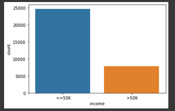
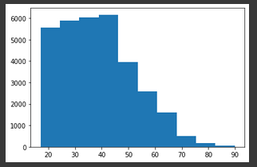
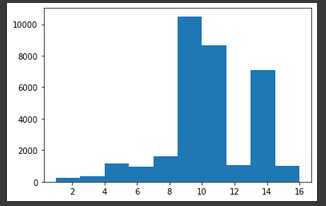
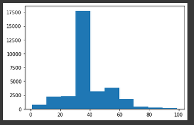
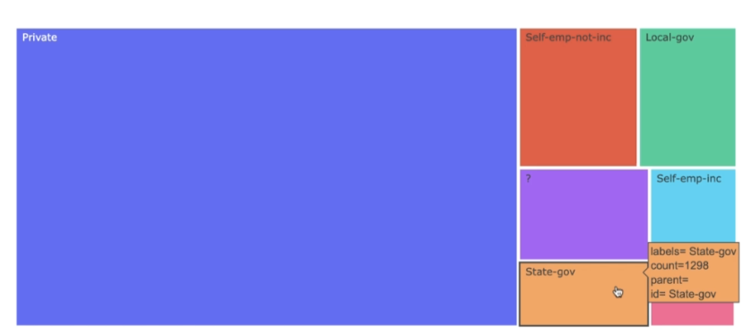
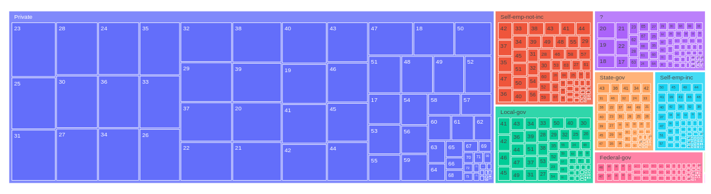
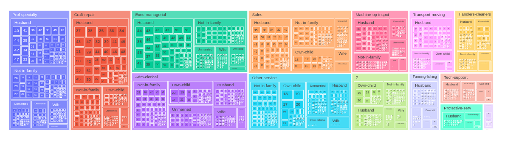
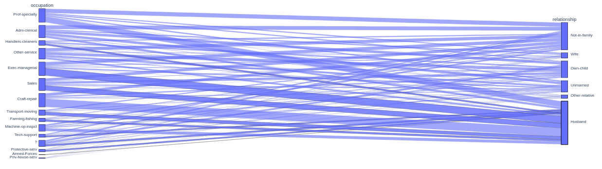
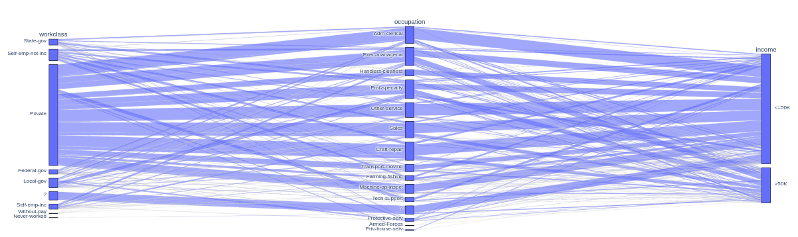
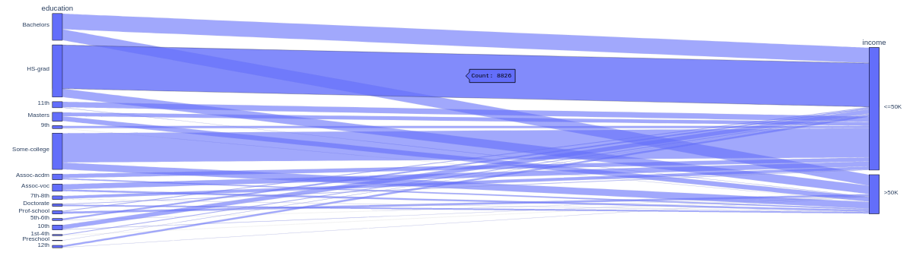

# visualização dos dados

## primeiramente faremos uma contagem de quantos registros temos para cada uma das classes

```python
np.unique(base_census['income'], return_counts = True)
```

### Output: `np.unique(base_census['income'], return_counts = True)`

```python
(array([' <=50K', ' >50K'], dtype=object), array([24720,  7841]))
```

```python
sns.countplot(x = base_census['income']);
```

- note que temos uma base que pode ser considerada desbalanceada



## Vamos gerar alguns histogramas, para analizar a distribuição desses dados

----------------------------

### Analizando o atributo `age`

```python
plt.hist(x = base_census['age']);
```



> podemos analizar que temos uma grande concentração de registros que possuem de 40 a 45 anos e níveis também altos de agrupamento desses registros nas faixas de 20, 30 anos de idade, podemos notar também uma queda desses registros com o aumento dessa idade, dos 70 anos em diante temos bem menos de mil registros.

----------------------------

### Analizando o atributo `education-num`

```python
plt.hist(x = base_census['education-num']);
```



> podemos analizar que a grade maioria das pessoas estudam entre 8 e 11 anos, e sua maior parte estudam 9 anos, temos também um pico grande em 14 anos de estudos. Temos um valor padrão de anos estudados para 9 anos nessa base de dados.

----------------------------

### Analizando o atributo `hour-per-week`

```python
plt.hist(x = base_census['hour-per-week']);
```



> podemos observar no número de horas trabalhadas por semana, que a maioria das pessoas trabalham em torno de 30 a 40 horas por semana, com o pico de mais de 17 mil e 500 registros.

----------------------------

## Vamos criar gráficos dinâmicos com o plotly

### Gerando gráfico treemap e analizando o atributo `workclass``

```python
grafico = px.treemap(base_census, path=['workclass'])
grafico.show()
```



> O interessante desse gráfico é que podemos agrupar
----------------------------

### Gerando gráfico treemap e analizando o atributo `workclass` e `age`

```python
grafico = px.treemap(base_census, path=['workclass','age'])
grafico.show()
```



----------------------------

### Gerando gráfico treemap e analizando o atributo `occupation`, `relationship` e `age`

```python
grafico = px.treemap(base_census, path=['occupation', 'relationship', 'age'])
grafico.show()
```



----------------------------

### Gerando gráfico parallel categories e analizando o atributo `occupation` e `relationship`

```python
grafico = px.parallel_categories(base_census, dimensions=['occupation', 'relationship'])
grafico.show()
```



----------------------------

### Gerando gráfico parallel categories e analizando o atributo `workclass`, `occupation` e `income`

```python
grafico = px.parallel_categories(base_census, dimensions=['workclass', 'occupation', 'income'])
grafico.show()
```



----------------------------

### Gerando gráfico parallel categories e analizando o atributo `education` e `income`

```python
grafico = px.parallel_categories(base_census, dimensions=['education', 'income'])
grafico.show()
```


