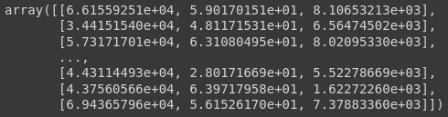

# Divisão entre previsores e classe

## Vamos realizar essa divisão entre X para previsores, e y para classe

- X_credit, nossos previsores, serão os atributos income, age e loan, pois default será nossa classe, o que nós queremos prever, e o clientid, não tem utilidade para o algoritmos de aprendizagem, pois ele não tem como fazer qualquer tipo de relação de o cliente 25 vai pagar ou não, os atributos que importão para prever se um cliente irá ou não pagar o empréstimo são os income, age e loan
- note que o `iloc`, necessita de dois parâmetros, as linhas e as colunas, onde colocamos:
  - linhas: queremos todas elas, pois são todos os clientes, então para isso utilizamos `:`, no pandas ele define como todas a linhas se for em linhas ou se for para colunas, todas as colunas
  - colunas: como queremos apenas o, income, age e loan, então retiramos o clientid e default, nossa contagem começa do 0 e vai até o 4, então retiramos o 0, pois refere-se ao clientid, mas mantemos o 4, pois como estamos dando um intervalo, então ele marca como fim do nosso intervalo o inicio do 4, por tanto, não incluindo-o
- `values`, vai converter para o formato do numpy, que é o formato necessário utilizado nas bibliotecas que trabalharemos

```python
X_credit = base_credit.iloc[:, 1:4].values
```

```python
X_credit
```

### Output: `X_credit`



### Vamos visualizar qual o tipo da variável

```python
type(X_credit)
```

### Output: `type(X_credit)`

```python
numpy.ndarray
```

### só para entender, o formato que tinhamos na base de dados era do tipo dataframe do pandas e com a conversão, passou a ser numpy array

```python
type(base_credit)
```

### Output: `type(base_credit)`

```python
pandas.core.frame.DataFrame
```

## Agora vamos pegar o atributo default, que será nossa classe

- para isso selecionamos com o `iloc`, todas as linhas e apenas a coluna 4, como já visto, é a coluna referente ao atributo default

```python
y_credit = base_credit.iloc[:, 4].values
```

### Vamos visualizar nossa classe

```python
y_credit
```

### Output: `y_credit`

```python
array([0, 0, 0, ..., 1, 0, 0])
```

### Vamos visualizar qual é o tipo de nnossa classe

```python
type(y_credit)
```

### Output: `type(y_credit)`

```python
numpy.ndarray
```
